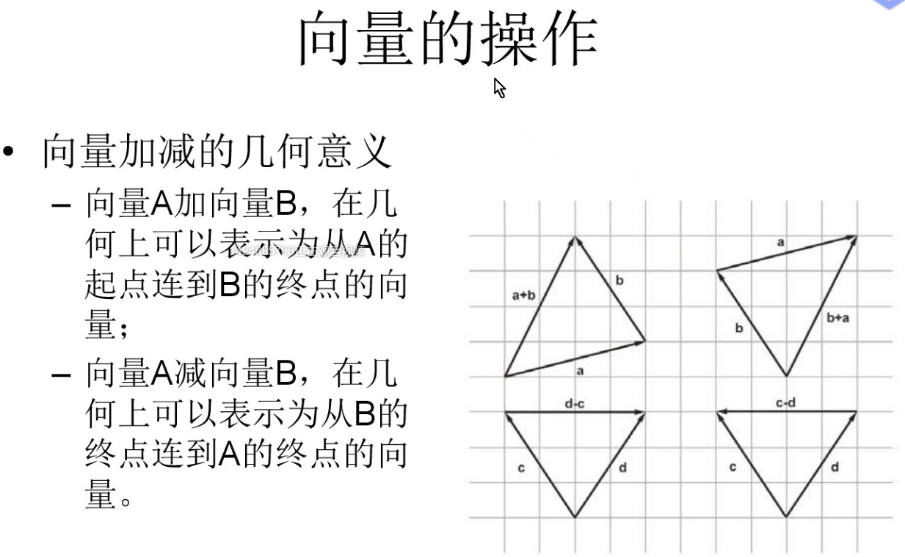
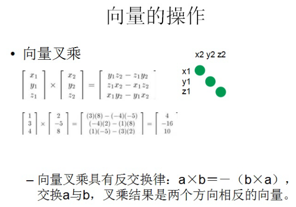

# Mathematical

## 基础

### 向量

a x b得到的方向由左手定则判断，四指指向a->b，大拇指方向即为a x b

可用于计算三角形法线

 

Vector3.magnitude ：返回该向量的长度。（只读）

Vector3.Project(Vector3 vector, Vector3 onNormal) ：将向量投影到另一个向量上

### 矩阵变换

一个4x4的矩阵可以存储平移、旋转、缩放的信息
$$
M=\left[\begin{array}\ x_{11}&x_{12}&x_{13}&x_{14} \\ x_{21}&x_{22}&x_{23}&x_{24} \\ x_{31}&x_{32}&x_{33}&x_{34}\\x_{41}&x_{42}&x_{43}&x_{44}\end{array}\right]=
\left[\begin{array}\ M_{3*3}&M_{translate}\\0_{1*3}&1\end{array}\right]
$$
该矩阵为适用于unity、OpenGL的列矩阵，而Direct3D、3dsmax则使用行矩阵，为列矩阵的转置矩阵，即：
$$
M=\left[\begin{array}\ M_{3*3}&0_{1*3}\\M_{translate}&1\end{array}\right]
$$
unity同时支持OpenGL和D3D，但当使用D3D时需要从列矩阵转换成行矩阵，这种转换是在unity内部自动进行的。

使用行矩阵或列矩阵与左手系或右手系无关，更多的图形库选择使用行矩阵，因为行矩阵在现有内存架构上的效率略高于列矩阵。

**行向量是行向量乘矩阵，列向量是矩阵乘列向量**。

设：点*D = (x, y, z, 1)*

1. 平移：

$$
Pos=\left[\begin{array}\ 
1&0&0&t_{x} \\ 
0&1&0&t_{y} \\ 
0&0&1&t_{z} \\
0&0&0&1
\end{array}\right]
\left[\begin{array}\
x \\y \\ z\\ 1
\end{array}\right]=
\left[\begin{array}\
x+t_{x} \\y+t_{y} \\ z+t_{z}\\ 1
\end{array}\right]
$$

​	若对方向矢量进行变换则会保持原样(方向矢量指w分量为0的四维向量)：
$$
Dir=\left[\begin{array}\ 
1&0&0&t_{x} \\ 
0&1&0&t_{y} \\ 
0&0&1&t_{z} \\
0&0&0&1
\end{array}\right]
\left[\begin{array}\
x \\y \\ z\\ 0
\end{array}\right]=
\left[\begin{array}\
x \\y \\ z\\ 0
\end{array}\right]
$$

2. 缩放

$$
Pos=\left[\begin{array}\ 
k_{x}&0&0&0 \\ 
0&k_{y}&0&0 \\ 
0&0&k_{z}&0 \\
0&0&0&1
\end{array}\right]
\left[\begin{array}\
x \\y \\ z\\ 1
\end{array}\right]=
\left[\begin{array}\
k_{x}x \\k_{y}y \\ k_{z}z\\ 1
\end{array}\right]
$$

​	若对方向矢量进行缩放变换:
$$
Dir=\left[\begin{array}\ 
k_{x}&0&0&0 \\ 
0&k_{y}&0&0 \\ 
0&0&k_{z}&0 \\
0&0&0&1
\end{array}\right]
\left[\begin{array}\
x \\y \\ z\\ 0
\end{array}\right]=
\left[\begin{array}\
k_{x}x \\k_{y}y \\ k_{z}z\\ 0
\end{array}\right]
$$

3. 旋转

   绕x轴旋转*Θ*

$$
R_{x}(\theta)=\left[\begin{array}\ 
1&0&0&0 \\ 
0&\cos\theta&-\sin\theta&0 \\ 
0&\sin\theta&\cos\theta&0 \\
0&0&0&1
\end{array}\right]
$$

​	绕y轴旋转*Θ*
$$
R_{y}(\theta)=\left[\begin{array}\ 
\cos\theta&0&\sin\theta&0 \\ 
0&1&0&0 \\ 
-\sin\theta&0&\cos\theta&0 \\
0&0&0&1
\end{array}\right]
$$
​	绕z轴旋转*Θ*
$$
R_{z}(\theta)=\left[\begin{array}\ 
\cos\theta&-\sin\theta&0&0 \\ 
\sin\theta&\cos\theta&0&0 \\ 
0&0&1&0 \\
0&0&0&1
\end{array}\right]
$$

4. 复合变换

​	复合变换的过程可使用下面的公式计算:
$$
M=M_{translate} M_{rotation} M_{scale}
$$
​	在列矩阵中该公式的阅读顺序为从右到左，即缩放->旋转->平移。

​	复合变换中旋转矩阵的计算公式为：
$$
M_{rotation}=M_{rotationZ} M_{rotationX} M_{rotationY}
$$

5. 逆变换

求逆矩阵的函数：inverse

public Matrix4x4 inverse ; //只读

逆矩阵可以实现反向变换，如：模型空间->世界空间的逆矩阵为世界空间->模型空间

​	平移矩阵的逆矩阵等于它的负矩阵：
$$
M_{translate}^{−1}=T^{−1}=−T
$$

$$
T^{−1}=\left[\begin{array}\ 
1&0&0&t_{x} \\ 
0&1&0&t_{y} \\ 
0&0&1&t_{z} \\
0&0&0&1
\end{array}\right]^{-1}
=\left[\begin{array}\ 
1&0&0&-t_{x} \\ 
0&1&0&-t_{y} \\ 
0&0&1&-t_{z} \\
0&0&0&1
\end{array}\right]
$$

​	缩放矩阵的逆矩阵为：
$$
S^{−1}=\left[\begin{array}\ 
k_{x}&0&0&0 \\ 
0&k_{y}&0&0 \\ 
0&0&k_{z}&0 \\
0&0&0&1
\end{array}\right]^{-1}
=\left[\begin{array}\ 
\frac1{k_{x}}&0&0&0 \\ 
0&\frac1{k_{y}}&0&0 \\ 
0&0&\frac1{k_{z}}&0 \\
0&0&0&1
\end{array}\right]
$$

​	旋转矩阵的逆矩阵为：
$$
M_{rotate}^{−1}=R(\theta)^{-1}=R(-\theta)=R(\theta)^{T}
$$

$$
R_{z}(\theta)^{-1}=\left[\begin{array}\ 
\cos\theta&-\sin\theta&0&0 \\ 
\sin\theta&\cos\theta&0&0 \\ 
0&0&1&0 \\
0&0&0&1
\end{array}\right]^{-1}
=\left[\begin{array}\ 
\cos\theta&\sin\theta&0&0 \\ 
-\sin\theta&\cos\theta&0&0 \\ 
0&0&1&0 \\
0&0&0&1
\end{array}\right]
=\left[\begin{array}\ 
\cos\theta&-\sin\theta&0&0 \\ 
\sin\theta&\cos\theta&0&0 \\ 
0&0&1&0 \\
0&0&0&1
\end{array}\right]^{T}
$$

​	复合矩阵的逆矩阵为：
$$
M^{-1}=(M_{translate} M_{rotate} M_{scale})^{-1}
=M_{scale}^{-1}M_{rotate}^{-1}M_{translate}^{-1}
=M_{scale}^{-1}M_{rotate}^{T}(-M_{translate})
$$

模型在世界空间中的变换基本都是使用正交矩阵 

### 离散卷积(Discrete Convolution)

这是连续卷积的通项公式，计算了f和g的卷积
$$
\large (f*g)(t):=\int_{-\infty}^{\infty}f(x)\cdot g(t-x)dx
$$

1. 数组之间的卷积

$$
(x,y,z)*(a,b,c)=(ax,bx+ay,cx+by+az,cy+zb,cz)
$$

​	当卷积对象长度>=1时，卷积结果的长度会大于卷积对象，因此在图像处理中，我们会忽略掉边缘值的计算。

2. 卷积核与图像处理

​	卷积核通常是一个大小为x*y的矩阵，卷积的双方即为卷积核和图片像素颜色值。

​	例如：高斯模糊卷积核，是一个从中心到边缘呈正态分布的完全对称矩阵。

3. 傅里叶变换卷积（f）

### 微积分

### 超复数

### 

## 渲染数学

### 四元数

### 波函数坍缩

### 球谐函数

### 双向反射分布函数

# Algorithm

## 纹理滤波

### 概述

常用纹理滤波：邻近点采样滤波（Nearest Point Sampling）、双线性滤波（Bilinear）、三线性滤波（Trilinear）、各向异性滤波（Anisotropic Filtering）

## 沃雷噪点

## 贝塞尔曲线

# OpenGL

# Direct3D

# Unity DRP

### 1. RayTracing Screen Space Reflection

