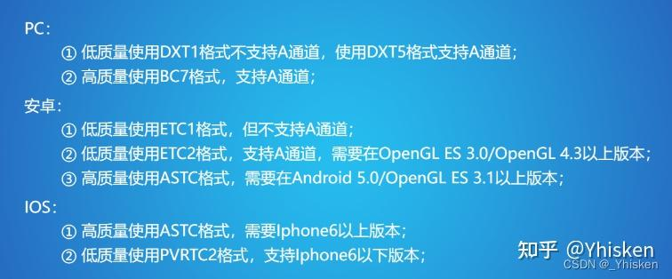

# Mathematical

## 基础

### 向量


a x b得到的方向由左手定则判断，四指指向a->b，大拇指方向即为a x b

可用于计算三角形法线

 

Vector3.magnitude ：返回该向量的长度。（只读）

Vector3.Project(Vector3 vector, Vector3 onNormal) ：将向量投影到另一个向量上


### 矩阵变换

一个4x4的矩阵可以存储平移、旋转、缩放的信息
$$
M=\left[\begin{array}\ x_{11}&x_{12}&x_{13}&x_{14} \\ x_{21}&x_{22}&x_{23}&x_{24} \\ x_{31}&x_{32}&x_{33}&x_{34}\\x_{41}&x_{42}&x_{43}&x_{44}\end{array}\right]=
\left[\begin{array}\ M_{3*3}&M_{translate}\\0_{1*3}&1\end{array}\right]
$$
该矩阵为适用于unity、OpenGL的列矩阵，而Direct3D、3dsmax则使用行矩阵，为列矩阵的转置矩阵，即：
$$
M=\left[\begin{array}\ M_{3*3}&0_{1*3}\\M_{translate}&1\end{array}\right]
$$
unity同时支持OpenGL和D3D，但当使用D3D时需要从列矩阵转换成行矩阵，这种转换是在unity内部自动进行的。


使用行矩阵或列矩阵与左手系或右手系无关，更多的图形库选择使用行矩阵，因为行矩阵在现有内存架构上的效率略高于列矩阵。

**行向量是行向量乘矩阵，列向量是矩阵乘列向量**。


设：点*D = (x, y, z, 1)*

1. 平移：

$$
Pos=\left[\begin{array}\ 
1&0&0&t_{x} \\ 
0&1&0&t_{y} \\ 
0&0&1&t_{z} \\
0&0&0&1
\end{array}\right]
\left[\begin{array}\
x \\y \\ z\\ 1
\end{array}\right]=
\left[\begin{array}\
x+t_{x} \\y+t_{y} \\ z+t_{z}\\ 1
\end{array}\right]
$$

​	若对方向矢量进行变换则会保持原样(方向矢量指w分量为0的四维向量)：
$$
Dir=\left[\begin{array}\ 
1&0&0&t_{x} \\ 
0&1&0&t_{y} \\ 
0&0&1&t_{z} \\
0&0&0&1
\end{array}\right]
\left[\begin{array}\
x \\y \\ z\\ 0
\end{array}\right]=
\left[\begin{array}\
x \\y \\ z\\ 0
\end{array}\right]
$$

2. 缩放

$$
Pos=\left[\begin{array}\ 
k_{x}&0&0&0 \\ 
0&k_{y}&0&0 \\ 
0&0&k_{z}&0 \\
0&0&0&1
\end{array}\right]
\left[\begin{array}\
x \\y \\ z\\ 1
\end{array}\right]=
\left[\begin{array}\
k_{x}x \\k_{y}y \\ k_{z}z\\ 1
\end{array}\right]
$$

​	若对方向矢量进行缩放变换:
$$
Dir=\left[\begin{array}\ 
k_{x}&0&0&0 \\ 
0&k_{y}&0&0 \\ 
0&0&k_{z}&0 \\
0&0&0&1
\end{array}\right]
\left[\begin{array}\
x \\y \\ z\\ 0
\end{array}\right]=
\left[\begin{array}\
k_{x}x \\k_{y}y \\ k_{z}z\\ 0
\end{array}\right]
$$

3. 旋转

   绕x轴旋转*Θ*

$$
R_{x}(\theta)=\left[\begin{array}\ 
1&0&0&0 \\ 
0&\cos\theta&-\sin\theta&0 \\ 
0&\sin\theta&\cos\theta&0 \\
0&0&0&1
\end{array}\right]
$$

​	绕y轴旋转*Θ*
$$
R_{y}(\theta)=\left[\begin{array}\ 
\cos\theta&0&\sin\theta&0 \\ 
0&1&0&0 \\ 
-\sin\theta&0&\cos\theta&0 \\
0&0&0&1
\end{array}\right]
$$
​	绕z轴旋转*Θ*
$$
R_{z}(\theta)=\left[\begin{array}\ 
\cos\theta&-\sin\theta&0&0 \\ 
\sin\theta&\cos\theta&0&0 \\ 
0&0&1&0 \\
0&0&0&1
\end{array}\right]
$$

4. 复合变换

​	复合变换的过程可使用下面的公式计算:
$$
M=M_{translate} M_{rotation} M_{scale}
$$
​	在列矩阵中该公式的阅读顺序为从右到左，即缩放->旋转->平移。


​	复合变换中旋转矩阵的计算公式为：
$$
M_{rotation}=M_{rotationZ} M_{rotationX} M_{rotationY}
$$

5. 逆变换

求逆矩阵的函数：inverse

public Matrix4x4 inverse ; //只读

逆矩阵可以实现反向变换，如：模型空间->世界空间的逆矩阵为世界空间->模型空间


​	平移矩阵的逆矩阵等于它的负矩阵：
$$
M_{translate}^{−1}=T^{−1}=−T
$$

$$
T^{−1}=\left[\begin{array}\ 
1&0&0&t_{x} \\ 
0&1&0&t_{y} \\ 
0&0&1&t_{z} \\
0&0&0&1
\end{array}\right]^{-1}
=\left[\begin{array}\ 
1&0&0&-t_{x} \\ 
0&1&0&-t_{y} \\ 
0&0&1&-t_{z} \\
0&0&0&1
\end{array}\right]
$$

​	缩放矩阵的逆矩阵为：
$$
S^{−1}=\left[\begin{array}\ 
k_{x}&0&0&0 \\ 
0&k_{y}&0&0 \\ 
0&0&k_{z}&0 \\
0&0&0&1
\end{array}\right]^{-1}
=\left[\begin{array}\ 
\frac1{k_{x}}&0&0&0 \\ 
0&\frac1{k_{y}}&0&0 \\ 
0&0&\frac1{k_{z}}&0 \\
0&0&0&1
\end{array}\right]
$$


​	旋转矩阵的逆矩阵为：
$$
M_{rotate}^{−1}=R(\theta)^{-1}=R(-\theta)=R(\theta)^{T}
$$

$$
R_{z}(\theta)^{-1}=\left[\begin{array}\ 
\cos\theta&-\sin\theta&0&0 \\ 
\sin\theta&\cos\theta&0&0 \\ 
0&0&1&0 \\
0&0&0&1
\end{array}\right]^{-1}
=\left[\begin{array}\ 
\cos\theta&\sin\theta&0&0 \\ 
-\sin\theta&\cos\theta&0&0 \\ 
0&0&1&0 \\
0&0&0&1
\end{array}\right]
=\left[\begin{array}\ 
\cos\theta&-\sin\theta&0&0 \\ 
\sin\theta&\cos\theta&0&0 \\ 
0&0&1&0 \\
0&0&0&1
\end{array}\right]^{T}
$$

​	复合矩阵的逆矩阵为：
$$
M^{-1}=(M_{translate} M_{rotate} M_{scale})^{-1}
=M_{scale}^{-1}M_{rotate}^{-1}M_{translate}^{-1}
=M_{scale}^{-1}M_{rotate}^{T}(-M_{translate})
$$


模型在世界空间中的变换基本都是使用正交矩阵 


### 离散卷积(Discrete Convolution)


这是连续卷积的通项公式，计算了f和g的卷积
$$
\large (f*g)(t):=\int_{-\infty}^{\infty}f(x)\cdot g(t-x)dx
$$

1. 数组之间的卷积

$$
(x,y,z)*(a,b,c)=(ax,bx+ay,cx+by+az,cy+zb,cz)
$$

​	当卷积对象长度>=1时，卷积结果的长度会大于卷积对象，因此在图像处理中，我们会忽略掉边缘值的计算。

2. 卷积核与图像处理

​	卷积核通常是一个大小为x*y的矩阵，卷积的双方即为卷积核和图片像素颜色值。

​	例如：高斯模糊卷积核，是一个从中心到边缘呈正态分布的完全对称矩阵。

3. 傅里叶变换卷积（f）


### 微积分


### 超复数


### 


## 渲染数学


### 四元数


### 波函数坍缩


### 球谐函数


### 双向反射分布函数

# 性能优化


## CPU消耗


### 常规逻辑计算消耗

#### 游戏逻辑


#### 动画逻辑


#### 加载卸载逻辑


#### 前端逻辑


### 渲染逻辑计算消耗


#### DrawCall、SetPassCall

SetPassCall是渲染流水线中切换渲染Pass产生的，因此需要在场景布置上，尽可能减少不同Shader变体的物体穿插放置。


使用各类合批技术，静态合批、动态合批、SRP合批


## GPU消耗

#### OverDraw

1.**透明混合和透明测试导致的OverDraw**

Alpha Test和Alpha Blend一般以植被，特效，UI为主，Alpha Test和Alpha Blend会导致前面所说的Early DT失效，硬件自带的天然优化手段也就没有了，因此也就产生了Late Z的Overdraw。虽然我们可以开启Pre-Z，去强行开启Early DT，但是实际上这可能会导致Overdraw翻倍，有时可能是负优化，具体情况还是要具体分析。

并且由于开启Alpha Blend通常为半透明物体， 为了确保透明物体绘制正确，一个比较常用的方法是透明物体（根据到相机的距离）从后往前提交，并且应该关闭深度测试，这存在非常严重的Overdraw，因为要从后往前混合多层。（大面积的少量重叠比小面积的大量重叠消耗更大）

所以在制作裁剪模型时尽量在建模软件里裁剪好，而不是使用alpha test。针对半透应该减少模型在屏幕中重叠的概率。制作植被时制作多层级的LOD，并且将多层模型合并可以有效缓解性能消耗。

2.**Quad OverDraw**

在光栅化流程中，GPU会计算某个像素在哪个三角面范围，从而把几何王个体的图元从三角面转换到一片像素范围中，GPU通常将三角面分解为2x2的像素进行处理（当然也有更大的比如8x8的，但是最小处理单位是2x2），而这一的一个2x2的像素块我们称之为一个Quad，而当一个Quad被多个三角形覆盖，GPU需要为每个三角形重新计算一次Quad，得到像素着色结果，这会导致不必要的计算开销和损失。Quad

因此在制作模型时应该提前判断，如一座山在屏幕上仅占100x100个像素，那就没必要包含200W个三角面。以面产生过多Quad Overdraw。


### 后处理

后处理包括MSAA，Bloom，DOF等，需要对FrameBuffer进行读写。一方面是因为它要在一帧内触发多次FrameBuffer的切换，另一方面是它要频繁读写FrameBuffer。

其次如果申请并采样RT，那么采样次数不宜过多，申请的RT分辨率也不宜过大。

另外就是要减少主存和Tile Memory的数据传输，像切换Render Target这种操作，要非常非常谨慎的使用。 每次切换Render Target都需要等待前面的指令全部执行完毕，把数据写入主存。切换到新的Render Target后，还需要把数据从主存Load到Tile Memory中。频繁的与主存交互不仅很慢，而且消耗大量带宽。所以类似后处理这样必须使用Render Target的，应当把多个Pass尽可能合并成一个Pass。


## 内存显存带宽


### 纹理

#### 纹理

**纹理压缩**



**纹理合并**

过大分辨率的纹理会同时造成内存和带宽的压力增加。并且当有许多小尺寸纹理时，建议把它们合并成一张大纹理，这点尤其在UI上常用，使用一张图集代替原本多个小的贴图。这样可以降低读取多个贴图的带宽压力和计算压力。同时如果有多张单通道贴图，也可以合并成一张多通道贴图，也可以减轻带宽压力。

**纹理滤波**

纹理过滤方式一般情况下都会选择双线性过滤，选择三线性或各向异性虽然能带来更好的质量，但是会增加采样点，以此可能会导致Cache Miss的概率变大，导致GPU去从内存读取，增加带宽压力。所以一般建议采用双线性过滤。

**Mipmap**

Mipmap大约会占用原图3/4的空间，关闭不必要的Mipmap，比如UI，或距离始终不变的物体。


#### 动作

一般来说引擎自带动作压缩算法，虽然这些算法在一些情况下会产生抖动，但可以根据实际情况调整。一般来说大于200KB且时长较长的动画资源我们认为是占用内存较大的动画资源，这些资源需要我们进行优化。


#### 网格

网格的顶点属性应避免多余冗余，如果网格的顶点属性只用到了3个，如位置，法线，uv，那么就没必要带有顶点色之类的。同时，应该控制网格的顶点数和面数，过多的顶点和三角面会造成过高的内存占用，同时也不利于裁剪，容易增加渲染面数。


#### 音频

音频压缩技术取决于对音质，文件大小，CPU占用和兼容性的需求。有损压缩格式（MP3，OGG Vorbis和AAC等）适用于需要高压缩比和较小文件大小的场景，而无损压缩格式（如FLAG）适用于对音质要求较高的场景。我们需要根据实际需求和性能预算权衡各种压缩技术的优缺点，选择合适的音频压缩格式。


#### Shader变体


## AI优化

### DLSS

Unity开启DLSS流程：

在管线设置中开启动态分辨率


在Package Manager中下载导入NVDIA包


在摄像机中允许动态分辨率


# Algorithm

## 纹理滤波


### 概述

常用纹理滤波：邻近点采样滤波（Nearest Point Sampling）、双线性滤波（Bilinear）、三线性滤波（Trilinear）、各向异性滤波（Anisotropic Filtering）

### Mipmap


## 沃雷噪点


## 贝塞尔曲线


# OpenGL


# Direct3D


# Unity DRP


### 1. RayTracing Screen Space Reflection


# 具体效果


## 多人战争迷雾效果

```
public class VisualFieldObject : MonoBehaviour
{
    public int visualFieldRadius = 2;
    private bool[,] inside;
    private VisualFieldRecorder recorder;

    public bool IsInside(Vector2Int coord)
    {
    }

    private void OnEnable()
    {
    }

    private void OnDisable()
    {
    }
}
```

VisualFieldObject挂载在拥有视野的对象上，存储本单位的视野半径，并提供了一个判断是否在视野（正方形）范围内的公开方法。

