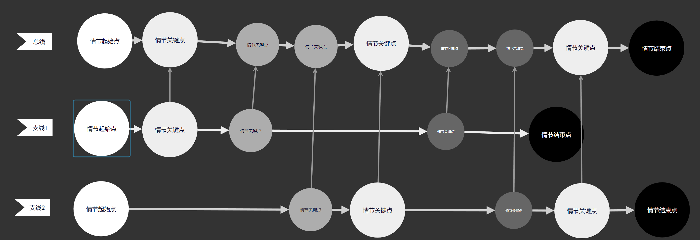
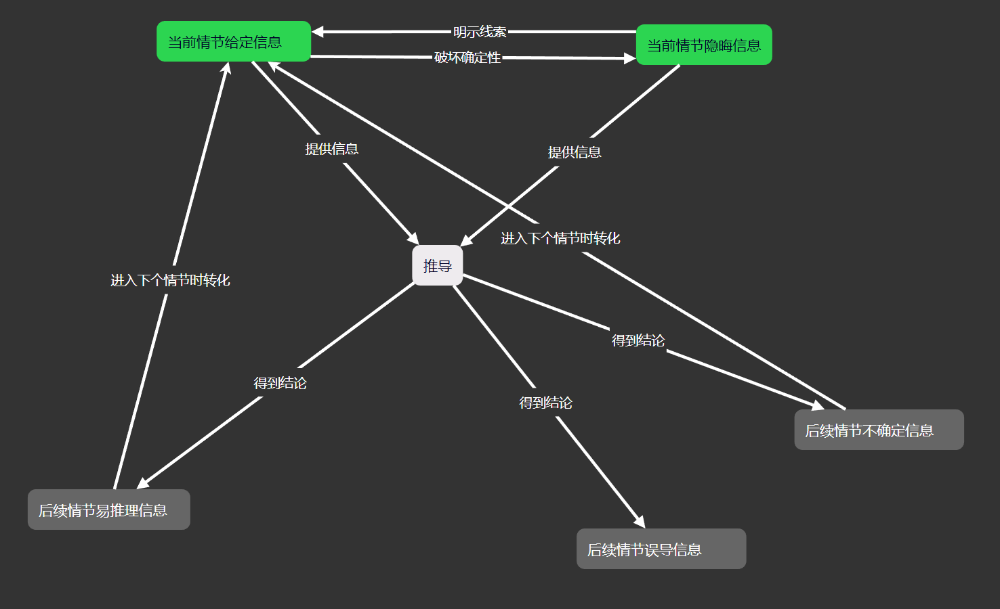
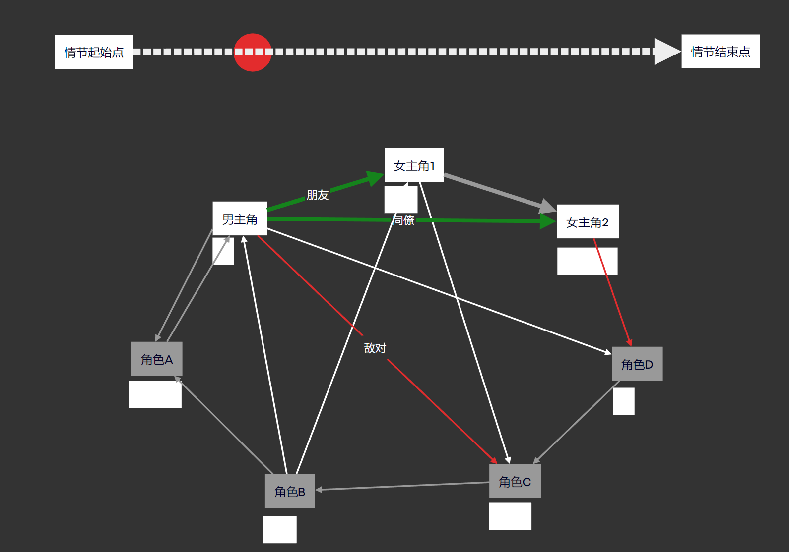
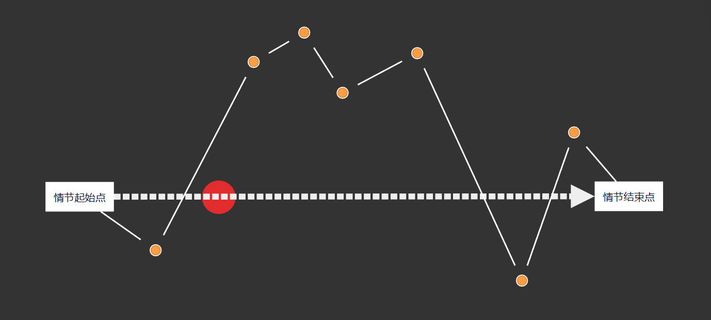

# 游戏机制
## 设计剖析

### 动物井解密设计

核心驱动力：相对明确的收集要素

新鲜感：多种道具机制，排列组合产生不同体验的解密

**机制引导**：

> ​	第一关：A机制
>
> ​	第二关：B机制
>
> ​	第三关：C机制
>
> ​	第四关：A+B
>
> ​	第五关：A+C
>
> ​	第六关：A+B+C
>
> ​	即机制的排列组合
>
> ​	引导过程中，侧重“无意中发现这个机制”的体验

### 这个游戏在试图杀死我吗

> 游戏内的Meta游戏，玩家需要游戏和游戏内的游戏道具、线索进行配合，一步步将游戏内的游戏通关
>
> 类似：一个人在屋子里敲鸡蛋，每敲一下，鸡蛋里会传出人的声音，他觉得很有趣，不断敲击，直到打碎了鸡蛋。然后突然有人开始不断敲门，最后他的房子被敲碎了。

### 忘了名字的一个反套路勇者斗恶龙类游戏

> 非常惊艳的一段演出设计：
>
> 勇者视角：场景被分成了上下两部分，勇者在上半边，公主在下半边，两人为了汇合一直在向同一个方向奔跑，似乎在寻找能汇合的缺口；
>
> 公主视角：勇者其实就是怪物，公主奔跑就是为了躲避勇者。
>
> 两种截然相反且激烈的情绪与目的相互碰撞，比之普通的反套路更加多了一层情绪的带入和惊讶，演出做到了让玩家真的认为自己是勇者，自己就是在救公主，和游戏中勇者的想法完全重合，相当牛逼。

### 和自己斗智斗勇

> 横板跳跃，场景中存在多种对立单位，玩家操控其中一种，并需要达成本关目标才能通关；
>
> 每次通关后切换为上个关卡中的另一个单位，并且会录制上个关卡中玩家的行为，并在第二个关卡中进行播放，第二关中玩家则需要去阻止第一关的自己。

### 窗口玩法

> 通过一些API创建多个窗口，通过windows窗口的一些特性，对窗口内的游戏对象产生影响，进而达成关卡目的。

------

## 实现玩法机制

### 魔法阵系统

本系统旨在实现一整套数值严谨的魔法阵系统

本系统固定0.5s一跳，每跳进行各类判定

1. 抽象基类: MagicCircle_Base

​	定义了魔法阵通用的属性与方法

2. 枚举类：MagicCircle_Type

​	列举魔法阵的属性

3. 若干魔法阵类：MagicCircle_General……

​	实现抽象类的方法，并拥有不同的特殊能力

​	(1). 魔法阵融合

​		法阵融合的过程由**基底法阵**和**内嵌法阵**组成，融合后所有法阵的特性功能均会被无损保留，功率、容量、法力会被叠加，属性会保留最高等级中最高法力的法阵的属性（如果有多个最高等级的的最高法力法阵，则保留多属性）。

​		每个法阵都有一个**插槽数量**的属性，指作为基底法阵时可嵌入的法阵数量；每个法阵都有一个**半径**的属性，每个插槽也都拥有一个**插槽半径**的属性，只有基底法阵的插槽半径和内嵌法阵的半径吻合才能进行融合。

​		融合**成功率**是基于**魔法阵完整度**这一参数计算的，如果目标法阵的完整度均为满则成功率为1，反之为0。

​		融合**异变率**也是基于**魔法阵完整度**计算的，如果目标法阵的完整度均为满则异变率为0，反之为1，同时异变幅度遵循正态分布（大概率是小幅度异变），每次异变都会可能使任何属性发生改变，且只有较高幅度的异变才能使属性发生异变。

​	(2). 魔法阵拆解

​		魔法阵拆解会导致**基底法阵**彻底被摧毁。

​		由于融合过程已经将属性融合，所以拆解后的得到的法阵的属性会基于源法阵的属性中随机抽选。

​		拆解后，功率、容量、法力会被拆分，拆分比例基于法阵等级计算，完整度继承源法阵。

​	(3). 魔法阵的状态

​		休眠状态：当法力值小于输入功率时触发，功能失效

​		充能状态：手动进入该状态，持续获取法力值直到最大容量，但功能失效

​		激发状态：当法力值大于输入功率时触发，功能生效。（不同类型的魔法阵可能有多种激发态）

​		超频状态：手动进入该状态，功率、容量、法力增强，持续损失法阵完整度

​		摧毁状态：当魔法阵完整度归零时，摧毁魔法阵，摧毁状态下功能永久失效，无法修复；

​	(4). 魔法阵

​	(5). 魔法阵

​		

4. 魔法阵管理类：MagicCircle_Manager

​	挂载在魔法阵的GameObject上，是“若干魔法阵类”的实例化

------

# 游戏剧情

## 故事情节

**契诃夫之枪**

**(Chekhov's Gun)**是一个戏剧性原则，即：**如果在第一幕中看到枪，那么在遵循传统的三幕结构的故事中，它应该在第三幕中使用。反之亦然，在第三幕中开枪的行为应在更早的时候完成铺垫。**

尽管这个例子名义上讲适用于武器，但“契诃夫之枪”的原则却适用于故事中的任何元素。从广义上讲，“契诃夫之枪”的理论认为：**一篇文章中的每一个元素都应该直接影响到整体。**

契诃夫定律：

- 由俄罗斯剧作家和作家契诃夫创造；
- 如果某件事完成了铺垫，就必须得到回报，反之亦然；
- 没有回报的铺垫被称为“未开火的契诃夫之枪”。

## 角色塑造

功能性角色：角色内核简单

如何杀死一个主要角色？

1. 角色内心有某种极度的纯粹；
2. 现实与环境容不下这份纯粹；
3. 放任角色生活在笔下，任他挣扎，任他努力，他的纯粹会自然而然地杀死他；
4. 使他的死亡，映射他的辉煌与执着。

------

# 项目-心灵生成测试

## 设定

### 角色设定

### 背景设定

## 剧情

### 梗概

### 事件

## 工具

### 故事线可视化工具

#### 量化标准

1. 故事线

> 故事线：通常由多条不同支线主线组成，故事线可视化工具最核心的可视化对象应当就是故事线及其节点。
>
> 可视化：作者可以编辑所有支线故事，以此自动合成玩家眼中的故事总线。支线中可以设置节点的**重要程度，发生时间，显隐性(隐性节点不会被现实在总线中)，故事线的合并与拆分，开始结束节点**。

2. 情节谜题

>谜题关卡：剧情信息的推进本质是给读者设下谜题，读者通过现有的信息对故事发展进行推理，作者需要做的是给此后必然的情节提供充足的信息，给情理之中意料之外的情节提供不完备的信息（或者说伏笔）
>
>结构：也许可以将这些剧情谜题分为若干大小关卡的形式进行分段处理。
>
>​	情节A：
>​		作者给予的信息：
>​			确定信息：信息1、信息2、信息3……
>​			隐晦信息：信息1、信息2、信息3……
>​		需要推理得到的信息：
>​			易推理的后续情节信息：信息1、信息2、信息3……
>​			不确定的后续情节信息：信息1、信息2、信息3……
>​			作者试图误导读者的后续情节信息：信息1、信息2、信息3……
>
>​		==小情节a
>​			作者给予的信息：
>​			需要推理得到的信息：
>​		==小情节b
>​			作者给予的信息：
>​			需要推理得到的信息：
>​		==小情节c……
>
>​	情节B：……
>
>​	情节C：……
>
>量化：这个信息涉及故事细节，可能并不适合全部进行可视化，也许适合进行量化，简单粗暴的给出一个线索抛出的数据？

3. 角色心理

> 角色心理：展示当前节点关键角色直接的联系与角色本身的情绪‘
>
> 可视化：每个剧情节点均可以变更角色的心理与关系，之后可以通过选择时间点查看角色心理变化。

4. 玩家心理

> 玩家心理：作者通过情节试图控制读者的情绪，这样才能让玩家更有代入感。我觉得这有用在于，内测阶段可以测试玩家实际游玩体验是否和作者标注的曲线吻合，如果吻合度低，说明剧本存在问题。
>
> 可视化：低于0时为负面情绪，高于0为正面情绪。

5. 其他量化参数

   > **角色参与度**：
   >
   > **节奏快慢**：慢节奏对应日常情节，快节奏对应高冲突情节
   >
   > **故事冲突程度**：冲突程度大致和节奏快慢呈反比
   >
   > **伏笔回收**：直观看到伏笔何时埋下，何时回收
   >
   > 

