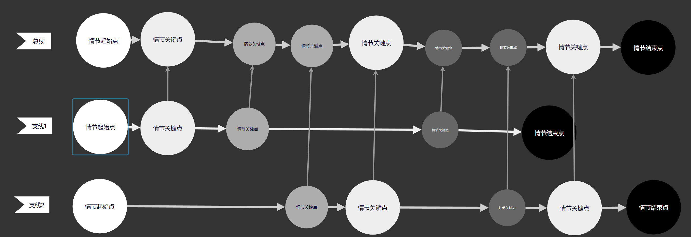
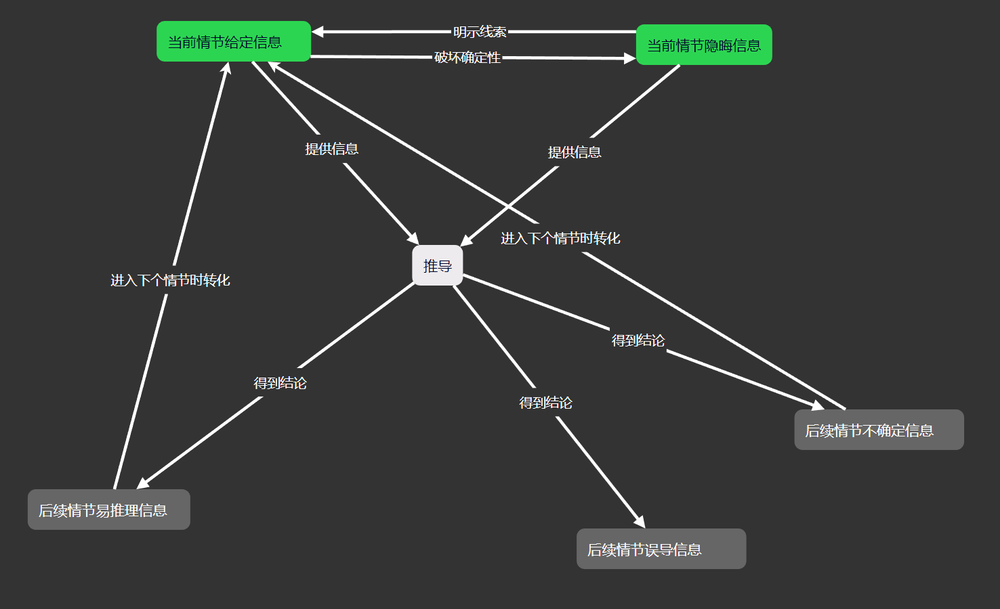
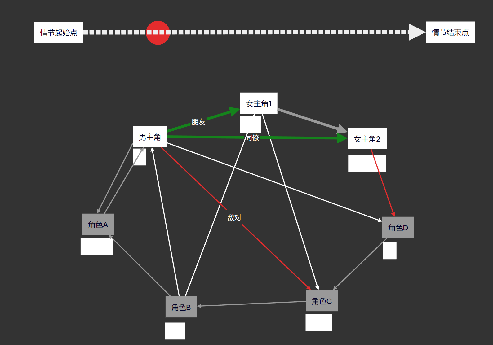
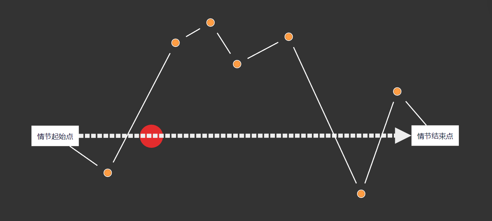

# 游戏机制

反复对技术进行妥协，最终只会得到一个千篇一律的作品。

## 设计剖析

### 动物井解密设计

核心驱动力：相对明确的收集要素

新鲜感：多种道具机制，排列组合产生不同体验的解密

**机制引导**：

> ​	第一关：A机制
>
> ​	第二关：B机制
>
> ​	第三关：C机制
>
> ​	第四关：A+B
>
> ​	第五关：A+C
>
> ​	第六关：A+B+C
>
> ​	即机制的排列组合
>
> ​	引导过程中，侧重“无意中发现这个机制”的体验

### 这个游戏在试图杀死我吗

> 游戏内的Meta游戏，玩家需要游戏和游戏内的游戏道具、线索进行配合，一步步将游戏内的游戏通关
>
> 类似：一个人在屋子里敲鸡蛋，每敲一下，鸡蛋里会传出人的声音，他觉得很有趣，不断敲击，直到打碎了鸡蛋。然后突然有人开始不断敲门，最后他的房子被敲碎了。

### 忘了名字的一个反套路勇者斗恶龙类游戏

> 非常惊艳的一段演出设计：
>
> 勇者视角：场景被分成了上下两部分，勇者在上半边，公主在下半边，两人为了汇合一直在向同一个方向奔跑，似乎在寻找能汇合的缺口；
>
> 公主视角：勇者其实就是怪物，公主奔跑就是为了躲避勇者。
>
> 两种截然相反且激烈的情绪与目的相互碰撞，比之普通的反套路更加多了一层情绪的带入和惊讶，演出做到了让玩家真的认为自己是勇者，自己就是在救公主，和游戏中勇者的想法完全重合，相当牛逼。

### 和自己斗智斗勇

> 横板跳跃，场景中存在多种对立单位，玩家操控其中一种，并需要达成本关目标才能通关；
>
> 每次通关后切换为上个关卡中的另一个单位，并且会录制上个关卡中玩家的行为，并在第二个关卡中进行播放，第二关中玩家则需要去阻止第一关的自己。

### 窗口玩法

> 通过一些API创建多个窗口，通过windows窗口的一些特性，对窗口内的游戏对象产生影响，进而达成关卡目的。

------

### 空之轨迹

> 最近我发现了使得轨迹系列好玩的真正秘密——只有玩家凭借自身意志探索出来的内容，才能带来真正的游戏快乐。
>
> 虽然轨迹系列是经典的jrpg，但它的设计理念或许和其他jrpg大相径庭。NPC人生轨迹的传递，让这部游戏真正鲜活了起来，这些NPC的对话内容其实并非游戏制作过程中必要的，因为这不会给玩家带来收益，也没有和游戏机制产生耦合，但它成功的带来了正反馈，因为这些内容正是玩家凭借自身意志探索而来的。

----

## 头脑风暴

### 魔法阵系统

本系统旨在实现一整套数值严谨的魔法阵系统

本系统固定0.5s一跳，每跳进行各类判定

1. 抽象基类: MagicCircle_Base

​	定义了魔法阵通用的属性与方法

2. 枚举类：MagicCircle_Type

​	列举魔法阵的属性

3. 若干魔法阵类：MagicCircle_General……

​	实现抽象类的方法，并拥有不同的特殊能力

​	(1). 魔法阵融合

​		法阵融合的过程由**基底法阵**和**内嵌法阵**组成，融合后所有法阵的特性功能均会被无损保留，功率、容量、法力会被叠加，属性会保留最高等级中最高法力的法阵的属性（如果有多个最高等级的的最高法力法阵，则保留多属性）。

​		每个法阵都有一个**插槽数量**的属性，指作为基底法阵时可嵌入的法阵数量；每个法阵都有一个**半径**的属性，每个插槽也都拥有一个**插槽半径**的属性，只有基底法阵的插槽半径和内嵌法阵的半径吻合才能进行融合。

​		融合**成功率**是基于**魔法阵完整度**这一参数计算的，如果目标法阵的完整度均为满则成功率为1，反之为0。

​		融合**异变率**也是基于**魔法阵完整度**计算的，如果目标法阵的完整度均为满则异变率为0，反之为1，同时异变幅度遵循正态分布（大概率是小幅度异变），每次异变都会可能使任何属性发生改变，且只有较高幅度的异变才能使属性发生异变。

​	(2). 魔法阵拆解

​		魔法阵拆解会导致**基底法阵**彻底被摧毁。

​		由于融合过程已经将属性融合，所以拆解后的得到的法阵的属性会基于源法阵的属性中随机抽选。

​		拆解后，功率、容量、法力会被拆分，拆分比例基于法阵等级计算，完整度继承源法阵。

​	(3). 魔法阵的状态

​		休眠状态：当法力值小于输入功率时触发，功能失效

​		充能状态：手动进入该状态，持续获取法力值直到最大容量，但功能失效

​		激发状态：当法力值大于输入功率时触发，功能生效。（不同类型的魔法阵可能有多种激发态）

​		超频状态：手动进入该状态，功率、容量、法力增强，持续损失法阵完整度

​		摧毁状态：当魔法阵完整度归零时，摧毁魔法阵，摧毁状态下功能永久失效，无法修复；

​	(4). 魔法阵

​	(5). 魔法阵

​		

4. 魔法阵管理类：MagicCircle_Manager

​	挂载在魔法阵的GameObject上，是“若干魔法阵类”的实例化

------

### 大师之国

#### 背景

这个特殊的国度存在着一种奇特的技术，可以使人在短时间内体验到一个领域的经历，并迅速掌握这个领域的经验与技巧，这个国度的居民们可以使用它成为百般领域的大师。在这里，人人都是技艺精湛者，人人都在寻求更丰富的领域，并试图掌握它。

但在此地，有一个群体例外，他们追求一个领域深层的构造，热衷于创造知识。

------

### 扮演巨龙的玩法

#### 概述

巨龙是人对生物的终极幻想，拥有强悍的体魄、庞大的身躯、超人的智慧、高超的魔法天赋，我希望这个游戏可以带给玩家新奇的扮演体验。

类型：类银河恶魔城，高隐藏内容量，主线内容量一般，多周目体验，泰拉瑞亚和一般横板冒险之间取个中间值

设定参考DND，但不会完全沿用DND设定

成长途径：

- 基础属性、体型、以及龙息随时间（探索度）成长；
- 魔法学习，在技能系统（龙之传承）中寻找合适的魔法进行学习；
- 战斗成长，落地肉体作战可以让基础属性得到成长，魔法作战可以提升熟练度；
- 职业等级，当基础属性和特定条件达成后可提升对应的职业等级，可以获得属性加成与专属技能；
- 魔法道具，难以获得且有使用限制但威力可观，功能多样；

探索体验：

- 主角在成长过程中体型也会增大，年轻时能去的区域，老后反而去不了
- 不同的地块存在不同的硬度，可以被撞击、攻击等手段破坏，但在属性未达标前，难以破坏
  - 这个设定可以衍生出很多有意思的设计，比如我设计一个宝藏宫殿，里面放着轮椅级别的道具，只能通过破坏地形前往，地形由难以破坏的中等硬度土块和不可破坏的超高硬度石，正常流程下可以在成长为太古龙时强行通过，但在青少年龙时可以依靠小体型，只通过破坏土块进入宫殿。当然这种设计必须得足够隐秘，最好是当玩家一周目达到太古龙时期才发现这个秘密。

#### 设定

**一、五色龙（Chromatic Dragons）**

**总体特征**

- **阵营**：通常为邪恶（混乱邪恶、守序邪恶或中立邪恶）
- **习性**：贪婪、傲慢、 territorial（领地意识极强），喜欢收集财宝
- **魔法天赋**：天生掌握龙语魔法，随年龄增长会觉醒更多类法术能力
- **龙息**：每种龙有独特的吐息武器（如酸、火焰、寒冰等）

------

**1. 红龙（Red Dragon）**

- **阵营**：守序邪恶
- **龙息**：锥形火焰
- **外貌**：猩红鳞片，犄角如山脊，瞳孔如熔岩
- **性格**：最贪婪傲慢的五色龙，自视为万物主宰，喜欢统治类人生物部落。
- **巢穴**：火山深处或高山洞穴，宝藏堆满黄金与魔法武器。
- **特殊能力**：火焰免疫，恐惧光环（幼龙以上），操控火元素魔法。

------

**2. 蓝龙（Blue Dragon）**

- **阵营**：守序邪恶
- **龙息**：闪电束
- **外貌**：钴蓝色鳞片，单角如雷击状，翅膀如沙漠风蚀岩层
- **性格**：狡猾且守序，喜欢沙漠地形，擅长设置陷阱和阴谋。
- **巢穴**：沙漠地下洞穴，用幻术隐藏入口。
- **特殊能力**：闪电免疫，操控沙暴和幻术魔法。

------

**3. 绿龙（Green Dragon）**

- **阵营**：守序邪恶
- **龙息**：锥形氯气毒雾
- **外貌**：翠绿色鳞片，头冠如荆棘，瞳孔如琥珀
- **性格**：阴险狡诈，喜欢用言语操纵猎物，巢穴周围常布满背叛者尸体。
- **巢穴**：森林深处或沼泽古堡，入口被藤蔓掩盖。
- **特殊能力**：毒素免疫，擅长精神操控魔法（如暗示术）。

------
**4. 黑龙（Black Dragon）**

- **阵营**：混乱邪恶
- **龙息**：线形强酸
- **外貌**：漆黑鳞片，角向后弯曲，面部似骷髅
- **性格**：残忍嗜杀，喜欢折磨猎物，栖息在沼泽或废墟中。
- **巢穴**：水下洞穴或淹没的神庙，充满腐臭气息。
- **特殊能力**：强酸免疫，水下呼吸，操控腐化与黑暗魔法。

------

**5. 白龙（White Dragon）**

- **阵营**：混乱邪恶
- **龙息**：锥形寒冰
- **外貌**：雪白鳞片，脊刺如冰棱，眼神原始野蛮
- **性格**：最野蛮的五色龙，智力较低但狩猎本能极强，像野兽般生存。
- **巢穴**：冰川裂缝或雪山洞穴，宝藏中常冻结着受害者。
- **特殊能力**：冰冻免疫，擅长冰系魔法，极端环境适应力。

------
二、金属龙（Metallic Dragons）

**总体特征**

- **阵营**：通常为善良（守序善良、中立善良或混乱善良）
- **习性**：智慧、宽容，愿意与凡人交流，部分会化身人形引导文明
- **魔法天赋**：天生掌握变形术（化身人形/动物），擅长防护与治愈魔法
- **龙息**：多样且常带特殊效果（如削弱、麻痹等）

------
**1. 金龙（Gold Dragon）**

- **阵营**：守序善良
- **龙息**：锥形火焰（主）/ 衰弱气体（副）
- **外貌**：金色鳞片如抛光铠甲，面部慈祥却威严，带有麝香气味
- **性格**：最智慧的金属龙，痛恨不义之举，常化身智者引导英雄。
- **巢穴**：偏远海岛或云端宫殿，藏书库堪比王国图书馆。
- **特殊能力**：火焰免疫，预言系魔法，化身任何类人生物。

------

**2. 银龙（Silver Dragon）**

- **阵营**：守序善良
- **龙息**：锥形寒冰（主）/ 麻痹气体（副）
- **外貌**：银白色鳞片，瞳孔如液态汞，飞行时如流星
- **性格**：热爱人类文化，常化身凡人参与社会，偏爱与勇士交友。
- **巢穴**：高山云端城堡，收藏人类艺术品和历史文物。
- **特殊能力**：冰冻免疫，操控云雾和治疗魔法。

------

**3. 青铜龙（Bronze Dragon）**

- **阵营**：守序善良
- **龙息**：闪电束（主）/ 斥力能量（副）
- **外貌**：青铜色鳞片，翅膀如蝠鲼，喜欢海水气味
- **性格**：好奇且正义，热衷观察战争，会化身水手保护航线。
- **巢穴**：海岸洞穴或沉船深处，用幻术保护宝藏。
- **特殊能力**：闪电免疫，操控天气和水元素魔法。

------

**4. 黄铜龙（Brass Dragon）**

- **阵营**：混乱善良
- **龙息**：线形火焰（主）/ 睡眠气体（副）
- **外貌**：黄铜色鳞片，面部似蜥蜴，活泼好动
- **性格**：话痨，热爱与旅行者聊天，收集 gossip 和故事。
- **巢穴**：沙漠绿洲或遗迹，入口常设谜题考验访客。
- **特殊能力**：火焰免疫，擅长幻术和沟通魔法（如通晓语言）。

------

**5. 赤铜龙（Copper Dragon）**

- **阵营**：混乱善良
- **龙息**：线形强酸（主）/ 迟缓气体（副）
- **外貌**：赤铜色鳞片，表情狡黠，喜欢讲冷笑话
- **性格**：顽皮幽默，擅长用恶作剧测试访客的幽默感。
- **巢穴**：干旱山区洞穴，布满陷阱和谜题通道。
- **特殊能力**：强酸免疫，操控大地变形和幻术魔法。

# 游戏设计师

## 作为游戏设计师

### 倾听

倾听是游戏设计师最重要的能力，因为决策在游戏设计师的脑中进行加工与产生，作为决策终端，应当在他人之后进行输出观点。

### 情感

在对一段体验进行描述时，很多人无法做到精准描述，他觉得体验不好只会觉得不好，往往讲不出具体不好的点。

但作为游戏设计师，我们需要尽可能精准的描述这段体验，描述出客观的优缺点，同样不能缺少主观的情感。

情感是人类对一段体验的直接感知，因此在这里，主观体验的重要程度不低于客观描述。

> 人们可能会忘记你所说的，但他们永远不会忘记你带给他们的感觉。

为了确定我们创造了正确的体验，我们需要常常自省：

- 我们希望玩家能得到怎样的体验？为什么？
- 当人们玩游戏的时候，他们产生了怎样的情感？为什么？
- 我怎样缩小实际体验与我的设想之间的差距？

#### 海森堡原理

当我们想观察自己玩游戏时的体验时，观察本身会影响到游戏体验，导致结论失真。这和量子力学中观测导致量子坍缩的现象很相似，因此称之为海森堡原理。

分享记忆：我们很难在进行体验是做分析，但完全可以在体验之后做分析，凭借着对游戏的即时感受，立刻分享自己的游玩感受、分析游戏的优缺点。

两次经历：第一次经历沉浸进去，注重体验。第二次经历时结合第一次体验进行分析。

暗中一瞥

默默观察

# 内容

游戏是一种体验，它能使玩家产生特定的感受：选择感、自由感、责任感、成就感、友谊等等。

## 故事情节

**契诃夫之枪**

**(Chekhov's Gun)**是一个戏剧性原则，即：**如果在第一幕中看到枪，那么在遵循传统的三幕结构的故事中，它应该在第三幕中使用。反之亦然，在第三幕中开枪的行为应在更早的时候完成铺垫。**

尽管这个例子名义上讲适用于武器，但“契诃夫之枪”的原则却适用于故事中的任何元素。从广义上讲，“契诃夫之枪”的理论认为：**一篇文章中的每一个元素都应该直接影响到整体。**

契诃夫定律：

- 由俄罗斯剧作家和作家契诃夫创造；
- 如果某件事完成了铺垫，就必须得到回报，反之亦然；
- 没有回报的铺垫被称为“未开火的契诃夫之枪”。

## 角色塑造

功能性角色：角色内核简单

如何杀死一个主要角色？

1. 角色内心有某种极度的纯粹；
2. 现实与环境容不下这份纯粹；
3. 放任角色生活在笔下，任他挣扎，任他努力，他的纯粹会自然而然地杀死他；
4. 使他的死亡，映射他的辉煌与执着。

------

# 项目-心灵生成测试

## 设定

### 角色设定

### 背景设定

## 剧情

### 梗概

### 事件

## 工具

### 故事线可视化工具

#### 量化标准

1. 故事线

> 故事线：通常由多条不同支线主线组成，故事线可视化工具最核心的可视化对象应当就是故事线及其节点。
>
> 可视化：作者可以编辑所有支线故事，以此自动合成玩家眼中的故事总线。支线中可以设置节点的**重要程度，发生时间，显隐性(隐性节点不会被现实在总线中)，故事线的合并与拆分，开始结束节点**。

2. 情节谜题

>谜题关卡：剧情信息的推进本质是给读者设下谜题，读者通过现有的信息对故事发展进行推理，作者需要做的是给此后必然的情节提供充足的信息，给情理之中意料之外的情节提供不完备的信息（或者说伏笔）
>
>结构：也许可以将这些剧情谜题分为若干大小关卡的形式进行分段处理。
>
>​	情节A：
>​		作者给予的信息：
>​			确定信息：信息1、信息2、信息3……
>​			隐晦信息：信息1、信息2、信息3……
>​		需要推理得到的信息：
>​			易推理的后续情节信息：信息1、信息2、信息3……
>​			不确定的后续情节信息：信息1、信息2、信息3……
>​			作者试图误导读者的后续情节信息：信息1、信息2、信息3……
>
>​		==小情节a
>​			作者给予的信息：
>​			需要推理得到的信息：
>​		==小情节b
>​			作者给予的信息：
>​			需要推理得到的信息：
>​		==小情节c……
>
>​	情节B：……
>
>​	情节C：……
>
>量化：这个信息涉及故事细节，可能并不适合全部进行可视化，也许适合进行量化，简单粗暴的给出一个线索抛出的数据？

3. 角色心理

> 角色心理：展示当前节点关键角色直接的联系与角色本身的情绪‘
>
> 可视化：每个剧情节点均可以变更角色的心理与关系，之后可以通过选择时间点查看角色心理变化。

4. 玩家心理

> 玩家心理：作者通过情节试图控制读者的情绪，这样才能让玩家更有代入感。我觉得这有用在于，内测阶段可以测试玩家实际游玩体验是否和作者标注的曲线吻合，如果吻合度低，说明剧本存在问题。
>
> 可视化：低于0时为负面情绪，高于0为正面情绪。

5. 其他量化参数

   > **角色参与度**：
   >
   > **节奏快慢**：慢节奏对应日常情节，快节奏对应高冲突情节
   >
   > **故事冲突程度**：冲突程度大致和节奏快慢呈反比
   >
   > **伏笔回收**：直观看到伏笔何时埋下，何时回收
   >
   > 

