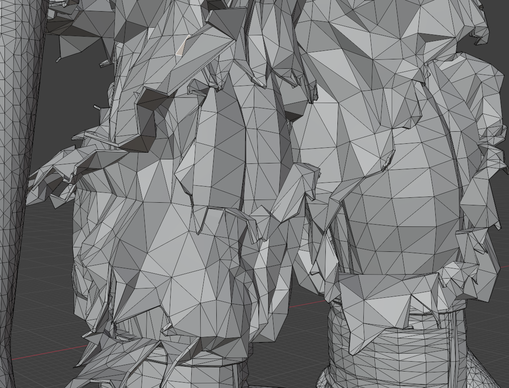

# 3D打印用模型

3D打印所用的模型和游戏用模型的区别：

1. 3D打印直接使用高模，保留雕刻细节；
2. 3D打印用的模型不可有重叠、独立等非常理结构；
3. 游戏模型通常只有单面，3D打印模型需要每一个结构都有完整封闭的水密结构；
   *补充解释：所谓水密结构，即放满水的话不会漏出来，没有缺口，如图破损的裤子，破布是双面密封的，不是单面的；
   
4. 3D打印用的模型内部需要存在支撑结构；
5. 3D打印所用的格式通常和游戏不同；

常用文件格式：

1. .STL：是STereoLithography的缩写，最通用，但不包含颜色信息，只能进行最基础的单一色彩模型打印；
2. .Obj：同样也是在游戏模型可通用的格式，包含颜色信息；
3. .gcode：是一种代码控制的一套逻辑，是基于控制机器打印的速度、步长、温度、密度等等物理过程来实现模型输出的，简单来说是程序化图形结构，常用于一些数学图形的打印；
4. .3MF：3D Manufacturing Format的缩写，新一代格式，包含模型、颜色、材质、打印设置等丰富信息，正在逐渐成为标准。

