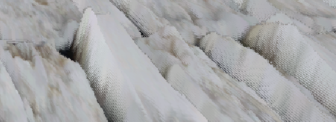

# Shader

## 渲染管线

渲染分为3个阶段 应用阶段 几何阶段 光栅化阶段 

 顶点数据->顶点着色器->曲面细分->几何处理->裁剪->屏幕映射->三角形设置->三角形遍历->片元着色器->逐片元操作->打印屏幕图像

空间变换：模型空间->世界空间->观察空间->裁剪空间->屏幕空间

> 应用阶段：由CPU处理。把视野外的物体剔除掉,然后设置要渲染的状态（材质纹理、纹理、Shader等），然后把图元（点、线、三角面）装载到显存。
>
> 几何阶段：由GPU处理。处理传来的顶点和三角面。这个阶段重要任务就是把模型坐标转换到屏幕坐标。这一阶段会输出屏幕空间的二维顶点坐标、顶点的深度值、颜色等相关属性。
>
> 光栅化阶段：由GPU处理。图元所包含的像素进行处理。然后哪些像素要被输出到屏幕上。


> 顶点着色器：可完全编程。最主要的是把模型空间的位置转换到裁剪空间。同时处理顶点颜色。
>
> 曲面细分：可完全编程。这个阶段细分图元用的。比如实现LOD效果，加顶点实现更细节的动画，用低模加细分在运行的时候实现高模效果。
>
> 几何着色器。是完全可编程的。在顶点着色器阶段我们不能得知顶点和顶点的关系，但是在几何着色器可以。几何着色器主要是添加或者减少图元。


 

**HDR和SDR的区别**

> 概念不同，HDR是指高动态范围图像，SDR是指标准动态范围图像；||亮度范围表现不同，HDR比SDR有更大更亮的数据存储；||图像细节表现不同，HDR技术可以在使图像在明暗之间获取更多的细节表现。

### 着色器


内联函数：

``` 内联函数
inline Type Name(xxx){
	xxx
}
用于被频繁调用的函数时，防止函数频繁入栈，造成性能浪费。
```


#### 顶点片元着色器

代码模板:
```
 Shader "Hidden/ShaderTemplate"
 {
   //Hidden 表示此Shader 无法在面板中找到 比如最常见的粉红色ErrorShader 
Properties
   {
     _MainTex ("Texture", 2D) = "white" {}
     _Color ("Color Tint",Color) = (1,1,1,1)
     _Range ("Range",Range(0,10)) = 5
     _Float ("Float",Float) = 4
     _Int ("Int",Int) = 10
     _Vector("Vector",Vector) = (1,2,3,4)
     _Cube ("Cube",Cube) = "white"{}
     _3D ("3D",3D) = "black"{}
   }
```

//Unity 会扫描所有SubShader语义块，选择第一个可以再目标平台运行的SubShader,假设都不支持，那么会调用Fallback

```   SubShader
   {
     //subShader中指定的状态会应用到所有pass
     //SubShader Tags 列表如下 标签设置与Pass中不一样，但语法一致


Tags{"Queue" = "Transparent" "RenderType" = "Opaque"} //多Tags 写法
     //Queue 控制渲染顺序，指定渲染队列
     //Queue 选项如下
     //Background 队列索引号 1000 最先渲染
     //Geometry  队列索引号 2000 默认渲染队列，不透明物体使用这个队列
     //AlphaTest 队列索引号 2450 需要透明度测试的使用这个队列 
     //Transparent队列索引号 3000 任何使用了透明度混合（例如关闭了深度写入的Shader）
     //Overlay  队列索引号 4000 可实现叠加效果 任何在需要在最后渲染的物体都需要使用该队列

//RenderType 对着色器进行分类 可以用于着色器替换功能
     //RenderType 选项如下
     //Opaque 渲染不透明物体时使用
     //Transparnet 渲染透明物体使用

//DisableBatching 指明是否对该SubShader使用批处理 true | false

//ForceNoShadowCasting 该SubShader 是否会投射阴影 true | false

//IgnoreProjector 是否忽略阴影 true | false 

//CanUseSpriteAtlas 当该SubShader 是用于Sprites 时， 将该标签设为false

//PreviewType 指明材质面板如何预览该材质 默认情况下，材质将显示为一个球形 Plane | SkyBox

//[RenderSetUp]
     //设置剔除模式 Back 背面 Front正面 Off关闭
     Cull Off 

//设置深度测试时 使用的函数
     //Less Greater | LEqual | GEqual | Equal | NotEqual | Always
     ZTest Less Greater

//深度写入 On | Off 打开 | 关闭
     ZWrite On

//混合 开启并设置
     Blend SrcAlpha OneMinusSrcAlpha
     //Blend 混合选项
     //Blend Off 关闭混合
     //Blend SrcFactor DstFactor 开启混合并设置混合因子 最终颜色 = 源颜色（该片元产生的颜色）* SrcFactor + 目标颜色（已经存在与颜色缓冲区的颜色）* DstFactor
     //Blend SrcFactor DstFactor,ScrFactorA DstFactorA 与上面一致，只是Alpha通道使用不同的因子来混合
     //BlendOp BlendOperation 混合操作命令

//混合因子
     //One    因子为1
     //Zero   因子为0
     //SrcColor 因子为源颜色值 混合RGB时 以源颜色RGB分量为因子 混合A时 以源颜色A分量为因子
     //SrcAlpha 因子为源颜色的Alpha值
     //DstColor 因子为目标颜色值
     //DstAlpha 因子为目标颜色值的Alpha值
     //OneMinusSrcColor 因子为 1-源颜色值
     //OneMinusSrcAlpha 因子为 1-源颜色值Alpha分量
     //OneMinusDstColor 因子为 1-目标颜色值
     //OneMinusDstAlpha 因子为 1-目标颜色值Alpha分量
     

//混合操作命令
     //Add    混合后 源颜色 + 目标颜色
     //Sub    混合后 源颜色 - 目标颜色
     //RevSub  混合后 目标颜色 - 源颜色
     //Min    RGBA分量 在源颜色值与目标颜色值中取最小值 （会忽略混合因子）
     //Max    RGBA分量 在源颜色值与目标颜色值中取最大值 （会忽略混合因子）

//每个Pass定义了一个完成的渲染流程 SubShader中的Pass 会按顺序全部执行
     Pass
     {
       Name "TemplatePass" //定义Pass名称 可以使用UsePass 直接使用其他UnityShader中的Pass
       UsePass "ShaderTemplate/TemplatePass" //使用其他UnityShader中的Pass

Tags{"LightMode" = "ForwordBase"}
       //Pass中的Tags 选项如下
       //LightMode 选项列表
       //ForwardBase  前向渲染 该Pass会计算环境光，平行光，逐顶点/SH光源 和 LightMaps
       //Always    不管使用哪种渲染路径，该Pass总是会被渲染，但不计算任何光照
       //ForwardAdd  前向渲染 该Pass会计算额外的逐像素光照，每个Pass对应一个光源
       //Deferred   用于延迟渲染 该Pass会渲染G缓冲
       //ShadowCaster 把物体的深度信息渲染到阴影映射纹理Shadowmap 或 一张深度纹理中
       //PrepassBase  遗留的延迟渲染 该Pass会渲染法线和高光反射的指数部分
       //PrepassFinal 遗留的延迟渲染 该Pass通过合并纹理，光照和自发光来渲染得到最后的颜色
       

       //RequireOptions 用于指定当满足某些条件时才渲染该Pass 目前只支持 SoftVegetation

CGPROGRAM // Cg/HLSL 代码段
       \#pragma vertex vert //编译指令指明顶点着色器代码
       \#pragma fragment frag //指明片元着色器代码
       
       \#include "UnityCG.cginc" //引入unity 内置文件

//Shader中使用属性 我们需要在CG代码中定义一个与属性名称和类型都匹配的变量
       sampler2D _MainTex;
       float4 _MainTex_ST;
       fixed4 _Color;
       half _Range;
       float _Float;
       int _Int;
       float4 _Vector;
       samplerCube _Cube;
       sampler3D _3D;

//浮点类型总结
       //float   32位高精度浮点
       //half   16位中精度浮点 范围[-6w,+6w] 精确到十进制后3.3位
       //fixed   11位低精度浮点 范围[-2,+2] 精度1/256 适用颜色和单位向量使用

struct a2v //应用阶段数据来源 Render -> UnityShader application to vertex
       {
         float4 vertex : POSITION;
         float2 uv : TEXCOORD0;
       };

//语义大全
       //POSITION 用模型空间的顶点坐标填充
       //TANGENT  用模型空间的切线方向填充
       //NORMAL  用模型空间的法线方向填充
       //TEXCOORD0 用模型空间的第一套纹理坐标来填充（一个材质可以有多张贴图）
       //TEXCOORD1 用模型空间的第二套纹理坐标来填充
       //TEXCOORD2 用模型空间的第三套纹理坐标来填充
       //TEXCOORD3 用模型空间的第四套纹理坐标来填充
       //COLOR0  用与储存颜色信息（可自定义）

//SV_ 表示系统数值语义 System-Value
       //SV_POSITION 顶点着色器的输出裁剪空间中的顶点坐标 顶点着色器最重要的事情就是把顶点坐标从模型空间转换到裁剪空间
       //SV_Target  接受用户输出颜色，输入到默认的帧缓存中

//此结构定义顶点着色器的输出 vertex to frag
       struct v2f 
       {
         float2 uv : TEXCOORD0;
         float4 vertex : SV_POSITION;
       };

//顶点着色器代码
       v2f vert (a2v v)
       {
         v2f o;
         o.vertex = UnityObjectToClipPos(v.vertex); //顶点的MVP 变换 模型-观察-投影矩阵
         o.uv = v.uv;
         return o;
       }
       
       
       //片元着色器代码
       fixed4 frag (v2f i) : SV_Target
       {
         fixed4 col = tex2D(_MainTex, i.uv); //通过UV坐标对主纹理进行采样
         // just invert the colors
         col = 1 - col;
         return col;
       }
       ENDCG
     }
   }

Fallback "VertexLit" //最后一条后路 SubShader全不支持 运行指定的Shader 可以关闭Fallback Off
 }
```

#### 细分着色器

1. TESS Control  Shader （D3D11 叫Hull shader），简称TCS。

> 细分控制着色器，输入Patch，一个Patch可以看成多个顶点的集合，包括坐标、颜色、纹理坐标等等
>
> 输出Patch ， gl_TessLevelOuter ， gl_TessLevelInner，后两者用于存储**把三角形的每条边分割成几段以及内部怎么继续分割**的信息。
>
>  *使用TCS时，glBegin函数的参数必须是GL_PATCHES，而不是以前那种传统的图元（点，线，三角形等）。 glPatchParameteri可以指定每个Patch包含几个顶点。在VS与TCS直接有个图元装配的过程，它就是把VS输出的顶点封装一个Patch，然后传给TCS。

```
#pragma hull hs

UnityTessellationFactors hsconst (InputPatch<InternalTessInterp_appdata,3> v) {
    UnityTessellationFactors o;
    //主要计算的数据，为float4类型，xyz为Tessellation factor，z为Inside Tessellation factor，详见下方标绿代码
    float4 tf;
    tf = float4(4.0f,4.0f,4.0f,4.0f);
    o.edge[0] = tf.x; 
    o.edge[1] = tf.y; 
    o.edge[2] = tf.z; 
    o.inside = tf.w;
    return o;
}
[UNITY_domain("tri")]
//指明输入hull shader的图元是三角形
[UNITY_partitioning("fractional_odd")]
//2.决定浮点数的舍入规则，本代码fractional_odd意为factor截断在[1,max]范围内，
[UNITY_outputtopology("triangle_cw")]
//决定图元的朝向，由组成三角形的三个顶点的顺序所产生的方向决定，cw为clockwise顺时针，ccw为counter clockwise逆时针。
[UNITY_patchconstantfunc("hsconst")]
//1.定义声明，用于指明计算factor的方法，然后在"hsconst"中计算每个边的细分数据
[UNITY_outputcontrolpoints(3)]
//指明输出Patch的定点数量
InternalTessInterp_appdata hs (InputPatch<InternalTessInterp_appdata,3> v, 
uint id : SV_OutputControlPointID) {
    return v[id];
}

#ifdef UNITY_CAN_COMPILE_TESSELLATION
struct UnityTessellationFactors {
    float edge[3] : SV_TessFactor;
    float inside : SV_InsideTessFactor;
};
#endif
```


**参数用法**：

> Tessellation factor = x 即该边出现(x-1)个细分点，被细分为x段。
>
> Inside Tessellation factor = x 若x为偶数则本三角中心出现一个细分三角，反之则无.
>
> [UNITY_patchconstantfunc("hsconst")]定义声明好了，Tessellation factor确定后，由于是float，所以下一步需要决定如何对factor进行舍入。
>
> [UNITY_partitioning("fractional_odd")]决定浮点数的舍入规则，fractional_odd、equal_spacing、even_spacing
>
> 在hull shader根据UnityTessellationFactors进行细分后，每个细分顶点都会有一个SV_DomainLacation，一组重心坐标。


2. TESS Evaluation Shader （D3D叫Domain shader），简称TES

> 输入：一系列顶点
>
> 下面的代码用于说明输入的信息，这一段表示输入三角形，每个TES程序都有它
>
> layout( triangles, fractional_odd_spacing, ccw ) in;
>
> 输出：一系列顶点
>
> TCS->TES之间有个过程叫Tessellation Primitive Generator（简称TGP），用于**将TCS输出的Patch转换成若干三角形**，TES后有一个图元装配的过程，可以把"一系列顶点"转换成图元。

```
#pragma domain ds
[UNITY_domain("tri")]//指明输入的数据使用SV_DomainLocation的类型，不同类型的图元使用不同长度的向量
v2f ds (UnityTessellationFactors tessFactors, const OutputPatch<InternalTessInterp_appdata,3> vi, float3 bary : SV_DomainLocation) {
appdata v;

v.vertex = vi[0].vertex*bary.x + vi[1].vertex*bary.y + vi[2].vertex*bary.z;
v.tangent = vi[0].tangent*bary.x + vi[1].tangent*bary.y + vi[2].tangent*bary.z;
v.normal = vi[0].normal*bary.x + vi[1].normal*bary.y + vi[2].normal*bary.z;
v.texcoord = vi[0].texcoord*bary.x + vi[1].texcoord*bary.y + vi[2].texcoord*bary.z;

v2f o = vert (v);
return o;
}


SV_DomainLocation
Type	Input Topology
float2	quad patch	//xy坐标
float3	tri patch	//重心坐标
float2	isoline		//xy坐标

SV_TessFactor		//边，周长
Type	Input Topology
float[4]	quad patch	//四边形
float[3]	tri patch	//三角形
float[2]	isoline		//线段

SV_InsideTessFactor		//内部
Type	Input Topology
float[2]	quad patch
float	tri patch
unused	isoline
```

三角形图元定位是由xy坐标与float3类型的重心坐标定位的，根据重心坐标可以顶点的数据进行重新定位，例如三角形细分顶点的位置的算法如下：

 v.vertex = vi[0].vertex*bary.x + vi[1].vertex*bary.y + vi[2].vertex*bary.z;

最后空间转换到裁剪空间，就可以输出到片元着色器。


*表面着色器中使用曲面细分着色器

```
Shader "Custom/Phong_固定曲面细分"
{
    Properties
    {
        
        _MainTex ("Albedo (RGB)", 2D) = "white" {}
        _Tessellation("Tessellation",Range(1,32))=1
        _Phong("Phong_Tessellation",Range(0,1))=0.2
    }
    SubShader
    {
        CGPROGRAM
        #include "Tessellation.cginc"
        half _Tessellation;
        fixed _Phong;
        //声明曲面细分函数  和Phong 细分编译指令
        #pragma surface surf Lambert tessellate:tessellation tessphong:_Phong

        float4 tessellation()
        {
            return _Tessellation;
        }
        struct Input 
        {
            float2 uv_MainTex;
            float2 uv_NormalMap;
        };

        sampler2D _MainTex;
        
        // 表面函数
        void surf(Input IN,inout SurfaceOutput o) 
        {
            o.Albedo=tex2D(_MainTex,IN.uv_MainTex).rgb;//根据lambert 模型需要输出的结构体，设置里面的值
        }
        ENDCG

    }
    FallBack "Diffuse"
}

```


#### 几何着色器

Geometry Shader ，简称GS

输入：一个图元

输出：一个或多个图元

layout( triangles ) in;//输入的图元是三角形，如果实际输入的不是三角形，则GS不会被调用。

layout( triangle_strip, max_vertices = 3 ) out;//输出一个三角形带

在三维空间中，一个图元指的是构成一个3D实体的顶点集合。例如空间中的一个点对应一个顶点，一条线段对应两个顶点，一个三角形对应三个顶点，这些都是图元。


如果图元类型为Point List，则每个顶点都被单独的作为一个点被绘制出来（效果图和上图一样），可以用它来模拟天空中的星星或者绘制由点构成的虚线等。


如果图元类型为Line List或者Line Strip，则每两个顶点构成一个线段图元。它们的区别在于，如果是Line List，这些线段都是独立的，而Line Strip的线段都是互相连接的（如下图）。Line List可以用来实现场景中雨水的效果，而Line Strip可以用来绘制非闭合的多边形。


#### 属性修饰符一览

```
Properties
    {
        _MainTex ("Texture", 2D) = "white" {}
                                                   
        [Header(Custom)]
        [Enum(CustomEnum)]  _CustomEnum ("CustomEnum", Float) = 1

        [Header(Option)]
        [Enum(UnityEngine.Rendering.BlendOp)]  _BlendOp  ("BlendOp", Float) = 0
        [Enum(UnityEngine.Rendering.BlendMode)] _SrcBlend ("SrcBlend", Float) = 1
        [Enum(UnityEngine.Rendering.BlendMode)] _DstBlend ("DstBlend", Float) = 0
        [Enum(Off, 0, On, 1)]_ZWriteMode ("ZWriteMode", float) = 1
        [Enum(UnityEngine.Rendering.CullMode)]_CullMode ("CullMode", float) = 2
        [Enum(UnityEngine.Rendering.CompareFunction)]_ZTestMode ("ZTestMode", Float) = 4
        [Enum(UnityEngine.Rendering.ColorWriteMask)]_ColorMask ("ColorMask", Float) = 15

        [Header(Stencil)]
        [Enum(UnityEngine.Rendering.CompareFunction)]_StencilComp ("Stencil Comparison", Float) = 8
        [IntRange]_StencilWriteMask ("Stencil Write Mask", Range(0,255)) = 255
        [IntRange]_StencilReadMask ("Stencil Read Mask", Range(0,255)) = 255
        [IntRange]_Stencil ("Stencil ID", Range(0,255)) = 0
        [Enum(UnityEngine.Rendering.StencilOp)]_StencilPass ("Stencil Pass", Float) = 0
        [Enum(UnityEngine.Rendering.StencilOp)]_StencilFail ("Stencil Fail", Float) = 0
        [Enum(UnityEngine.Rendering.StencilOp)]_StencilZFail ("Stencil ZFail", Float) = 0
    }

```

 

[HideInInspector] - 不在材质检视面板中显示属性值。

  [NoScaleOffset] - 对于具有此特性的纹理属性，材质检视面板不会显示纹理平铺/偏移字段。

   [Normal] - 表示纹理属性需要法线贴图。

  [HDR] - 表示纹理属性需要高动态范围 (HDR) 纹理。

   [Gamma] - 表示在 UI 中将浮点/矢量属性指定为 sRGB 值（就像颜色一样），并且可能需要根据使用的颜色空间进行转换。请参阅着色器程序中的属性。

   [PerRendererData] - 表示纹理属性将以 MaterialPropertyBlock 的形式来自每渲染器数据。材质检视面板会更改这些属性的纹理字段 UI。

  [MainTexture] - 表示一个属性 (property) 是材质的主纹理。默认情况下，Unity 将属性 (property) 名称为 _MainTex 的纹理视为主纹理。如果您的纹理具有其他属性 (property) 名称，但您希望 Unity 将这个纹理视为主纹理，请使用此属性 (attribute)。如果您多次使用此属性 (attribute)，则 Unity 会使用第一个属性 (property)，而忽略后续属性 (property)。

  [MainColor] - 表示一个属性 (property) 是材质的主色。默认情况下，Unity 将属性 (property) 名称为 _Color 的颜色视为主色。如果您的颜色具有其他属性 (property) 名称，但您希望 Unity 将这个颜色视为主色，请使用此属性 (attribute)。如果您多次使用此属性 (attribute)，则 Unity 会使用第一个属性 (property)，而忽略后续属性 (property)。

 [Toggle] - 是与否

 [Main(test)] 、[Sub(test)] - 主属性与子属性，目前没发现具体用途


#### 混合模式

**混合命令**

//关闭混合（默认）
 Blend Off 

 //片元产生的颜色乘以SrcFactor，加上屏幕上已有的颜色乘以DstFactor，得到最终的颜色（写入颜色缓存）
 Blend SrcFactor DstFactor

//同上，只不过使用单独的因子SrcFactorA和DstFactorA来混合透明度通道
 Blend SrcFactor DstFactor, SrcFactorA DstFactorA

//用其他的操作来取代加法混合。
 BlendOp BlendOperation

//同上，只不过对于透明度通道使用不同的操作。
 BlendOp OpColor, OpAlpha
 注：此外还有AlphaToMask On命令


**常见混合公式**

Blend SrcAlpha OneMinusSrcAlpha // 传统透明度
 Blend One OneMinusSrcAlpha // 预乘透明度
 Blend One One // 叠加
 Blend OneMinusDstColor One // 柔和叠加
 Blend DstColor Zero // 相乘——正片叠底
 Blend DstColor SrcColor // 两倍相乘

当然，相乘/正片叠底的混合命令写成：
 Blend Zero SrcColor
 也是合情合理合法的。

最后，我们还可以扩展一下：
 参考百度百科滤色，我们知道，滤色的公式是：
 结果色=255－[（255－基色）×（255－混合色）]/255
 对应于[0,1]范围内也就是
 FinalColor=1-(1-Dst)*(1-Src)
 也就是
 Dst+Src-Dst*Src
 也就是
 Src*1+Dst*(1-Src)
 或者
 Src*(1-Dst)+Dst*1
 所以滤色的混合命令我们可以写成下面两种：
 Blend OneMinusDstColor One
 Blend One OneMinusSrcColor 


**混合因子**

One  混合因子1，表示完全的源颜色或目标颜色
 Zero 混合因子0，舍弃掉源颜色或目标颜色
 SrcColor  源颜色值
 SrcAlpha 源透明度
 DstColor 目标颜色值
 DstAlpha 目标透明度
 OneMinusSrcColor // 1-SrcColor
 OneMinusSrcAlpha // 1-SrcAlpha
 OneMinusDstColor // 1-DstColor
 OneMinusDstAlpha // 1-DstAlpha


#### 色彩空间

线性空间（Linear Space）

线性空间中的数值是表述物理世界中的亮度变化的值，是一个正比例函数。

 

线性空间就能展示真实世界的色彩表现，为什么还要其他色彩空间呢？

根据韦伯定律：人对自然界刺激的感知，是非线性的。


对人类目测结果，色条1的亮度过渡更柔和更接近线性，其实色条1在50%的位置的亮度值为20%-25%，色条2才是真实世界的线性过渡。

 

伽马空间（Gamma Space）


伽马矫正，当Gamma=1.0时即为线性空间。

1996年，微软和惠普发布了sRGB色彩空间作为行业标准。

sRGB色彩空间就是伽马空间Gamma0.45，旨在从色彩层面做一次矫正工作，避免程序做重复工作。


**Shader里的计算均为线性计算**，须在线性空间下进行。

大部分颜色贴图是sRGB空间输出，是非线性的。

采样贴图需在计算前后做一些变换，统一到同一空间下进行。

因此一般色彩空间转换流程：

1. 输入一张贴图，若为sRGB色彩空间，需要先转换至线性空间，unity中勾选sRGB选项即可自动转换；
2. 确保shader中的色彩计算均处于线性空间即可进行运算；
3. 当我们计算完所有的颜色，即将输出时。进行伽马校正，将色彩空间转换为Gamma0.45空间。
4. 输出到屏幕上，屏幕会有一个自己2.2幂的运算，和上一步的(1/2.2幂)相互相乘，最终呈现Gamma=1.0的正确输出。


#### 模板测试

片元着色器到帧缓冲区的过程中，

PixelOwnership Test 屏幕像素测试，用于决定屏幕像素使用权限

-->Scissor Test裁剪测试，用于决定 在屏幕像素权限内，再次决定渲染的部分，一般为全部

-->Alpha Test透明度测试，剔除α小于0.5的片元

-->Stencil Test模板测试

-->Depth Test深度测试

 

帧缓冲区有许多缓冲区构成，这些缓冲区大致分为： 

颜色缓冲区：用于绘图的缓冲区，它包含了颜色索引或者RGBA颜色数据。 

深度缓冲区：存储每个像素的深度值，当启动深度测试时，片段像素深度值和深度缓冲区深度值进行比较，决定片段哪些像素点数据可以替换到颜色缓冲区中。 

模板缓冲区：为每一个屏幕上的像素点保存一个无符号整数值（通常为8位二进制数），就像使用纸板和喷漆一样精确的混图一样，当启动 [模板测试](http://www.blogjava.net/qileilove/archive/2014/01/23/409269.html)时，通过模板测试的片段像素点会被替换到颜色缓冲区中，从而显示出来，未通过的则不会保存到颜色缓冲区中，从而达到了过滤的功能。

累积缓冲区：累积缓冲区允许你把渲染到颜色缓冲区的值，拷贝到累积缓冲区。在多次拷贝操作到累积缓冲区时，可以用不同方式的把颜色缓冲区内容和当前累积缓冲区的内容进行重复混合

 ```
 Stencil
 
 {
 
     Ref Value//用于比较的值
 
     ReadMask readMask
 
     WriteMask writeMask
 
     Comp comparsionFunction//比较的方式
 
     Pass stencilOperation//如果通过了测试 默认keep
 
     Fail stencilOperation//如果未通过
 
     ZFail stencilOperation//模板测试通过但深度测试未通过
 
 }
 ```

Stencil的所有参数如下

 

Ref 就是参考值，当参数允许赋值时，会把参考值赋给当前像素

ReadMask 对当前参考值和已有值进行mask操作，默认值255，一般不用

WriteMask 写入Mask操作，默认值255，一般不用

Comp 比较方法。是拿Ref参考值和当前像素缓存上的值进行比较。默认值always

 


 

按照解释，遮挡和被遮挡物体的参考值都设置为1

然后先渲染遮挡物体，再渲染被遮挡物体（渲染顺序由"RenderType" 决定，代表的数值越小越在前）


#### 渲染模式

1.前向渲染

前向渲染中，按顺序渲染物体，每个物体分别遍历计算光照，每渲染一盏光都要重复计算顶点、法线、uv等等数据，而且即使一些光源对物体影响很小，依然会加入计算，在多光源场景下性能表现会很差。


2.延迟渲染

用于解决大量光照的渲染，第一个Pass会先做一个整体的无光渲染，将模型数据写入缓存，第二个Pass中则遍历四个G-Buffer，计算出光照后统一贴在Base Pass计算出的结果上。这种做法就是典型的空间换时间，增加了显存消耗。同时因为渲染顺序的原因，延迟渲染中透明物体处理需要特殊的方案。


延迟渲染中，几何数据被存储的位置被称为几何缓冲区，即G-Buffer。

延迟着色需要四个 G 缓冲区。它们的组合大小为 LDR 每像素 160 位，HDR 为 192 位/像素。这比单个 32 位帧缓冲区要多得多。现代台式机 GPU 带宽完全足够，但移动甚至笔记本电脑 GPU 在高分辨率的时候带宽很难满足，因此延迟渲染难以运用进移动渲染设备。

```
Shader "XT/UnlitDeferredShading"
{
    Properties
    {
        _MainTex("main tex",2D)="white"{}
        _Diffuse("diffuse",Color) = (1,1,1,1)
        _Specular("specular",Color) = (1,1,1,1)
        _Gloss("gloss",Range(1,50)) = 20
    }
        SubShader
    {
        Tags { "RenderType" = "Opaque" }

        Pass
        {
            Tags{"LightMode" = "Deferred"}
            CGPROGRAM

            #include"UnityCG.cginc"

            #pragma target 3.0
            #pragma vertex vert
            #pragma fragment frag
            //排除不支持MRT的硬件
            //#pragma exclude_renderers norm
            #pragma multi_compile __ UNITY_HDR_ON

            sampler2D _MainTex;
            float4 _MainTex_ST;
            float4 _Diffuse;
            float4 _Specular;
            float _Gloss;

            struct appdata
            {
                float4 vertex:POSITION;
                float3 normal:NORMAL;
                float2 uv:TEXCOORD0;
            };

            struct v2f
            {
                float4 vertex:SV_POSITION;
                float2 uv : TEXCOORD0;
                float3 worldPos:TEXCOORD1;
                float3 worldNormal:TEXCOORD2;
            };

            struct DeferredOutput
            {
                float4 gBuffer0:SV_TARGET0;
                float4 gBuffer1:SV_TARGET1;
                float4 gBuffer2:SV_TARGET2;
                float4 gBuffer3:SV_TARGET3;
            };

            v2f vert(appdata v)
            {
                v2f o;
                o.vertex = UnityObjectToClipPos(v.vertex);
                o.uv = TRANSFORM_TEX(v.uv, _MainTex);
                o.worldPos = mul(unity_ObjectToWorld, v.vertex).xyz;
                o.worldNormal = UnityObjectToWorldNormal(v.normal);
                return o;
            }

            DeferredOutput frag(v2f i)
            {
                DeferredOutput o;
                fixed3 color = tex2D(_MainTex, i.uv).rgb*_Diffuse.rgb;
                o.gBuffer0.rgb = color;
                o.gBuffer0.a = 1;
                o.gBuffer1.rgb = _Specular.rgb;
                o.gBuffer1.a = _Gloss/50;
                o.gBuffer2 = float4(i.worldNormal*0.5+0.5, 1);
                #if !defined(UNITY_HDR_ON)
                    color.rgb = exp2(-color.rgb);
                #endif
                o.gBuffer3 = fixed4(color, 1);
                return o;
            }
            ENDCG
        }
    }
}
```


#### 计算着色器

计算着色器是一个特殊的GPU程序，并不在渲染流水线中，一般用于进行大量的并行运算，可以直接访问显存中的资源，广泛应用于机器学习、仿真计算、图形渲染等计算机领域。


```
#pragma kernel CSMain

//定义入口函数

 

RWTexture2D<float4> Result;

//定义一个可读写的2D纹理

 

[numthreads(tx,ty,tz)]

//定义一个线程组中可被执行线程的总数量

//tx*ty*tz即为所有线程总数量

 
/*SV_DispatchThreadID：
id值按照tx,ty,tz大小依次排列，比如[numthreads(8,8,2)]中，
第1个SV_GroupThreadID为：(0,0,0)
第2个SV_GroupThreadID为：(1,0,0)
第9个SV_GroupThreadID为：(0,1,0)
第64个SV_GroupThreadID为：(7,7,0)
第65个SV_GroupThreadID为：(0,0,1)*/

void CSMain (uint3 id : SV_DispatchThreadID)

{

	Result[id.xy] = float4(id.x & id.y, (id.x & 15)/15.0, (id.y & 15)/15.0, 0.0);
/*使用输入的id参数来计算每个像素的颜色，并将结果写入到Result纹理中。具体来说，它使用id.x和id.y的按位与操作来生成纹理的红色通道，使用id.x和15的按位与操作除以15来生成纹理的绿色通道，使用id.y和15的按位与操作除以15来生成纹理的蓝色通道。最后，将alpha通道设置为0.0。*/
}
```


线程组：

线程组（ThreadGroup）就是由线程组成的管理线程的类。

在GPU编程中，我们可以将所有要执行的线程划分成一个个线程组，一个线程组在单个流多处理器（Stream Multiprocessor，简称SM）上被执行。如果我们的GPU架构有16个SM，那么至少需要16个线程组来保证所有SM有事可做。为了更好的利用GPU，每个SM至少需要两个线程组，因为SM可以切换到处理不同组中的线程来隐藏线程阻塞（如果着色器需要等待Texture处理的结果才能继续执行下一条指令，就会出现阻塞）。

每个线程组都有一个各自的共享内存（Shared Memory），该组中的所有线程都可以访问该组对应的共享内存，但是不能访问别的组对应的共享内存。因此线程同步操作可以在线程组中的线程之间进行，不同的线程组则不能进行同步操作。


在Direct3D12中，可以通过ID3D12GraphicsCommandList::Dispatch(gX,gY,gZ)方法创建gX*gY*gZ个线程组。注意顺序，先numthreads定义好每个核函数对应线程组里线程的数量（tX*tY*tZ），再用Dispatch定义用多少线程组(gX*gY*gZ)来处理这个核函数。


#### 着色器变体

为什么使用变体？

使用Shader变体的意义在于优化和灵活性。Shader变体是在不同平台、不同硬件和不同配置下的Shader的不同版本、不同效果，我们希望通过少量的shader文件实现不同的效果。通过使用Shader变体，可以根据运行平台的不同，选择最适合的Shader版本，以提高性能和兼容性。

使用Shader变体可以根据硬件的不同，选择合适的渲染路径和特性。例如，在移动设备上，可以选择使用较低的分辨率、减少复杂度的Shader变体，以提高性能和节省电量。而在高性能PC上，可以选择使用更高质量的Shader变体，以获得更好的视觉效果。

此外，使用Shader变体还可以根据不同的配置需求，进行定制化的渲染。例如，在不同的光照条件下，可以选择使用不同的Shader变体来处理阴影效果。通过使用Shader变体，可以灵活地适应不同的场景需求，提供更好的渲染效果。

**静态分支：#if**


**2.变体分支**


1. 定义方式

  定义方式中值得注意的是，#pragma shader_feature A其实是 #pragma shader_feature _ A的简写，下划线表示未定义宏(nokeyword)。因此此时shader其实对应了两个变体，一个是nokeyword，一个是定义了宏A的。

  而#pragma multi_compile A并不存在简写这一说，所以shader此时只对应A这个变体。若要表示未定义任何变体，则应写为 #pragma multi_compile _ A。


2. 宏的适用范围

  两种定义方式可以使用在任何shader中，只是各自有一些建议使用情况。

  multi_compile定义的宏，如#pragma multi_compile_fog，#pragma multi_compile_fwdbase等，基本上适用于大部分shader，与shader自身所带的属性无关。

  shader_feature定义的宏多用于针对shader自身的属性。比如shader中有_NormalMap这个属性(Property)，便可通过#pragma shader_feature _NormalMap来定义宏，用来实现这个shader在material有无_NormalMap时可进行不同的处理。


3. 变体的生成

  multi_compile会默认生成所有的变体，因此应当谨慎适用multi_compile，否则将会导致变体数量激增。如： #pragma multi_compile A B C #pragma multi_compile D E

  则此时会生成 A D、A E、B D、B E、C D、C E这6中变体。

  shader_feature要生成何种变体可用shader variant collection进行自定义设置。

 

4. 变体的debug

shader变体的缺失可能并不会导致Editor中效果显示异常，但打

包后则可能出现黑片或紫片，因此需要特殊方法来测试。

方法一：在editor模式下frameDebug 查看正常的表现shader的属性和使用编译情况（查看编译后的变体代码Show generated code）；

方法二：真机连接frameDebug调试核查表现失常的shader的属性中是否缺失属性例如：是谁偷走了我的lightmap？？ 没能切换使用正确的shaderVariant。

解决问题：首先确定 shaderVariant是否打包进去了（用bundle拆解工具 AssetStudio核查bundle内的信息），第二是否执行命令“切换到lightmap_on的shaderVariant”

(AssetStudio，软件在unity包文件夹)


 #### 着色器变体管理

由于Shader变体编译时排列组合的性质，在一套不进行变体管理的复杂Shader系统中很容易导致空间快速膨胀，可能会导致内存占用过大。


multi_compile建议用于声明可能实时切换的全局keyword声明组，例如阴影、全局雾效、雨、雪。因为一个物体可能在多个场景使用，材质也就会在多个场景用到，一个场景有雾，另一个场景有雨，而材质只能引用一组keyword组合，为了能实时切换，就需要把切换效果后的变体也打入包中；而对于材质静态的keyword声明组就可以用shader_feature，例如这个材质是否用到了NormalMap，是否有视差计算，这个在打包时就确定好的，运行时不会动态改变，即可声明为shader_feature。

  multi_compile_local适合解决打包时不确定变体，需要在运行时动态切换单个材质变体的需求，例如某些建筑、角色需要运行时溶解；溶解只针对当前角色的材质而不是全局的，需要Material.EnableKeyword，所以用local；并且需要溶解/未溶解的变体都被打入包中，所以需要声明为multi_compile在打包时排列组合，组合起来就是multi_compile_local。

#### URP Shader模板

```glsl
Shader "Custom/MyCustomURPShader"
{
    Properties
    {
        [MainTexture] _MainTex ("MainTexture", 2D) = "white" {}
        [MainColor]_MainColor ("Main Color", Color) = (1,1,1,1)
        _Metallic ("Metallic", Range(0, 1)) = 0
        _Smoothness ("Smoothness", Range(0, 1)) = 0.5

        // //Option Enum
        // [Header(Option)]
        // [Enum(UnityEngine.Rendering.BlendOp)]_BlendOp("BlendOp", Float) = 0.0
        // [Enum(UnityEngine.Rendering.BlendMode)]_SrcBlend("SrcBlend", Float) = 1.0
        // [Enum(UnityEngine.Rendering.BlendMode)]_DstBlend("DstBlend", Float) = 0.0
        // [Enum(UnityEngine.Rendering.BlendMode)]_SrcBlendAlpha("SrcBlendAlpha", Range(0, 1)) = 1.0
        // [Enum(UnityEngine.Rendering.BlendMode)]_DstBlendAlpha("DstBlendAlpha", Range(0, 1)) = 0.0
        // [Header(ZTest)]
        // [ToggleUI]_ZWrite("ZWrite", Float) = 1.0
        // [Enum(UnityEngine.Rendering.CompareFunction)]_ZTest("ZTest", Float) = 4.0
        // [ToggleUI]_ZClip("ZClip", Float) = 1.0
        // [Enum(UnityEngine.Rendering.CullMode)]_Cull("Cull", Float) = 2.0
        // [Header(Mask)]
        // //[Enum(UnityEngine.Rendering.ColorWriteMask)]_ColorMask("ColorMask", Float) = 15.0
        // //[ToggleUI]_AlphaToMask("AlphaToMask", Float) = 0.0

        // //Stencil enum
        // [Header(Stencil)]
        // [IntRange]_Stencil ("Stencil ID", Range(0,255)) = 0
        // [IntRange]_StencilWriteMask ("Stencil Write Mask", Range(0,255)) = 255
        // [IntRange]_StencilReadMask ("Stencil Read Mask", Range(0,255)) = 255
        // [Enum(UnityEngine.Rendering.CompareFunction)]_StencilComp("StencilComp", Float) = 0.0
        // [Enum(UnityEngine.Rendering.StencilOp)]_StencilOp("StencilOp", Float) = 0.0
        // [Enum(UnityEngine.Rendering.StencilOp)]_StencilOpFail("StencilOpFail", Float) = 0.0
        // [Enum(UnityEngine.Rendering.StencilOp)]_StencilOpZFail("StencilOpZFail", Float) = 0.0
        // [Enum(UnityEngine.Rendering.StencilOp)]_StencilOpZFailFront("StencilOpZFailFront", Float) = 0.0
        // [Enum(UnityEngine.Rendering.CompareFunction)]_StencilCompFront("StencilCompFront", Float) = 0.0
        // [Enum(UnityEngine.Rendering.StencilOp)]_StencilOpFront("StencilOpFront", Float) = 0.0
        // [Enum(UnityEngine.Rendering.CompareFunction)]_StencilCompBack("StencilCompBack", Float) = 0.0
        // [Enum(UnityEngine.Rendering.StencilOp)]_StencilOpBack("StencilOpBack", Float) = 0.0
        // [Enum(UnityEngine.Rendering.StencilOp)]_StencilOpZFailBack("StencilOpZFailBack", Float) = 0.0
        //[HideInInspector][NoScaleOffset]unity_Lightmaps("unity_Lightmaps", 2DArray) = "" {}
    }

    SubShader
    {
        Tags 
        { 
            "RenderPipeline"="UniversalPipeline"
            // "RenderType"="Background"
            "RenderType"="Opaque"
            // "RenderType"="Transparent"
            // "RenderType"="TransparentCutout"
            // "RenderType"="Overlay"

            //"Queue" = "Background"
            "Queue"="Geometry"
            //"Queue" = "AlphaTest"
            //"Queue" = "Transparent"
            //"Queue" = "TransparentCutout"
            //"Queue" = "Overlay"
            //"IgnoreProjector" = "True"
        }
        //LOD 100
        Pass
        {
            Tags
			{
				"LightMode"="UniversalForward"
			}

            // BlendOp [_BlendOp]
            // Blend [_SrcBlend][_DstBlend], [_SrcBlendAlpha][_DstBlendAlpha]
            // ZWrite [_ZWrite]
            // ZTest [_ZTest]
            // ZClip [_ZClip]
            // Cull [_Cull]
            // ColorMask [_ColorMask]
            // AlphaToMask [_AlphaToMask]

            // Stencil
            // {
            //     Ref [_Stencil]
            //     Comp [_StencilComp]
            //     ReadMask [_StencilReadMask]
            //     WriteMask [_StencilWriteMask]
            //     Pass [_StencilOp]
            //     Fail [_StencilOpFail]
            //     ZFail [_StencilOpZFail]
            //     ZFailFront [_StencilOpZFailFront]
            //     CompFront [_StencilCompFront]
            //     PassFront [_StencilOpFront]
            //     CompBack [_StencilCompBack]
            //     PassBack [_StencilOpBack]
            //     ZFailBack [_StencilOpZFailBack]
            // }

            //Geometry
            ZWrite On
            ZTest LEqual
            Cull Back

            ////Transparent
            //ZWrite Off
            //Blend SrcAlpha OneMinusSrcAlpha // 传统透明度
            //Blend One OneMinusSrcAlpha // 预乘透明度
            //Blend OneMinusDstColor One // 软加法
            //Blend DstColor Zero // 正片叠底（相乘）
            //Blend OneMinusDstColor One // 滤色 //柔和叠加（soft Additive）
            //Blend DstColor SrcColor // 2x相乘 (2X Multiply)
            //Blend One One // 线性减淡
            //BlendOp Min Blend One One //变暗
            //BlendOp Max Blend One One //变亮


            HLSLPROGRAM
            #pragma target 3.5
            #pragma vertex vert
            #pragma fragment frag

            #include "Packages/com.unity.render-pipelines.universal/ShaderLibrary/Core.hlsl"
            #include "Packages/com.unity.render-pipelines.universal/ShaderLibrary/Lighting.hlsl"

            //尽量对齐到float4,否则unity底层会自己填padding来对齐,会有空间浪费
            //Align to float4 as much as possible, otherwise the underlying Unity will fill in padding to align, which will waste space
            CBUFFER_START(UnityPerMaterial)
            half4 _MainColor;
            float _Metallic;
            float _Smoothness;
            float4 _MainTex_ST;
            CBUFFER_END


            ////GPU Instancing 和SRP Batcher冲突 根据需要确定是否开启
            ////GPU Installing and SRP Batcher conflict, determine whether to enable as needed
            // #pragma multi_compile_instancing
            // #include "Packages/com.unity.render-pipelines.core/ShaderLibrary/UnityInstancing.hlsl"
            
            // UNITY_INSTANCING_BUFFER_START(PerInstance)
            // //UNITY_DEFINE_INSTANCED_PROP(float4, _MainColor)
            // UNITY_INSTANCING_BUFFER_END(PerInstance)

            ////接收阴影关键字
            ////Receive shadow keywords
            // #pragma multi_compile _ _MAIN_LIGHT_SHADOWS
            // #pragma multi_compile _ _MAIN_LIGHT_SHADOWS_CASCADE
            // #pragma multi_compile _ _SHADOWS_SOFT

            
            struct Attributes
            {
                float4 positionOS : POSITION;
                float3 normalOS : NORMAL;
                float2 uv : TEXCOORD0;
                UNITY_VERTEX_INPUT_INSTANCE_ID
            };

            struct Varings
            {
                float4 positionCS : SV_POSITION;
                float2 uv : TEXCOORD0;
                float3 positionWS : TEXCOORD1;
                float3 normalWS : TEXCOORD2;
                float3 viewDirWS : TEXCOORD3;
                UNITY_VERTEX_INPUT_INSTANCE_ID
            };

            TEXTURE2D(_MainTex);
            SAMPLER(sampler_MainTex);

            Varings vert (Attributes IN)
            {
                Varings OUT;
                ////GPU Instancing
                // UNITY_SETUP_INSTANCE_ID(IN);
                // UNITY_TRANSFER_INSTANCE_ID(IN, OUT);
                
                VertexPositionInputs positionInputs = GetVertexPositionInputs(IN.positionOS.xyz);
                VertexNormalInputs normalInputs = GetVertexNormalInputs(IN.normalOS.xyz);
                //OUT.positionCS = TransformObjectToHClip(IN.positionOS);
                OUT.positionCS = positionInputs.positionCS;
                OUT.positionWS = positionInputs.positionWS;
                OUT.viewDirWS = GetCameraPositionWS() - positionInputs.positionWS;
                OUT.normalWS = normalInputs.normalWS;
                OUT.uv = TRANSFORM_TEX(IN.uv, _MainTex);
                return OUT;
            }

            half4 frag (Varings IN) : SV_Target
            {
                ////GPU Instancing
                //UNITY_SETUP_INSTANCE_ID(IN);
                //half4 mainColor = UNITY_ACCESS_INSTANCED_PROP(PerInstance, _MainColor);

                // light
                float4 shadowCoord = TransformWorldToShadowCoord(IN.positionWS.xyz);
                Light light = GetMainLight(shadowCoord);
                float3 lightDirWS = light.direction;
                float3 lightColor = light.color;
                float lightIntensity = light.distanceAttenuation;

                //采样纹理
                half4 texColor = SAMPLE_TEXTURE2D(_MainTex, sampler_MainTex, IN.uv);  
                // Diffuse lighting
                //half3 diffuse = LightingLambert(light.color, light.direction, IN.normalWS);
                float3 normal = normalize(IN.normalWS);
                float NdotL = saturate(dot(normal, lightDirWS));
                half3 diffuse = _MainColor.xyz * texColor.xyz *lightColor * NdotL;

                // Specular lighting (Blinn-Phong)
                //half3 specular = LightingSpecular(light.color, light.direction, normalize(IN.normalWS), normalize(IN.viewDirWS), _SpecularColor, _Smoothness);
                float metallic = _Metallic;
                float smoothness = _Smoothness;
                float3 viewDir = IN.viewDirWS;
                float3 halfDir = normalize(lightDirWS + viewDir);
                float NdotH = saturate(dot(normal, halfDir));
                float specularIntensity = pow(NdotH, smoothness * 100.0);
                half3 specular = lightColor * lightIntensity * specularIntensity * metallic;

                //逐顶点光源
                //half3 vertexLight = VertexLighting(vertexInput.positionWS, normalInput.normalWS);
                //逐像素光源
                // uint pixelLightCount = GetAdditionalLightsCount();
                // for (uint lightIndex = 0; lightIndex < pixelLightCount; ++lightIndex)
                // {
                //     Light light = GetAdditionalLight(lightIndex, IN.positionWS);
                //     diffuse += LightingLambert(light.color, light.direction, IN.normalWS);
                //     specular += LightingSpecular(light.color, light.direction, normalize(IN.normalWS), normalize(IN.viewDirWS), _SpecularColor, _Smoothness);
                // }
                
                // Shadow
                float shadow = light.shadowAttenuation;

                half4 finalColor = half4(diffuse + specular,texColor.a) * shadow;

                return finalColor;
            }
            ENDHLSL
        }

        //以下是对应的三个官方pass，自定义Shader不需要这么多变体，最好自己找地方再写一次
        //Here are the corresponding three official passes. Custom Shaders do not require so many variations, it is best to find a place to write them again
        // UsePass "Universal Render Pipeline/Lit/ShadowCaster"
        // UsePass "Universal Render Pipeline/Lit/depthOnly"
        // UsePass "Universal Render Pipeline/Lit/DepthNormals"

        //以下是这三个pass的官方代码，如果你需要自定义这些pass,你可以在这个基础上修改
        //Here are the official codes for these three passes. If you need to customize these passes, you can modify them based on this
        Pass
        {
            Name "ShadowCaster"
            Tags
            {
                "LightMode" = "ShadowCaster"
            }

            // -------------------------------------
            // Render State Commands
            ZWrite On
            ZTest LEqual
            ColorMask 0
            Cull Back

            HLSLPROGRAM
            #pragma target 3.5

            // -------------------------------------
            // Shader Stages
            #pragma vertex ShadowPassVertex
            #pragma fragment ShadowPassFragment

            // This is used during shadow map generation to differentiate between directional and punctual light shadows, as they use different formulas to apply Normal Bias
            #pragma multi_compile_vertex _ _CASTING_PUNCTUAL_LIGHT_SHADOW

            // -------------------------------------
            // Includes
            #include "Packages/com.unity.render-pipelines.universal/Shaders/SimpleLitInput.hlsl"
            #include "Packages/com.unity.render-pipelines.universal/Shaders/ShadowCasterPass.hlsl"
            ENDHLSL
        }
        Pass
        {
            Name "DepthOnly"
            Tags
            {
                "LightMode" = "DepthOnly"
            }

            // -------------------------------------
            // Render State Commands
            ZWrite On
            ColorMask R
            Cull Back

            HLSLPROGRAM
            #pragma target 3.5

            // -------------------------------------
            // Shader Stages
            #pragma vertex DepthOnlyVertex
            #pragma fragment DepthOnlyFragment
            // -------------------------------------
            // Includes
            #include "Packages/com.unity.render-pipelines.universal/Shaders/SimpleLitInput.hlsl"
            #include "Packages/com.unity.render-pipelines.universal/Shaders/DepthOnlyPass.hlsl"
            ENDHLSL
        }
        Pass
        {
            Name "DepthNormals"
            Tags
            {
                "LightMode" = "DepthNormals"
            }

            // -------------------------------------
            // Render State Commands
            ZWrite On
            Cull Back

            HLSLPROGRAM
            #pragma target 3.5
            // -------------------------------------
            // Shader Stages
            #pragma vertex DepthNormalsVertex
            #pragma fragment DepthNormalsFragment
            // -------------------------------------
            // Includes
            #include "Packages/com.unity.render-pipelines.universal/Shaders/SimpleLitInput.hlsl"
            #include "Packages/com.unity.render-pipelines.universal/Shaders/SimpleLitDepthNormalsPass.hlsl"
            ENDHLSL
        }
    }
    //使用官方的Diffuse作为FallBack会增加大量变体，可以考虑自定义
    //FallBack "Diffuse"
}
```


#### HDRP Shader模板

```glsl
Shader "HDRP/SimpleShader"
{
    Properties
    {
        _MainTex ("Texture", 2D) = "white" {}
    }

    SubShader
    {
        Tags
        {
            "RenderPipeline" = "HDRenderPipeline"
            "RenderType" = "Opaque"
            "Queue" = "Geometry"
        }

        Pass
        {
            Name "Forward"
            Tags { "LightMode" = "ForwardOnly" }

            HLSLPROGRAM
            #pragma target 4.5
            #pragma only_renderers d3d11 playstation xboxone xboxseries vulkan metal switch
            #pragma vertex vert
            #pragma fragment frag

            #include "Packages/com.unity.render-pipelines.core/ShaderLibrary/Common.hlsl"
            #include "Packages/com.unity.render-pipelines.high-definition/Runtime/ShaderLibrary/ShaderVariables.hlsl"

            struct appdata
            {
                float4 vertex : POSITION;
                float2 uv : TEXCOORD0;
            };

            struct v2f
            {
                float2 uv : TEXCOORD0;
                float4 positionCS : SV_POSITION;
            };

            TEXTURE2D(_MainTex);
            SAMPLER(sampler_MainTex);
            float4 _MainTex_ST;

            v2f vert(appdata v)
            {
                v2f o;
                o.positionCS = TransformObjectToHClip(v.vertex.xyz);
                o.uv = TRANSFORM_TEX(v.uv, _MainTex);
                return o;
            }

            float4 frag(v2f i) : SV_Target
            {
                return SAMPLE_TEXTURE2D(_MainTex, sampler_MainTex, i.uv);
            }
            ENDHLSL
        }
    }
}
```

# 小东西

```
half2 screenPos = i.positionCS.xy/_ScreenParams.xy;
```

## 具体效果

### 基础效果

#### 视差映射

<video src="video/视差映射.mp4"></video>

视差映射的核心思想是通过高度值，对目标像素进行高度位置计算与可见性测试

##### 1. Basic Parallax Mapping

最基础最简单的视差映射，将计算放在世界空间中计算，parallaxUV中计算偏移后的位置。

```glsl
float2 ParallaxMapping(float height, float2 uv, float3 viewDirTS, float2 offsetScale)
{
    height += offsetScale.x;
    height *= offsetScale.y;
    float2 parallaxUV = uv + height * viewDirTS.xy * rcp(viewDirTS.z);
    return parallaxUV;
}
half4 frag (v2f i) : SV_Target
{
    float height = SAMPLE_TEXTURE2D(_ParallaxMap, sampler_ParallaxMap, i.uv).z;
    float3 viewDirWS = GetWorldSpaceNormalizeViewDir(i.positionWS);
    float3 bitangent = i.tangentWS.w * cross(i.normalWS.xyz, i.tangentWS.xyz);
    float3x3 TBN = float3x3(i.tangentWS.xyz, bitangent.xyz, i.normalWS.xyz);
    
    float3 viewDirTS = TransformWorldToTangentDir(viewDirWS, TBN, true);
    float2 uv = ParallaxMapping(height, i.uv, viewDirTS, float2(_HeightOffset, _HeightScale));
    
    half4 col = tex2D(_MainTex, uv);
    return col;
}
```


优点：快捷简单性能好。

缺点：在掠角会失效，只能进行极小的便宜，偏移越大走样越严重，不能细看。


**Offset Limit Parallax Mapping**

为了改善掠角问题，Welsh提出了Offset Limit方案，限制偏移值的大小，即删掉“rcp(viewDirTS.z)”。


##### 2. Ray marching Parallax Mapping

光线步进视差映射


在对光线步进算法进行优化之前，我们先用最原始的固定步长进行迭代计算

值得一说的是本代码中使用了一个简单有效的优化技巧：根据dot(n,v)决定步长，可以让视觉焦点以外的地方减少步进数量，优化性能。

```glsl
float2 SteepParallaxMapping(TEXTURE2D_PARAM(heightMap, sampler_heightMap), float2 inddx, float2 inddy, int channel, float2 uv, float3 viewDirTS, float2 offsetScale, float slicesMin, float slicesMax)
{
    int slicesNum = ceil(lerp(slicesMax, slicesMin, abs(dot(float3(0, 0, 1), viewDirTS))));// 步数
    float deltaHeight = rcp(slicesNum);// 步长高度
    float2 deltaUV = offsetScale.y * viewDirTS.xy * rcp(viewDirTS.z * slicesNum);// 每次步进的UV偏移量
    float2 currUVOffset = -deltaUV;
    float currHeight = SAMPLE_TEXTURE2D_GRAD(heightMap, sampler_heightMap, uv + currUVOffset, inddx, inddy)[channel];
    float rayHeight = 1.0 - deltaHeight;

    for (int i = 0; i < slicesNum; i++)
    {
        if (currHeight > rayHeight)
            break;
        rayHeight -= deltaHeight;
        currUVOffset -= deltaUV;
        currHeight = SAMPLE_TEXTURE2D_GRAD(heightMap, sampler_heightMap, uv + currUVOffset, inddx, inddy)[channel];
    }
    float2 parallaxUV = uv + currUVOffset;
    return parallaxUV;
}
```


优点：效果很棒

缺点：消耗很高，而且步进次数稍低一点就会产生分层纹路


##### 3. Parallax Occlusion Mapping (POM)

这个算法是对光线步进视差映射的优化，它在结果计算中考虑了上次步进得到的结果，减淡了一些斜面的条纹

优化前（Max:50 Min:20）：



优化后（Max:50 Min:20）：


```glsl
float2 OcclusionParallaxMapping(TEXTURE2D_PARAM(heightMap, sampler_heightMap), float2 inddx,
    float2 inddy, int channel, float2 uv, float3 viewDirTS, float2 offsetScale, float slicesMin, float slicesMax)
{
    int slicesNum = ceil(lerp(slicesMax, slicesMin, abs(dot(float3(0, 0, 1), viewDirTS))));
    float deltaHeight = offsetScale.x * rcp(slicesNum);
    float2 deltaUV = offsetScale.y * viewDirTS.xy * rcp(viewDirTS.z * slicesNum);
    float prevHeight = SAMPLE_TEXTURE2D_GRAD(heightMap, sampler_heightMap, uv, inddx, inddy)[channel];// 算法优化中，记录上一次步进的高度值
    float2 currUVOffset = -deltaUV;
    float currHeight = SAMPLE_TEXTURE2D_GRAD(heightMap, sampler_heightMap, uv + currUVOffset, inddx, inddy)[channel];
    float rayHeight = 1.0 - deltaHeight;
    
    for (int i = 0; i < slicesNum; i++)
    {
        if (currHeight > rayHeight)
            break;
        prevHeight = currHeight;// 记录步进前的位置
        rayHeight -= deltaHeight;
        currUVOffset -= deltaUV;
        currHeight = SAMPLE_TEXTURE2D_GRAD(heightMap, sampler_heightMap, uv + currUVOffset, inddx, inddy)[channel];
    }
    float currDeltaHeight = currHeight - rayHeight;// 计算出误差值
    float prevDeltaHeight = rayHeight + deltaHeight - prevHeight;//上一次步进的高度值
    float weight = currDeltaHeight / (currDeltaHeight + prevDeltaHeight);//当前步进的变化值所占上一步进+当前步进的比重
    float2 parallaxUV = (uv + currUVOffset) + weight * deltaUV;//根据比重再做一次偏移，让斜面渲染效果更丝滑
    return parallaxUV;
}
```

##### 4. Relief Parallax Mapping

即便大幅度下调步进次数，已经几乎看不到斜面的步进条纹了。原理是在线性搜索结束后，再使用二分搜索进一步逼近精确值，二分搜索仅进行五次迭代，但数值精确度确大幅提升。

性能方面会比POM高一点点，但效果大幅度提升

Max:20 Min:10


```glsl
float2 ReliefParallaxMapping(TEXTURE2D_PARAM(heightMap, sampler_heightMap), float2 inddx,
    float2 inddy, int channel, float2 uv, float3 viewDirTS, float2 offsetScale, float slicesMin, float slicesMax)
{
    // The number of slices depends on VdotN (view angle smaller, slices smaller).
    int slicesNum = ceil(lerp(slicesMax, slicesMin, abs(dot(float3(0, 0, 1), viewDirTS))));
    float deltaHeight = 1.0 * rcp(slicesNum);
    float2 deltaUV = offsetScale.y * viewDirTS.xy * rcp(viewDirTS.z * slicesNum);
    
    float2 currUVOffset = -deltaUV;
    float currHeight = SAMPLE_TEXTURE2D_GRAD(heightMap, sampler_heightMap, uv + currUVOffset, inddx, inddy)[channel];
    float rayHeight = 1.0 - deltaHeight;
    
    // Linear search
    for (int sliceIndex = 0; sliceIndex < slicesNum; sliceIndex++)
    {
        if (currHeight > rayHeight)
            break;
        rayHeight -= deltaHeight;
        currUVOffset -= deltaUV;
        currHeight = SAMPLE_TEXTURE2D_GRAD(heightMap, sampler_heightMap, uv + currUVOffset, inddx, inddy)[channel];
    }
    // Binary search
    float2 halfDeltaUV = deltaUV * 0.5;
    float halfDeltaHeight = deltaHeight * 0.5;
    // Backward
    rayHeight += halfDeltaHeight;
    currUVOffset += halfDeltaUV;
    for(int i = 0; i < 5; i++)
    {
        currHeight = SAMPLE_TEXTURE2D_GRAD(heightMap, sampler_heightMap, uv + currUVOffset, inddx, inddy)[channel];
        
        halfDeltaUV *= 0.5;
        halfDeltaHeight *= 0.5;
        float delta = currHeight - rayHeight;
        if (abs(delta) <= 0.01)
            break;
        if(delta > 0)
        {
            // Backward
            rayHeight += halfDeltaHeight;
            currUVOffset += halfDeltaUV;
        }
        else
        {
            // Forward
            rayHeight -= halfDeltaHeight;
            currUVOffset -= halfDeltaUV;
        }
    }
    
    float2 parallaxUV = uv + currUVOffset;
    return parallaxUV;
}
```

##### 5. Secant Method Relief Mapping

效果和Relief几乎不相上下，但性能比Relief好，可惜很难实现自阴影

原理是，将普通Relief中的二分搜索用几何求交算法代替，不再需要用循环反复采样了。


```glsl
float2 SecantMethodReliefMapping(TEXTURE2D_PARAM(heightMap, sampler_heightMap), float2 inddx,
    float2 inddy, int channel, float2 uv, float3 viewDirTS, float2 offsetScale, float slicesMin, float slicesMax)
{
    // The number of slices depends on VdotN (view angle smaller, slices smaller).
    int slicesNum = ceil(lerp(slicesMax, slicesMin, abs(dot(float3(0, 0, 1), viewDirTS))));
    float deltaHeight = 1.0 * rcp(slicesNum);
    float2 deltaUV = offsetScale.y * viewDirTS.xy * rcp(viewDirTS.z * slicesNum);
    
    float prevHeight = SAMPLE_TEXTURE2D_GRAD(heightMap, sampler_heightMap, uv, inddx, inddy)[channel];
    float2 currUVOffset = -deltaUV;
    float currHeight = SAMPLE_TEXTURE2D_GRAD(heightMap, sampler_heightMap, uv + currUVOffset, inddx, inddy)[channel];
    float rayHeight = 1.0 - deltaHeight;
    
    // Linear search
    for (int sliceIndex = 0; sliceIndex < slicesNum; sliceIndex++)
    {
        if (currHeight > rayHeight)
            break;
        prevHeight = currHeight;
        rayHeight -= deltaHeight;
        currUVOffset -= deltaUV;
        currHeight = SAMPLE_TEXTURE2D_GRAD(heightMap, sampler_heightMap, uv + currUVOffset, inddx, inddy)[channel];
    }
    float pt0 = rayHeight + deltaHeight;
    float pt1 = rayHeight;
    float delta0 = pt0 - prevHeight;
    float delta1 = pt1 - currHeight;
    float delta;
    // Secant method to affine the search
    // Ref: Faster Relief Mapping Using the Secant Method - Eric Risser
    for (int i = 0; i < 3; ++i)
    {
        // intersectionHeight is the height [0..1] for the intersection between view ray and heightfield line
        float intersectionHeight = (pt0 * delta1 - pt1 * delta0) / (delta1 - delta0);
        // Retrieve offset require to find this intersectionHeight
        currUVOffset = -(1 - intersectionHeight) * deltaUV * slicesNum;
        currHeight = SAMPLE_TEXTURE2D_GRAD(heightMap, sampler_heightMap, uv + currUVOffset, inddx, inddy)[channel];
        delta = intersectionHeight - currHeight;
        if (abs(delta) <= 0.01)
            break;
        // intersectionHeight < currHeight => new lower bounds
        if (delta < 0.0)
        {
            delta1 = delta;
            pt1 = intersectionHeight;
        }
        else
        {
            delta0 = delta;
            pt0 = intersectionHeight;
        }
    }
    float2 parallaxUV = uv + currUVOffset;
    return parallaxUV;
}
```


#### 故障效果

1. 色调分离
2. 像素偏移
3. CRT扫描线
4. UV偏移
5. 随机色块
6. 随机噪点


#### 三向映射

基础功能：

``` 
half2 yUV = i.worldPos.xz；
half2 xUV = i.worldPos.zy；
half2 zUV = i.worldPos.xy；
half3 yDiff = tex2D(_AlbedoMap, yUV);
half3 xDiff = tex2D(_AlbedoMap, xUV);
half3 zDiff = tex2D(_AlbedoMap, zUV);
```

用世界空间坐标分别制作UV并分别采样，相当于将贴图分别平铺在世界空间中。

```
half3 blendWeights = pow(abs(i.worldNormal), _TriplanarBlendSharpness);
```

制作混合参数，对世界法线做绝对值，使所有法线指向世界坐标正方向；控制其指数，可以控制混合曲线；

```
blendWeights = blendWeights / (blendWeights.x + blendWeights.y + blendWeights.z);
```

使法线映射至(0,1)中，并使X+Y+Z=1；

```
fixed4 col = fixed4(xDiff * blendWeights.x + yDiff * blendWeights.y + zDiff * blendWeights.z, 1.0);
```

进行混合，法线和一个面夹角越接近90°则这个面的贴图越清晰。

 

附加功能：

1. UV控制：

   ```
   yUV.x = yUV.x * _AlbedoMap_ST.x + _AlbedoMap_ST.z;
   yUV.y = yUV.y * _AlbedoMap_ST.y + _AlbedoMap_ST.w;
   xUV.x = xUV.x * _AlbedoMap_ST.x + _AlbedoMap_ST.z;
   xUV.y = xUV.y * _AlbedoMap_ST.y + _AlbedoMap_ST.w;
   zUV.x = zUV.x * _AlbedoMap_ST.x + _AlbedoMap_ST.z;
   zUV.y = zUV.y * _AlbedoMap_ST.y + _AlbedoMap_ST.w;
   ```

2. 其他混合算法：


#### 广告牌

广告牌技术(Billborading)：使物体某个面始终正对着摄像机，既然如此 算法核心就是构建变换矩阵，一个变换矩阵需要三个基向量，广告牌通常使用表面法线、指向上的方向、指向右的方向，以及一个锚点。

**Screen-Aligned Billboard 对齐屏幕的公告牌**

> 最简单的是屏幕对齐的广告牌。这种形式与二维精灵是一样的，因为图像总是平行于屏幕，并且有一个恒定的向上向量。摄像机将物体呈现到与远近平面平行的视图平面上。对于这种类型的广告牌，所需的物体表面法线是视图平面法线的相反方向，其中视图平面的法线n指向远离视图位置的方向。向上的向量up来自相机本身，这定义了相机的向上方向。这两个向量已经垂直了，所以只需要“正确”的向右向量r就可以形成广告牌的旋转矩阵。因为n和up是相机的常数，所以将该旋转矩阵用于场景中所有的公告牌。常用与粒子系统或总是面向屏幕的文本。

```
output.pos = mul(UNITY_MATRIX_P, 
    mul(UNITY_MATRIX_MV, float4(0.0, 0.0, 0.0, 1.0))
        + float4(input.vertex.x, input.vertex.y, 0.0, 0.0)
        * float4(_ScaleX, _ScaleY, 1.0, 1.0));
```


用UNITY_MATRIX_MV把模型空间原点(0,0,0,1)转换到观察空间，

观察空间本质是一个世界空间的旋转版本，它的xy平面始终平行于观察面，

最后，UNITY_MATRIX_P将顶点转换至裁剪空间。

 

**World-Oriented Billboard 面向世界的公告牌**

> 在屏幕对齐的广告牌中，当视角水平旋转时（摄像机以视线方向为轴旋转），公告牌将会在世界空间一起旋转从而保持在视图中的固定不变，然而公告牌这种行为有时候是违反世界规律的，如摄像机水平旋转，天空中的云本不应该会水平旋转，然而为了保持与屏幕对齐它会水平旋转甚至转至上下颠倒（若此时相机正在倒立观看的话）。这时候，就要将原先向上的向量由相机本身的向上向量变为世界空间下的向上向量，再用这个向上向量与物体法向（与视线方向相反且平行）叉乘求得向右向量，最后用物体法向与该向右向量叉乘求得物体最终准确的向上向量，完成新的坐标系的重建
>
> 最后所得的旋转矩阵为 M = （ r，u'，n ) ，全程在物体空间下变换。
>
> 有时在FOV（file of view）较大时，由于投影矩阵的作用，离视轴较远（既靠近视图边缘）的真实物体（既非公告牌）会有些明显拉伸畸形，而由于公告牌始终平行视平面，无论处于视图哪个位置都不会有畸形或形变，看起来有时反物理，有点假。此时若想刻意表现这种畸形效果（这种畸形并不是坏处，有时能增强表现力），就要用到Viewpoint-oriented的方法来代替原先Screen-Aligned 的方法。此时，原先物体表面法向由原来的与视平面法向平行变成从物体中心指向相机位置。Viewpoint-oriented Billboard用和真实物体变换到视平面相同的变换方式来变换图片，所以最后公告牌会出现上述描绘真实物体那样的畸形。


**Axial Billboard 轴向公告牌**

> 有些公告牌并不直接面向观察者，而是绕着世界空间某个固定的轴旋转并尽可能的面向观察者，如渲染远处的树木，树是一个公告牌面片，树干朝向固定为世界坐标的向上方向，树面片以树干为轴旋转，若玩家俯视树就会发现树只是个垂直于地平面的面片，此时若为树增加一个横截面面片（无公告牌效果）与地平面平行，可以减少俯瞰时的违和感。

```
Float3 horizontal= UNITY_MATRIX_V[1].xyz * _HorizontalCtrl+float3(0,1,0) * (1-_HorizontalCtrl);
Float3x3 BillboardMatrix={
UNITY_MATRIX_V[0].xyz,
horizontal,
UNITY_MATRIX_V[2].xyz};
v.vertex.rgb= mul(v.vertex.rgb,BillboardMatrix);
```


#### 卡通水

本效果实现大致分为两个大目标：

1. 模拟水的深度渐变

​	既然是模拟水的深度，那我们就可以采用基于深度着色的方法来实现，最后对不同深度值进行边界控制，分配颜色就行了

2. 白色波浪

​	首先很容易想到的是噪声图，对灰度值进行边界处理，加上UV动画

**Shader关键变量设置**：

> _DepthGradientShallow ：浅层梯度颜色值_
>
> DepthGradientDeep ：深层梯度颜色值
> 
> _DepthMaxDistance ：梯度值系数
> 
> _FoamColor ：泛光颜色
> 
> _SurfaceNoise ：泛光形状噪声图
> 
> _SurfaceNoiseScroll ：泛光漂流速度
> 
> _SurfaceNoiseCutoff ：泛光剪切系数
> 
> _SurfaceDistortion ：泛光扭曲噪声图
> 
> _SurfaceDistortionAmount ：扭曲系数
> 
> _FoamMaxDistance
> 
> _FoamMinDistance控制泛光面积 (不好用待修改)

相关函数、宏、语义：

 

标签："Queue" = "Transparent" 透明的

语义：

- Blend SrcAlpha OneMinusSrcAlpha正常混合(透明度混合)
- ZWrite Off关闭深度写入


关于shader混合效果拓展知识：

https://blog.csdn.net/wdsdsdsds/article/details/52535352

 

宏定义 ：#define SMOOTHSTEP_AA 0.01 定义常数SMOOTHSTEP_AA为0.01

关于宏定义的拓展：

http://m.biancheng.net/view/187.html

可以看到思路是两层颜色进行透明度混合效果，而颜色值与透明值分开计算：

```
float3 color = (top.rgb * top.a) + (bottom.rgb * (1 - top.a));
float alpha = top.a + bottom.a * (1 - top.a); 
```

顶点着色器：

ComputeScreenPos返回齐次坐标下的屏幕坐标值，而非屏幕空间坐标。

参数为裁剪空间坐标位置，因此常常如下使用该函数：

```
o.pos = UnityObjectToClipPos(v.vertex);
o.screenPos = ComputeScreenPos(o.pos);
```


https://blog.csdn.net/linuxheik/article/details/86691117

 

```
TRANSFORM_TEX:

#define TRANSFORM_TEX(tex,name)

 (tex.xy * name##_ST.xy + name##_ST.zw)

//将模型顶点的uv和Tiling、Offset两个变量进行运算，计算出实际显示用的定点uv。

 

COMPUTE_VIEW_NORMAL:

#define COMPUTE_VIEW_NORMAL 

normalize(mul((float3x3)UNITY_MATRIX_IT_MV, v.normal))
```

 

UNITY_MATRIX_IT_MV:模型*观察矩阵的逆转置矩阵

即 将法线从模型空间转换至观察空间，

而若是转换坐标则直接使用模型*观察矩阵，其原因如下链接文章解释：

https://blog.csdn.net/cubesky/article/details/38682975


片元着色器：

使用tex2Dproj进行采样，

二者唯一的区别是，在对纹理进行采样之前，tex2Dproj将输入的UV xy坐标除以其w坐标。这是将坐标从正交投影转换为透视投影。

 

UNITY_PROJ_COORD ：预定义的着色器预处理器宏

给定一个 4 分量矢量，此宏返回一个适合投影纹理读取的纹理坐标。在大多数平台上，它直接返回给定值。

 

LinearEyeDepth ：将非线性转化为线性灰度图

_CameraDepthTexture ：获取地面到摄像机的深度值，深度纹理是一种灰度图像，它根据物体与相机的距离给物体上色。在Unity中，离镜头越近的物体颜色越白，而离镜头越远的物体颜色越深。

这个_CameraDepthTexture变量对所有着色器可用，但不是默认的;如果你在场景中选择Camera对象，你会注意到它附加了脚本CameraDepthTextureMode，它的其中一个字段设置为Depth。这个脚本指示相机将当前场景的深度纹理渲染到上面的着色器变量中。

_Time_Time : 用来驱动shader内部的动画。我们可以用它来计算时间的变换。基于此可以在shader中实现各种动画效果。

_Time各个分量的值如下：

```
_Time.x = time / 20
_Time.y = time
_Time.z = time * 2
_Time.w = time * 3
```

本程序中我们调用了_Time.y以实现uv动画

 

C#脚本：Camera Depth Texture Mode

实现对屏幕空间的深度采样，输出一张全屏大小的Render Texture

 NDC ：(Normalize Device Coordinate)归一化设备坐标

x,y,z轴被映射至(1, -1)区间的坐标。

深度图中的值在(0, 1)区间，所以通过d=0.5*ndc+0.5将坐标Z轴映射至(0, 1)，这个Z轴的信息即深度值。

 

不会被深度图存储的条件：

第一条：Queue = Transparent //透明

第二条：没有被ShadowCaster通道，或者没有单独画进深度图的通道

符合1或2条，就不会被计算存储到深度图中，对于自身带有ShadowCaster Pass或者FallBack中含有，并且Render Queue小于等于2500的渲染对象才会出现在深度纹理中

 

UNITY_DECLARE_DEPTH_TEXTURE(_CameraDepthTexture);这段代码为声明_CameraDepthTexture

深度纹理获取解析：

https://www.cnblogs.com/zsb517/p/6655546.html


### URP RenderFeature

RenderFeature是属于渲染管线的一部分，基于其封装性，很难用其他继承的脚本去访问和控制，即使能访问到也会对其产生一些破坏，不建议访问。

*Tips：文档和网络资料的缺失导致很多东西需要使用经验主义去应对

1. 在这个用于Debug的Render Feature后处理中，我们将这个Feature注入到透明物体渲染结束的阶段，可以看到场景中的这个Sprite物体渲染时机在我们的Debug Feature之前，但我们的Render Feature抓取到的图像中还没有渲染这张图像，这特么太奇怪了！


上图为截帧中Sprite对象渲染的时机


上图为截帧中Debug Render Feature渲染的时机

解决方法：把Sprite物体改为无光照Shader的Quad，只能这样了，各种办法都试过了都不行，我也很绝望。


#### Blitter类解析

*本文章基于URP14.0（unity不写文档，只能自己看）

Blitter是Unity SRP渲染管线的底层渲染工具，并且性能优于原先的Blit类，主要负责纹理渲染方面，包括：屏幕后处理、纹理、渲染纹理

1. BlitShaderIDs类：存储Shader全局属性的ID；

2. Initialize方法：对Blitter类进行初始化，会在渲染管线初始化时运行；

3. Cleanup方法：释放Blitter类的资源，会在渲染管线释放时运行；

4. BlitTexture方法：这是该类的核心功能之一，用于进行高效的纹理blit（位块传送）操作，主要用于后处理、自定义管线等操作。

   ```c#
   CommandBuffer cmd; //命令缓冲区，方法内需要将一些渲染指令写入该缓冲区
   RenderTargetIdentifier source; //指向源RenderTexture的ID
   RenderTargetIdentifier destination; //指向目标RenderTexture的ID
   RTHandle source; //源RenderTexture的句柄，代替曾经RenderTexture类型的作用，性能比之更好
   RenderBufferLoadAction loadAction; //颜色和深度/模板缓冲区的加载操作
   RenderBufferStoreAction storeAction; //颜色和深度/模板缓冲区的存储操作
   Vector4 scaleBias; //纹理的缩放偏移值
   float mipLevel; //Mipmap等级
   bool bilinear; //是否线性插值
   Material material; //blit（位块传送）时使用的Shader
   int pass; //要运行material的shader的Pass的索引
   ```

5. BlitCameraTexture方法：进一步封装后的BlitTexture方法

```c#
CommandBuffer cmd; //同上
RTHandle source; //同上
RTHandle destination; //目标RenderTexture的句柄
Rect destViewport; //视口大小数据
…………
```


#### Bloom


#### 屏幕空间反射


#### 降噪算法

##### 时域降噪


##### 填补降噪


#### 抗锯齿算法

##### 时域抗锯齿（TAA）

它通过结合多帧渲染的结果来减少图像中的锯齿和闪烁效应。TAA是一种基于时域的解决方案，通过对连续帧之间的像素信息进行分析和融合来实现抗锯齿效果。

##### 快速抗锯齿（FXAA）

快速近似抗锯齿是一种基于后处理的抗锯齿算法。它通过在最终渲染图像上应用滤波器来减少锯齿和边缘伪影。FXAA的优点是简单快速，对于实时渲染具有较低的计算开销。

##### 多重采样抗锯齿（MSAA）

它通过在每个像素上进行多个样本的采样来减少[锯齿效应](https://zhida.zhihu.com/search?content_id=230192640&content_type=Article&match_order=2&q=锯齿效应&zhida_source=entity)。每个样本都有自己的颜色和深度值，然后根据这些样本进行合成得到最终的像素颜色。多样本抗锯齿能够提供较好的图像质量，减少锯齿和边缘伪影。


### HDRP  Custom Pass

#### 灰度后处理

1. 创建一个 **C# 自定义后期处理**文件（在 Assets 文件夹中单击鼠标右键：**Create** **> Rendering** > **HDRP C# Post Process Volume**）并将其命名为 **GrayScale**。

**注意**：由于 Unity 中序列化的工作原理，文件名和类名必须相同，否则 Unity 无法正确序列化它。

1. 将 [灰度 C# 脚本 部分](https://docs.unity3d.com/Packages/com.unity.render-pipelines.high-definition@13.1/manual/Custom-Post-Process.html#CSharp)的示例代码复制到**你的C#后期处理体积**中。
2. 创建一个全屏后期处理着色器（在 Assets 文件夹中单击鼠标右键：**Create** **> Shader** > **HDRP** > **Post Process**），并将其命名为 **GrayScale**。
3. 将 [GrayScale Shader 部分中](https://docs.unity3d.com/Packages/com.unity.render-pipelines.high-definition@13.1/manual/Custom-Post-Process.html#Shader)的示例代码复制到您的后处理 Shader 中。
4. 将 **GrayScale** 效果添加到项目执行的自定义后期处理列表中。为此，请转到 **Edit** > **Project Settings** > **HDRP 默认设置**，然后在 **After Post Process** 列表底部单击 **+** 并选择 **GrayScale**。
5. 现在，您可以将 **GrayScale** 后期处理覆盖添加到场景中的 **Volumes**。要更改效果设置，请单击折叠箭头正下方的 **all** 小文本，然后使用 **Intensity** 滑块进行调整。
6. （可选）您可以为后期处理效果创建自定义编辑器。有关如何执行此作的信息，请参阅[自定义编辑器](https://docs.unity3d.com/Packages/com.unity.render-pipelines.high-definition@13.1/manual/Custom-Post-Process.html#CustomEditor)。

灰度C#脚本pass：

这是 C# 自定义后处理文件。自定义后处理效果将配置数据和逻辑存储在同一个类中。若要创建效果的设置，可以使用从 [VolumeParameter](https://docs.unity3d.com/Packages/com.unity.render-pipelines.core@latest/index.html?subfolder=/api/UnityEngine.Rendering.VolumeParameter-1.html) 继承的预先存在的类，或者，如果要使用预先存在的类不包含的属性，请创建从 VolumeParameter 继承的新类.

```c#
using UnityEngine;
using UnityEngine.Rendering;
using UnityEngine.Rendering.HighDefinition;
using System;

[Serializable, VolumeComponentMenu("Post-processing/Custom/GrayScale")]
public sealed class GrayScale : CustomPostProcessVolumeComponent, IPostProcessComponent
{
    [Tooltip("Controls the intensity of the effect.")]
    public ClampedFloatParameter intensity = new ClampedFloatParameter(0f, 0f, 1f);

    Material m_Material;

    public bool IsActive() => m_Material != null && intensity.value > 0f;

    public override CustomPostProcessInjectionPoint injectionPoint => CustomPostProcessInjectionPoint.AfterPostProcess;

    public override void Setup()
    {
        if (Shader.Find("Hidden/Shader/GrayScale") != null)
            m_Material = new Material(Shader.Find("Hidden/Shader/GrayScale"));
    }

    public override void Render(CommandBuffer cmd, HDCamera camera, RTHandle source, RTHandle destination)
    {
        if (m_Material == null)
            return;

        m_Material.SetFloat("_Intensity", intensity.value);
        cmd.Blit(source, destination, m_Material, 0);
    }

    public override void Cleanup() => CoreUtils.Destroy(m_Material);

}
```

着色器：

```glsl
Shader "Hidden/Shader/GrayScale"
{
    Properties
    {
        // This property is necessary to make the CommandBuffer.Blit bind the source texture to _MainTex
        _MainTex("Main Texture", 2DArray) = "grey" {}
    }

    HLSLINCLUDE

    #pragma target 4.5
    #pragma only_renderers d3d11 playstation xboxone xboxseries vulkan metal switch

    #include "Packages/com.unity.render-pipelines.core/ShaderLibrary/Common.hlsl"
    #include "Packages/com.unity.render-pipelines.core/ShaderLibrary/Color.hlsl"
    #include "Packages/com.unity.render-pipelines.high-definition/Runtime/ShaderLibrary/ShaderVariables.hlsl"
    #include "Packages/com.unity.render-pipelines.high-definition/Runtime/PostProcessing/Shaders/FXAA.hlsl"
    #include "Packages/com.unity.render-pipelines.high-definition/Runtime/PostProcessing/Shaders/RTUpscale.hlsl"

    struct Attributes
    {
        uint vertexID : SV_VertexID;
        UNITY_VERTEX_INPUT_INSTANCE_ID
    };

    struct Varyings
    {
        float4 positionCS : SV_POSITION;
        float2 texcoord   : TEXCOORD0;
        UNITY_VERTEX_OUTPUT_STEREO

    };

    Varyings Vert(Attributes input)
    {
        Varyings output;

        UNITY_SETUP_INSTANCE_ID(input);
        UNITY_INITIALIZE_VERTEX_OUTPUT_STEREO(output);

        output.positionCS = GetFullScreenTriangleVertexPosition(input.vertexID);
        output.texcoord = GetFullScreenTriangleTexCoord(input.vertexID);

        return output;
    }

    // List of properties to control your post process effect
    float _Intensity;
    TEXTURE2D_X(_MainTex);

    float4 CustomPostProcess(Varyings input) : SV_Target
    {
        UNITY_SETUP_STEREO_EYE_INDEX_POST_VERTEX(input);

        float3 sourceColor = SAMPLE_TEXTURE2D_X(_MainTex, s_linear_clamp_sampler, input.texcoord).xyz;

        // Apply greyscale effect
        float3 color = lerp(sourceColor, Luminance(sourceColor), _Intensity);

        return float4(color, 1);
    }

    ENDHLSL

    SubShader
    {
        Pass
        {
            Name "GrayScale"

            ZWrite Off
            ZTest Always
            Blend Off
            Cull Off

            HLSLPROGRAM
                #pragma fragment CustomPostProcess
                #pragma vertex Vert
            ENDHLSL
        }
    }

    Fallback Off
}
```


### 高级效果


#### 视锥体剔除

基于Compute Shader实现对GPU实例化物体的裁切

##### Hierarchical Z-Buffer

**Hierarchical Z-Buffer**技术，应用于遮挡剔除时可以用于计算加速。是一个典型的空间换时间的算法，我们首先初始化一块Z-Buffer，然后基于最大值滤波生成多个较低分辨率的深度图，这些深度图由小到大呈金字塔状。

1. 按照传统光栅渲染流程，场景初次渲染生成深度缓冲区

2. 对原始深度图进行降采样，构建层次化深度缓冲区

3. 遮挡剔除，首先进行AABB包围盒剔除，然后根据AABB包围盒区域首先在低分辨率深度图中查询深度

   ​	如果该层的深度缓冲区中，包围盒区域内的最大深度值比物体的最小深度还远，则说明物体被遮挡，停止进一步测试，该物体被完	全剔除。

   ​	如果测试通过，说明该层没有足够信息判断物体被遮挡，那么继续在较高分辨率的层次进行测试，并重复该过程。

4. 最后经过剔除后就可以渲染剩下的物体了，进行常规的几何和光栅化渲染。


##### 视锥体剔除

视锥体剔除基于计算着色器实现，具体代码如下文件：

 [ViewFrustumCulling.compute](code\CSCull\ViewFrustumCulling.compute) 

#### 可编辑GPU草地（渲染部分）

*脚本部分详见[UnityC#.md](UnityC#.md)的AABB裁切、序列化内容

##### GPU裁切

经过AABB裁切后草地性能已经非常不错了，但仍然存在一些多余的渲染，但CPU已经不足以支持再高精度的裁剪工作了，如果想进行更高精度的剔除则需要使用compute shader，把计算交给并行能力更强大的GPU去计算，遍历每棵草，判断它是否在我们的视线范围内。

compute shader要进行的裁切分为两部分：视锥体裁切、遮挡剔除裁切

1. 视锥体裁切

   

2. 遮挡剔除裁切

##### 草地着色器

1. GPU实例化buffer读取

2. 空间坐标计算

   

3. 多光源渲染：

   下文是URP的Light.hlsl文件中用于计算Forward Add光的代码片段，和build-in不同的是，前向渲染的额外光照不再需要写进第二个Pass里了。

   概括来说的话，代码中首先使用GetAdditionalLightsCount获取片元额外光的数量，LIGHT_LOOP_BEGIN……LIGHT_LOOP_END遍历每个额外光，GetAdditionalLight获取额外光对象，并将光加进片元中。

   ```glsl
   #if defined(_ADDITIONAL_LIGHTS)
       uint pixelLightCount = GetAdditionalLightsCount();
   
       #if USE_FORWARD_PLUS
       for (uint lightIndex = 0; lightIndex < min(URP_FP_DIRECTIONAL_LIGHTS_COUNT, MAX_VISIBLE_LIGHTS); lightIndex++)
       {
           FORWARD_PLUS_SUBTRACTIVE_LIGHT_CHECK
   
           Light light = GetAdditionalLight(lightIndex, inputData, shadowMask, aoFactor);
   
   #ifdef _LIGHT_LAYERS
           if (IsMatchingLightLayer(light.layerMask, meshRenderingLayers))
   #endif
           {
               lightingData.additionalLightsColor += LightingPhysicallyBased(brdfData, brdfDataClearCoat, light,
                                                                             inputData.normalWS, inputData.viewDirectionWS,
                                                                             surfaceData.clearCoatMask, specularHighlightsOff);
           }
       }
       #endif
   
       LIGHT_LOOP_BEGIN(pixelLightCount)
           Light light = GetAdditionalLight(lightIndex, inputData, shadowMask, aoFactor);
   
   #ifdef _LIGHT_LAYERS
           if (IsMatchingLightLayer(light.layerMask, meshRenderingLayers))
   #endif
           {
               lightingData.additionalLightsColor += LightingPhysicallyBased(brdfData, brdfDataClearCoat, light,
                                                                             inputData.normalWS, inputData.viewDirectionWS,
                                                                             surfaceData.clearCoatMask, specularHighlightsOff);
           }
       LIGHT_LOOP_END
       #endif
   ```

   我预想按照这个大致流程给GPU实例化草地加入额外光照即可，但实际因为GPU实例化的特殊性，渲染管线无法知道具体的每棵草是否受到额外的光，即USE_FORWARD_PLUS这个宏是否开启，可以看到下文中如果USE_FORWARD_PLUS未开启，那GetAdditionalLight和GetAdditionalLightsCount就无法输出正确的数据：

   ```glsl
   int GetAdditionalLightsCount()
   {
   #if USE_FORWARD_PLUS
       return 0;
   #else
       return int(min(_AdditionalLightsCount.x, unity_LightData.y));
   #endif
   }
   ```

   ```glsl
   Light GetAdditionalLight(uint i, float3 positionWS)
   {
   #if USE_FORWARD_PLUS
       int lightIndex = i;
   #else
       int lightIndex = GetPerObjectLightIndex(i);
   #endif
       return GetAdditionalPerObjectLight(lightIndex, positionWS);
   }
   ```

   还有一个不能忽略的点是GetAdditionalLightsCount中的unity_LightData.y也不是正确的数字，gpu实例草中的位置信息管线本身是不知道的，因此这个值可以替换成我们自定的一个数字或者让脚本计算额外光数量_AddLightCount，避免额外光数量一直识别为0，也避免shader中额外光的遍历循环产生过多空转：

   ```glsl
   #if _ADDITIONAL_LIGHTS
       uint pixelLightCount = int(min(_AdditionalLightsCount.x, _AddLightCount));
       half3 viewDir = normalize(_WorldSpaceCameraPos - input.positionWS);
   LIGHT_LOOP_BEGIN(pixelLightCount)
       Light light = GetAdditionalPerObjectLight(lightIndex, input.positionWS);
       color.rgb += ApplySingleDirectLight(light, normalWS, viewDir, diffuseColor.xyz, input.positionOS.y);
   LIGHT_LOOP_END
   #endif
   ```

   

#### 写实人物渲染

##### 皮肤渲染

皮肤渲染中，光照模型主要组成为：次表面散射、透射、漫反射、镜面反射、环境光

1. 次表面散射：
2. 透射：
3. 漫反射：
4. 镜面反射：
5. 环境光：

##### 头发渲染


##### 眼球渲染


#### 视差映射雪地交互

技术点：视差映射、RT高度贴图、雪地光影


##### 脚本控制

 [ViewFrustumCulling.cs](code\CSCull\ViewFrustumCulling.cs) 


#### 毛星云-X-PostProcessing系统


#### 体积类效果

##### 体积光


##### 体积云


# 虚幻引擎


## 常用技术


### 虚拟纹理（Virtual Texture，简称VT）

1. 原理：
   类似于虚拟内存的概念，VT的核心思想便是尽可能只把需要用到的纹理内容加载到内存中。和[Texture Streaming](https://zhida.zhihu.com/search?content_id=242896378&content_type=Article&match_order=1&q=Texture+Streaming&zhida_source=entity)不一样的是，他不是仅仅以[Mip等级](https://zhida.zhihu.com/search?content_id=242896378&content_type=Article&match_order=1&q=Mip等级&zhida_source=entity)为粒度进行控制，而是将原始贴图切分成大小相同的Page，然后在运行时对所需要的Page发起请求。Page沿用了虚拟内存中页的概念，下文我们也互换地使用Tile来表示。请求完毕的Page会被映射到一个物理贴图（参考物理内存）中供实际的渲染使用。为了得知Page被映射到物理贴图中的哪个位置，我们还需要给shader额外提供一个页表（PageTable），来索引贴图实际的位置。物理贴图和页表的尺寸一般来说都远小于原始贴图，所以通过额外的采样和动态加载机制，我们节省了内存。


### Nanite

这个视图可以看到Nanite流程中一些数据结构的可视化


类似于网格版的VT，渲染管线会把多个三角面组成一个簇（cluster），首先Nanite网格是基于流处理的，会动态加载进内存，然后对每个cluster决定LOD级别，再基于cluster进行视锥体剔除和遮挡剔除，因为需要生成额外的cluster构造包围数据，因此Nanite网格包体会比原来的Mesh大一些。

Nanite只能进行一定限度内的三角面数量变化，不会做出能影响到模型形体的合面，因此效果不错，但相应的，面数下降是有限度的，因此如果一个模型存在近距离看细节的需求的同时也有远距离观看的情景时，需要老LOD技术配合才能达到性能的极致。

**Nanite不支持什么？**

​	不支持：

​		半透明或者带遮罩的材质

​		非刚体形变，骨骼动画等

​		细分和置换

​	支持但不友好：

​		对于aggregate类型的几何体不友好

​		很多很小的物体组成了一个带孔的体积

​		草地、树叶、毛发（因为这种情况，LOD很难建立的很有效）


问：一个3A游戏镜头中的cluster的数量非常多，这种数量的组下进行视锥体剔除和遮挡剔除，是如何做到剔除本身消耗的性能做的不错的地步的？


### 程序化生成（PCG）


## 材质图

### 基本PBR材质

总览：


基础色，UE的贴图和采样是合在一起的（TextureSample），还可以输入Mip等级，静态分支是用static switch，Base Color节点是用于便于整理，可以转接到最终输出节点上去。


**材质函数**：QMF_BaseColorAdjustments，是调节基础色饱和、亮度和对比度的功能，是可自定义的材质函数，相当于include文件。


ORM三合一贴图，RGB通道分别为：AO、Roughness、Metallic，为避免进行多余的采样计算，每条都增加了静态分支。


**材质函数**：处理AO，粗糙度和金属度同理。


法线贴图和置换贴图同理，不过置换贴图只有在开启曲面细分的时候才能启用.


这是uv坐标的scale和offset，UV的节点叫“TextureCoordinate”


#### 透明


###  特殊节点

1. 避开自动曝光


### 角色渲染


#### 纱布材质

遇到这类透明的纱材质时，应当使用透明测试制作，这样做出的纱材质也更加有质感。

传入两张贴图，一张透明度贴图，一张遮罩贴图，并将二者相乘后反相，即可得到纱布材质的遮罩图。

这两张贴图同时也影响到了纱布的颜色和光滑度，纱布越不透明的地方，质感会越接近丝绸，因此光滑度会高，颜色会深。


### 物件渲染

#### 冰材质

很好看的冰


大致可以分为三部分：

1. 视差映射以及法线扭曲模拟冰的折射；
2. 冰的光照模型：次表面散射、光的反射、光的透射；
3. 
