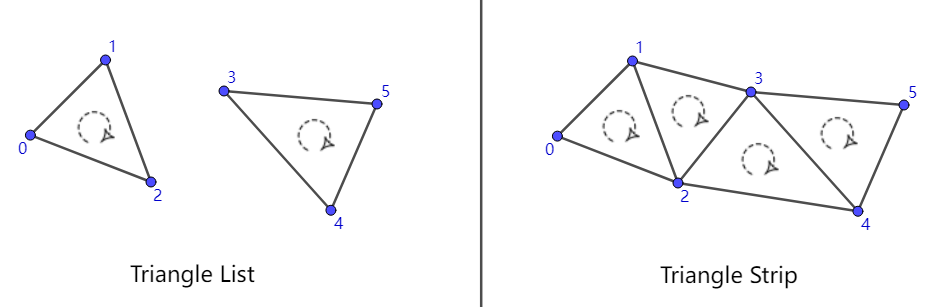

# Shader

## 渲染管线

渲染分为3个阶段 应用阶段 几何阶段 光栅化阶段 

 

应用阶段：由CPU处理。把视野外的物体剔除掉,然后设置要渲染的状态（材质纹理、纹理、Shader等），然后把图元（点、线、三角面）装载到显存。

几何阶段：由GPU处理。处理传来的顶点和三角面。这个阶段重要任务就是把模型坐标转换到屏幕坐标。这一阶段会输出屏幕空间的二维顶点坐标、顶点的深度值、颜色等相关属性。

光栅化阶段：由GPU处理。图元所包含的像素进行处理。然后哪些像素要被输出到屏幕上。

 

顶点数据->顶点着色器->曲面细分->几何处理->裁剪->屏幕映射->三角形设置->三角形遍历->片元着色器->逐片元操作->打印屏幕图像

顶点着色器：可完全编程。最主要的是把模型空间的位置转换到裁剪空间。同时处理顶点颜色。

曲面细分：可完全编程。这个阶段细分图元用的。比如实现LOD效果，加顶点实现更细节的动画，用低模加细分在运行的时候实现高模效果。

几何着色器。是完全可编程的。在顶点着色器阶段我们不能得知顶点和顶点的关系，但是在几何着色器可以。几何着色器主要是添加或者减少图元。

空间变换：模型空间->世界空间->观察空间->裁剪空间->屏幕空间

 

HDR和SDR的区别

概念不同，HDR是指高动态范围图像，SDR是指标准动态范围图像；||亮度范围表现不同，HDR比SDR有更大更亮的数据存储；||图像细节表现不同，HDR技术可以在使图像在明暗之间获取更多的细节表现。

### 着色器


内联函数：

``` 内联函数
inline Type Name(xxx){
	xxx
}
用于被频繁调用的函数时，防止函数频繁入栈，造成性能浪费。
```


#### 顶点片元着色器

代码模板:
```
 Shader "Hidden/ShaderTemplate"
 {
   //Hidden 表示此Shader 无法在面板中找到 比如最常见的粉红色ErrorShader 
Properties
   {
     _MainTex ("Texture", 2D) = "white" {}
     _Color ("Color Tint",Color) = (1,1,1,1)
     _Range ("Range",Range(0,10)) = 5
     _Float ("Float",Float) = 4
     _Int ("Int",Int) = 10
     _Vector("Vector",Vector) = (1,2,3,4)
     _Cube ("Cube",Cube) = "white"{}
     _3D ("3D",3D) = "black"{}
   }
```

//Unity 会扫描所有SubShader语义块，选择第一个可以再目标平台运行的SubShader,假设都不支持，那么会调用Fallback

```   SubShader
   {
     //subShader中指定的状态会应用到所有pass
     //SubShader Tags 列表如下 标签设置与Pass中不一样，但语法一致


Tags{"Queue" = "Transparent" "RenderType" = "Opaque"} //多Tags 写法
     //Queue 控制渲染顺序，指定渲染队列
     //Queue 选项如下
     //Background 队列索引号 1000 最先渲染
     //Geometry  队列索引号 2000 默认渲染队列，不透明物体使用这个队列
     //AlphaTest 队列索引号 2450 需要透明度测试的使用这个队列 
     //Transparent队列索引号 3000 任何使用了透明度混合（例如关闭了深度写入的Shader）
     //Overlay  队列索引号 4000 可实现叠加效果 任何在需要在最后渲染的物体都需要使用该队列

//RenderType 对着色器进行分类 可以用于着色器替换功能
     //RenderType 选项如下
     //Opaque 渲染不透明物体时使用
     //Transparnet 渲染透明物体使用

//DisableBatching 指明是否对该SubShader使用批处理 true | false

//ForceNoShadowCasting 该SubShader 是否会投射阴影 true | false

//IgnoreProjector 是否忽略阴影 true | false 

//CanUseSpriteAtlas 当该SubShader 是用于Sprites 时， 将该标签设为false

//PreviewType 指明材质面板如何预览该材质 默认情况下，材质将显示为一个球形 Plane | SkyBox

//[RenderSetUp]
     //设置剔除模式 Back 背面 Front正面 Off关闭
     Cull Off 

//设置深度测试时 使用的函数
     //Less Greater | LEqual | GEqual | Equal | NotEqual | Always
     ZTest Less Greater

//深度写入 On | Off 打开 | 关闭
     ZWrite On

//混合 开启并设置
     Blend SrcAlpha OneMinusSrcAlpha
     //Blend 混合选项
     //Blend Off 关闭混合
     //Blend SrcFactor DstFactor 开启混合并设置混合因子 最终颜色 = 源颜色（该片元产生的颜色）* SrcFactor + 目标颜色（已经存在与颜色缓冲区的颜色）* DstFactor
     //Blend SrcFactor DstFactor,ScrFactorA DstFactorA 与上面一致，只是Alpha通道使用不同的因子来混合
     //BlendOp BlendOperation 混合操作命令

//混合因子
     //One    因子为1
     //Zero   因子为0
     //SrcColor 因子为源颜色值 混合RGB时 以源颜色RGB分量为因子 混合A时 以源颜色A分量为因子
     //SrcAlpha 因子为源颜色的Alpha值
     //DstColor 因子为目标颜色值
     //DstAlpha 因子为目标颜色值的Alpha值
     //OneMinusSrcColor 因子为 1-源颜色值
     //OneMinusSrcAlpha 因子为 1-源颜色值Alpha分量
     //OneMinusDstColor 因子为 1-目标颜色值
     //OneMinusDstAlpha 因子为 1-目标颜色值Alpha分量
     

//混合操作命令
     //Add    混合后 源颜色 + 目标颜色
     //Sub    混合后 源颜色 - 目标颜色
     //RevSub  混合后 目标颜色 - 源颜色
     //Min    RGBA分量 在源颜色值与目标颜色值中取最小值 （会忽略混合因子）
     //Max    RGBA分量 在源颜色值与目标颜色值中取最大值 （会忽略混合因子）

//每个Pass定义了一个完成的渲染流程 SubShader中的Pass 会按顺序全部执行
     Pass
     {
       Name "TemplatePass" //定义Pass名称 可以使用UsePass 直接使用其他UnityShader中的Pass
       UsePass "ShaderTemplate/TemplatePass" //使用其他UnityShader中的Pass

Tags{"LightMode" = "ForwordBase"}
       //Pass中的Tags 选项如下
       //LightMode 选项列表
       //ForwardBase  前向渲染 该Pass会计算环境光，平行光，逐顶点/SH光源 和 LightMaps
       //Always    不管使用哪种渲染路径，该Pass总是会被渲染，但不计算任何光照
       //ForwardAdd  前向渲染 该Pass会计算额外的逐像素光照，每个Pass对应一个光源
       //Deferred   用于延迟渲染 该Pass会渲染G缓冲
       //ShadowCaster 把物体的深度信息渲染到阴影映射纹理Shadowmap 或 一张深度纹理中
       //PrepassBase  遗留的延迟渲染 该Pass会渲染法线和高光反射的指数部分
       //PrepassFinal 遗留的延迟渲染 该Pass通过合并纹理，光照和自发光来渲染得到最后的颜色
       

       //RequireOptions 用于指定当满足某些条件时才渲染该Pass 目前只支持 SoftVegetation

CGPROGRAM // Cg/HLSL 代码段
       \#pragma vertex vert //编译指令指明顶点着色器代码
       \#pragma fragment frag //指明片元着色器代码
       
       \#include "UnityCG.cginc" //引入unity 内置文件

//Shader中使用属性 我们需要在CG代码中定义一个与属性名称和类型都匹配的变量
       sampler2D _MainTex;
       float4 _MainTex_ST;
       fixed4 _Color;
       half _Range;
       float _Float;
       int _Int;
       float4 _Vector;
       samplerCube _Cube;
       sampler3D _3D;

//浮点类型总结
       //float   32位高精度浮点
       //half   16位中精度浮点 范围[-6w,+6w] 精确到十进制后3.3位
       //fixed   11位低精度浮点 范围[-2,+2] 精度1/256 适用颜色和单位向量使用

struct a2v //应用阶段数据来源 Render -> UnityShader application to vertex
       {
         float4 vertex : POSITION;
         float2 uv : TEXCOORD0;
       };

//语义大全
       //POSITION 用模型空间的顶点坐标填充
       //TANGENT  用模型空间的切线方向填充
       //NORMAL  用模型空间的法线方向填充
       //TEXCOORD0 用模型空间的第一套纹理坐标来填充（一个材质可以有多张贴图）
       //TEXCOORD1 用模型空间的第二套纹理坐标来填充
       //TEXCOORD2 用模型空间的第三套纹理坐标来填充
       //TEXCOORD3 用模型空间的第四套纹理坐标来填充
       //COLOR0  用与储存颜色信息（可自定义）

//SV_ 表示系统数值语义 System-Value
       //SV_POSITION 顶点着色器的输出裁剪空间中的顶点坐标 顶点着色器最重要的事情就是把顶点坐标从模型空间转换到裁剪空间
       //SV_Target  接受用户输出颜色，输入到默认的帧缓存中

//此结构定义顶点着色器的输出 vertex to frag
       struct v2f 
       {
         float2 uv : TEXCOORD0;
         float4 vertex : SV_POSITION;
       };

//顶点着色器代码
       v2f vert (a2v v)
       {
         v2f o;
         o.vertex = UnityObjectToClipPos(v.vertex); //顶点的MVP 变换 模型-观察-投影矩阵
         o.uv = v.uv;
         return o;
       }
       
       
       //片元着色器代码
       fixed4 frag (v2f i) : SV_Target
       {
         fixed4 col = tex2D(_MainTex, i.uv); //通过UV坐标对主纹理进行采样
         // just invert the colors
         col = 1 - col;
         return col;
       }
       ENDCG
     }
   }

Fallback "VertexLit" //最后一条后路 SubShader全不支持 运行指定的Shader 可以关闭Fallback Off
 }
```

#### 细分着色器

1. TESS Control  Shader （D3D11 叫Hull shader），简称TCS。

细分控制着色器，输入Patch，一个Patch可以看成多个顶点的集合，包括坐标、颜色、纹理坐标等等

输出Patch ， gl_TessLevelOuter ， gl_TessLevelInner，后两者用于存储**把三角形的每条边分割成几段以及内部怎么继续分割**的信息。

 *使用TCS时，glBegin函数的参数必须是GL_PATCHES，而不是以前那种传统的图元（点，线，三角形等）。 glPatchParameteri可以指定每个Patch包含几个顶点。在VS与TCS直接有个图元装配的过程，它就是把VS输出的顶点封装一个Patch，然后传给TCS。

```
#pragma hull hs

UnityTessellationFactors hsconst (InputPatch<InternalTessInterp_appdata,3> v) {
    UnityTessellationFactors o;
    //主要计算的数据，为float4类型，xyz为Tessellation factor，z为Inside Tessellation factor，详见下方标绿代码
    float4 tf;
    tf = float4(4.0f,4.0f,4.0f,4.0f);
    o.edge[0] = tf.x; 
    o.edge[1] = tf.y; 
    o.edge[2] = tf.z; 
    o.inside = tf.w;
    return o;
}
[UNITY_domain("tri")]
//指明输入hull shader的图元是三角形
[UNITY_partitioning("fractional_odd")]
//2.决定浮点数的舍入规则，本代码fractional_odd意为factor截断在[1,max]范围内，
[UNITY_outputtopology("triangle_cw")]
//决定图元的朝向，由组成三角形的三个顶点的顺序所产生的方向决定，cw为clockwise顺时针，ccw为counter clockwise逆时针。
[UNITY_patchconstantfunc("hsconst")]
//1.定义声明，用于指明计算factor的方法，然后在"hsconst"中计算每个边的细分数据
[UNITY_outputcontrolpoints(3)]
//指明输出Patch的定点数量
InternalTessInterp_appdata hs (InputPatch<InternalTessInterp_appdata,3> v, 
uint id : SV_OutputControlPointID) {
    return v[id];
}

#ifdef UNITY_CAN_COMPILE_TESSELLATION
struct UnityTessellationFactors {
    float edge[3] : SV_TessFactor;
    float inside : SV_InsideTessFactor;
};
#endif
```

参数用法：

Tessellation factor = x 即该边出现(x-1)个细分点，被细分为x段。

Inside Tessellation factor = x 若x为偶数则本三角中心出现一个细分三角，反之则无.

[UNITY_patchconstantfunc("hsconst")]定义声明好了，Tessellation factor确定后，由于是float，所以下一步需要决定如何对factor进行舍入。

[UNITY_partitioning("fractional_odd")]决定浮点数的舍入规则，fractional_odd、equal_spacing、even_spacing

在hull shader根据UnityTessellationFactors进行细分后，每个细分顶点都会有一个SV_DomainLacation，一组重心坐标。


2. TESS Evaluation Shader （D3D叫Domain shader），简称TES

输入：一系列顶点

下面的代码用于说明输入的信息，这一段表示输入三角形，每个TES程序都有它

layout( triangles, fractional_odd_spacing, ccw ) in;

输出：一系列顶点

TCS->TES之间有个过程叫Tessellation Primitive Generator（简称TGP），用于**将TCS输出的Patch转换成若干三角形**，TES后有一个图元装配的过程，可以把"一系列顶点"转换成图元。

```
#pragma domain ds
[UNITY_domain("tri")]//指明输入的数据使用SV_DomainLocation的类型，不同类型的图元使用不同长度的向量
v2f ds (UnityTessellationFactors tessFactors, const OutputPatch<InternalTessInterp_appdata,3> vi, float3 bary : SV_DomainLocation) {
appdata v;

v.vertex = vi[0].vertex*bary.x + vi[1].vertex*bary.y + vi[2].vertex*bary.z;
v.tangent = vi[0].tangent*bary.x + vi[1].tangent*bary.y + vi[2].tangent*bary.z;
v.normal = vi[0].normal*bary.x + vi[1].normal*bary.y + vi[2].normal*bary.z;
v.texcoord = vi[0].texcoord*bary.x + vi[1].texcoord*bary.y + vi[2].texcoord*bary.z;

v2f o = vert (v);
return o;
}


SV_DomainLocation
Type	Input Topology
float2	quad patch	//xy坐标
float3	tri patch	//重心坐标
float2	isoline		//xy坐标

SV_TessFactor		//边，周长
Type	Input Topology
float[4]	quad patch	//四边形
float[3]	tri patch	//三角形
float[2]	isoline		//线段

SV_InsideTessFactor		//内部
Type	Input Topology
float[2]	quad patch
float	tri patch
unused	isoline
```

三角形图元定位是由xy坐标与float3类型的重心坐标定位的，根据重心坐标可以顶点的数据进行重新定位，例如三角形细分顶点的位置的算法如下：

 v.vertex = vi[0].vertex*bary.x + vi[1].vertex*bary.y + vi[2].vertex*bary.z;

最后空间转换到裁剪空间，就可以输出到片元着色器。


*表面着色器中使用曲面细分着色器

```
Shader "Custom/Phong_固定曲面细分"
{
    Properties
    {
        
        _MainTex ("Albedo (RGB)", 2D) = "white" {}
        _Tessellation("Tessellation",Range(1,32))=1
        _Phong("Phong_Tessellation",Range(0,1))=0.2
    }
    SubShader
    {
        CGPROGRAM
        #include "Tessellation.cginc"
        half _Tessellation;
        fixed _Phong;
        //声明曲面细分函数  和Phong 细分编译指令
        #pragma surface surf Lambert tessellate:tessellation tessphong:_Phong

        float4 tessellation()
        {
            return _Tessellation;
        }
        struct Input 
        {
            float2 uv_MainTex;
            float2 uv_NormalMap;
        };

        sampler2D _MainTex;
        
        // 表面函数
        void surf(Input IN,inout SurfaceOutput o) 
        {
            o.Albedo=tex2D(_MainTex,IN.uv_MainTex).rgb;//根据lambert 模型需要输出的结构体，设置里面的值
        }
        ENDCG

    }
    FallBack "Diffuse"
}

```


#### 几何着色器

Geometry Shader ，简称GS

输入：一个图元

输出：一个或多个图元

layout( triangles ) in;//输入的图元是三角形，如果实际输入的不是三角形，则GS不会被调用。

layout( triangle_strip, max_vertices = 3 ) out;//输出一个三角形带

在三维空间中，一个图元指的是构成一个3D实体的顶点集合。例如空间中的一个点对应一个顶点，一条线段对应两个顶点，一个三角形对应三个顶点，这些都是图元。


如果图元类型为Point List，则每个顶点都被单独的作为一个点被绘制出来（效果图和上图一样），可以用它来模拟天空中的星星或者绘制由点构成的虚线等。



如果图元类型为Line List或者Line Strip，则每两个顶点构成一个线段图元。它们的区别在于，如果是Line List，这些线段都是独立的，而Line Strip的线段都是互相连接的（如下图）。Line List可以用来实现场景中雨水的效果，而Line Strip可以用来绘制非闭合的多边形。


#### 属性修饰符一览

```
Properties
    {
        _MainTex ("Texture", 2D) = "white" {}
                                                   
        [Header(Custom)]
        [Enum(CustomEnum)]  _CustomEnum ("CustomEnum", Float) = 1

        [Header(Option)]
        [Enum(UnityEngine.Rendering.BlendOp)]  _BlendOp  ("BlendOp", Float) = 0
        [Enum(UnityEngine.Rendering.BlendMode)] _SrcBlend ("SrcBlend", Float) = 1
        [Enum(UnityEngine.Rendering.BlendMode)] _DstBlend ("DstBlend", Float) = 0
        [Enum(Off, 0, On, 1)]_ZWriteMode ("ZWriteMode", float) = 1
        [Enum(UnityEngine.Rendering.CullMode)]_CullMode ("CullMode", float) = 2
        [Enum(UnityEngine.Rendering.CompareFunction)]_ZTestMode ("ZTestMode", Float) = 4
        [Enum(UnityEngine.Rendering.ColorWriteMask)]_ColorMask ("ColorMask", Float) = 15

        [Header(Stencil)]
        [Enum(UnityEngine.Rendering.CompareFunction)]_StencilComp ("Stencil Comparison", Float) = 8
        [IntRange]_StencilWriteMask ("Stencil Write Mask", Range(0,255)) = 255
        [IntRange]_StencilReadMask ("Stencil Read Mask", Range(0,255)) = 255
        [IntRange]_Stencil ("Stencil ID", Range(0,255)) = 0
        [Enum(UnityEngine.Rendering.StencilOp)]_StencilPass ("Stencil Pass", Float) = 0
        [Enum(UnityEngine.Rendering.StencilOp)]_StencilFail ("Stencil Fail", Float) = 0
        [Enum(UnityEngine.Rendering.StencilOp)]_StencilZFail ("Stencil ZFail", Float) = 0
    }

```

 

[HideInInspector] - 不在材质检视面板中显示属性值。

  [NoScaleOffset] - 对于具有此特性的纹理属性，材质检视面板不会显示纹理平铺/偏移字段。

   [Normal] - 表示纹理属性需要法线贴图。

  [HDR] - 表示纹理属性需要高动态范围 (HDR) 纹理。

   [Gamma] - 表示在 UI 中将浮点/矢量属性指定为 sRGB 值（就像颜色一样），并且可能需要根据使用的颜色空间进行转换。请参阅着色器程序中的属性。

   [PerRendererData] - 表示纹理属性将以 MaterialPropertyBlock 的形式来自每渲染器数据。材质检视面板会更改这些属性的纹理字段 UI。

  [MainTexture] - 表示一个属性 (property) 是材质的主纹理。默认情况下，Unity 将属性 (property) 名称为 _MainTex 的纹理视为主纹理。如果您的纹理具有其他属性 (property) 名称，但您希望 Unity 将这个纹理视为主纹理，请使用此属性 (attribute)。如果您多次使用此属性 (attribute)，则 Unity 会使用第一个属性 (property)，而忽略后续属性 (property)。

  [MainColor] - 表示一个属性 (property) 是材质的主色。默认情况下，Unity 将属性 (property) 名称为 _Color 的颜色视为主色。如果您的颜色具有其他属性 (property) 名称，但您希望 Unity 将这个颜色视为主色，请使用此属性 (attribute)。如果您多次使用此属性 (attribute)，则 Unity 会使用第一个属性 (property)，而忽略后续属性 (property)。

 [Toggle] - 是与否

 [Main(test)] 、[Sub(test)] - 主属性与子属性，目前没发现具体用途


#### 混合模式

**混合命令**

//关闭混合（默认）
 Blend Off 

 //片元产生的颜色乘以SrcFactor，加上屏幕上已有的颜色乘以DstFactor，得到最终的颜色（写入颜色缓存）
 Blend SrcFactor DstFactor

//同上，只不过使用单独的因子SrcFactorA和DstFactorA来混合透明度通道
 Blend SrcFactor DstFactor, SrcFactorA DstFactorA

//用其他的操作来取代加法混合。
 BlendOp BlendOperation

//同上，只不过对于透明度通道使用不同的操作。
 BlendOp OpColor, OpAlpha
 注：此外还有AlphaToMask On命令


**常见混合公式**

Blend SrcAlpha OneMinusSrcAlpha // 传统透明度
 Blend One OneMinusSrcAlpha // 预乘透明度
 Blend One One // 叠加
 Blend OneMinusDstColor One // 柔和叠加
 Blend DstColor Zero // 相乘——正片叠底
 Blend DstColor SrcColor // 两倍相乘

当然，相乘/正片叠底的混合命令写成：
 Blend Zero SrcColor
 也是合情合理合法的。

最后，我们还可以扩展一下：
 参考百度百科滤色，我们知道，滤色的公式是：
 结果色=255－[（255－基色）×（255－混合色）]/255
 对应于[0,1]范围内也就是
 FinalColor=1-(1-Dst)*(1-Src)
 也就是
 Dst+Src-Dst*Src
 也就是
 Src*1+Dst*(1-Src)
 或者
 Src*(1-Dst)+Dst*1
 所以滤色的混合命令我们可以写成下面两种：
 Blend OneMinusDstColor One
 Blend One OneMinusSrcColor 


**混合因子**

One  混合因子1，表示完全的源颜色或目标颜色
 Zero 混合因子0，舍弃掉源颜色或目标颜色
 SrcColor  源颜色值
 SrcAlpha 源透明度
 DstColor 目标颜色值
 DstAlpha 目标透明度
 OneMinusSrcColor // 1-SrcColor
 OneMinusSrcAlpha // 1-SrcAlpha
 OneMinusDstColor // 1-DstColor
 OneMinusDstAlpha // 1-DstAlpha


#### 色彩空间

线性空间（Linear Space）

线性空间中的数值是表述物理世界中的亮度变化的值，是一个正比例函数。

 

线性空间就能展示真实世界的色彩表现，为什么还要其他色彩空间呢？

根据韦伯定律：人对自然界刺激的感知，是非线性的。


对人类目测结果，色条1的亮度过渡更柔和更接近线性，其实色条1在50%的位置的亮度值为20%-25%，色条2才是真实世界的线性过渡。

 

伽马空间（Gamma Space）


伽马矫正，当Gamma=1.0时即为线性空间。

1996年，微软和惠普发布了sRGB色彩空间作为行业标准。

sRGB色彩空间就是伽马空间Gamma0.45，旨在从色彩层面做一次矫正工作，避免程序做重复工作。


**Shader里的计算均为线性计算**，须在线性空间下进行。

大部分颜色贴图是sRGB空间输出，是非线性的。

采样贴图需在计算前后做一些变换，统一到同一空间下进行。

因此一般色彩空间转换流程：

1. 输入一张贴图，若为sRGB色彩空间，需要先转换至线性空间，unity中勾选sRGB选项即可自动转换；
2. 确保shader中的色彩计算均处于线性空间即可进行运算；
3. 当我们计算完所有的颜色，即将输出时。进行伽马校正，将色彩空间转换为Gamma0.45空间。
4. 输出到屏幕上，屏幕会有一个自己2.2幂的运算，和上一步的(1/2.2幂)相互相乘，最终呈现Gamma=1.0的正确输出。


#### 模板测试

片元着色器到帧缓冲区的过程中，

PixelOwnership Test 屏幕像素测试，用于决定屏幕像素使用权限

-->Scissor Test裁剪测试，用于决定 在屏幕像素权限内，再次决定渲染的部分，一般为全部

-->Alpha Test透明度测试，剔除α小于0.5的片元

-->Stencil Test模板测试

-->Depth Test深度测试

 

帧缓冲区有许多缓冲区构成，这些缓冲区大致分为： 

颜色缓冲区：用于绘图的缓冲区，它包含了颜色索引或者RGBA颜色数据。 

深度缓冲区：存储每个像素的深度值，当启动深度测试时，片段像素深度值和深度缓冲区深度值进行比较，决定片段哪些像素点数据可以替换到颜色缓冲区中。 

模板缓冲区：为每一个屏幕上的像素点保存一个无符号整数值（通常为8位二进制数），就像使用纸板和喷漆一样精确的混图一样，当启动 [模板测试](http://www.blogjava.net/qileilove/archive/2014/01/23/409269.html)时，通过模板测试的片段像素点会被替换到颜色缓冲区中，从而显示出来，未通过的则不会保存到颜色缓冲区中，从而达到了过滤的功能。

累积缓冲区：累积缓冲区允许你把渲染到颜色缓冲区的值，拷贝到累积缓冲区。在多次拷贝操作到累积缓冲区时，可以用不同方式的把颜色缓冲区内容和当前累积缓冲区的内容进行重复混合

 ```
 Stencil
 
 {
 
     Ref Value//用于比较的值
 
     ReadMask readMask
 
     WriteMask writeMask
 
     Comp comparsionFunction//比较的方式
 
     Pass stencilOperation//如果通过了测试 默认keep
 
     Fail stencilOperation//如果未通过
 
     ZFail stencilOperation//模板测试通过但深度测试未通过
 
 }
 ```

Stencil的所有参数如下

 

Ref 就是参考值，当参数允许赋值时，会把参考值赋给当前像素

ReadMask 对当前参考值和已有值进行mask操作，默认值255，一般不用

WriteMask 写入Mask操作，默认值255，一般不用

Comp 比较方法。是拿Ref参考值和当前像素缓存上的值进行比较。默认值always

 


 

按照解释，遮挡和被遮挡物体的参考值都设置为1

然后先渲染遮挡物体，再渲染被遮挡物体（渲染顺序由"RenderType" 决定，代表的数值越小越在前）


#### 渲染模式

1.前向渲染

前向渲染中，按顺序渲染物体，每个物体分别遍历计算光照，每渲染一盏光都要重复计算顶点、法线、uv等等数据，而且即使一些光源对物体影响很小，依然会加入计算，在多光源场景下性能表现会很差。


2.延迟渲染

用于解决大量光照的渲染，第一个Pass会先做一个整体的无光渲染，将模型数据写入缓存，第二个Pass中则遍历四个G-Buffer，计算出光照后统一贴在Base Pass计算出的结果上。这种做法就是典型的空间换时间，增加了显存消耗。同时因为渲染顺序的原因，延迟渲染中透明物体处理需要特殊的方案。


延迟渲染中，几何数据被存储的位置被称为几何缓冲区，即G-Buffer。

延迟着色需要四个 G 缓冲区。它们的组合大小为 LDR 每像素 160 位，HDR 为 192 位/像素。这比单个 32 位帧缓冲区要多得多。现代台式机 GPU 带宽完全足够，但移动甚至笔记本电脑 GPU 在高分辨率的时候带宽很难满足，因此延迟渲染难以运用进移动渲染设备。

```
Shader "XT/UnlitDeferredShading"
{
    Properties
    {
        _MainTex("main tex",2D)="white"{}
        _Diffuse("diffuse",Color) = (1,1,1,1)
        _Specular("specular",Color) = (1,1,1,1)
        _Gloss("gloss",Range(1,50)) = 20
    }
        SubShader
    {
        Tags { "RenderType" = "Opaque" }

        Pass
        {
            Tags{"LightMode" = "Deferred"}
            CGPROGRAM

            #include"UnityCG.cginc"

            #pragma target 3.0
            #pragma vertex vert
            #pragma fragment frag
            //排除不支持MRT的硬件
            //#pragma exclude_renderers norm
            #pragma multi_compile __ UNITY_HDR_ON

            sampler2D _MainTex;
            float4 _MainTex_ST;
            float4 _Diffuse;
            float4 _Specular;
            float _Gloss;

            struct appdata
            {
                float4 vertex:POSITION;
                float3 normal:NORMAL;
                float2 uv:TEXCOORD0;
            };

            struct v2f
            {
                float4 vertex:SV_POSITION;
                float2 uv : TEXCOORD0;
                float3 worldPos:TEXCOORD1;
                float3 worldNormal:TEXCOORD2;
            };

            struct DeferredOutput
            {
                float4 gBuffer0:SV_TARGET0;
                float4 gBuffer1:SV_TARGET1;
                float4 gBuffer2:SV_TARGET2;
                float4 gBuffer3:SV_TARGET3;
            };

            v2f vert(appdata v)
            {
                v2f o;
                o.vertex = UnityObjectToClipPos(v.vertex);
                o.uv = TRANSFORM_TEX(v.uv, _MainTex);
                o.worldPos = mul(unity_ObjectToWorld, v.vertex).xyz;
                o.worldNormal = UnityObjectToWorldNormal(v.normal);
                return o;
            }

            DeferredOutput frag(v2f i)
            {
                DeferredOutput o;
                fixed3 color = tex2D(_MainTex, i.uv).rgb*_Diffuse.rgb;
                o.gBuffer0.rgb = color;
                o.gBuffer0.a = 1;
                o.gBuffer1.rgb = _Specular.rgb;
                o.gBuffer1.a = _Gloss/50;
                o.gBuffer2 = float4(i.worldNormal*0.5+0.5, 1);
                #if !defined(UNITY_HDR_ON)
                    color.rgb = exp2(-color.rgb);
                #endif
                o.gBuffer3 = fixed4(color, 1);
                return o;
            }
            ENDCG
        }
    }
}
```


#### 计算着色器

计算着色器是一个特殊的GPU程序，并不在渲染流水线中，一般用于进行大量的并行运算，可以直接访问显存中的资源，广泛应用于机器学习、仿真计算、图形渲染等计算机领域。


```
#pragma kernel CSMain

//定义入口函数

 

RWTexture2D<float4> Result;

//定义一个可读写的2D纹理

 

[numthreads(tx,ty,tz)]

//定义一个线程组中可被执行线程的总数量

//tx*ty*tz即为所有线程总数量

 
/*SV_DispatchThreadID：
id值按照tx,ty,tz大小依次排列，比如[numthreads(8,8,2)]中，
第1个SV_GroupThreadID为：(0,0,0)
第2个SV_GroupThreadID为：(1,0,0)
第9个SV_GroupThreadID为：(0,1,0)
第64个SV_GroupThreadID为：(7,7,0)
第65个SV_GroupThreadID为：(0,0,1)*/

void CSMain (uint3 id : SV_DispatchThreadID)

{

	Result[id.xy] = float4(id.x & id.y, (id.x & 15)/15.0, (id.y & 15)/15.0, 0.0);
/*使用输入的id参数来计算每个像素的颜色，并将结果写入到Result纹理中。具体来说，它使用id.x和id.y的按位与操作来生成纹理的红色通道，使用id.x和15的按位与操作除以15来生成纹理的绿色通道，使用id.y和15的按位与操作除以15来生成纹理的蓝色通道。最后，将alpha通道设置为0.0。*/
}
```


线程组：

线程组（ThreadGroup）就是由线程组成的管理线程的类。

在GPU编程中，我们可以将所有要执行的线程划分成一个个线程组，一个线程组在单个流多处理器（Stream Multiprocessor，简称SM）上被执行。如果我们的GPU架构有16个SM，那么至少需要16个线程组来保证所有SM有事可做。为了更好的利用GPU，每个SM至少需要两个线程组，因为SM可以切换到处理不同组中的线程来隐藏线程阻塞（如果着色器需要等待Texture处理的结果才能继续执行下一条指令，就会出现阻塞）。

每个线程组都有一个各自的共享内存（Shared Memory），该组中的所有线程都可以访问该组对应的共享内存，但是不能访问别的组对应的共享内存。因此线程同步操作可以在线程组中的线程之间进行，不同的线程组则不能进行同步操作。


在Direct3D12中，可以通过ID3D12GraphicsCommandList::Dispatch(gX,gY,gZ)方法创建gX*gY*gZ个线程组。注意顺序，先numthreads定义好每个核函数对应线程组里线程的数量（tX*tY*tZ），再用Dispatch定义用多少线程组(gX*gY*gZ)来处理这个核函数。


#### 着色器变体

为什么使用变体？

使用Shader变体的意义在于优化和灵活性。Shader变体是在不同平台、不同硬件和不同配置下的Shader的不同版本、不同效果，我们希望通过少量的shader文件实现不同的效果。通过使用Shader变体，可以根据运行平台的不同，选择最适合的Shader版本，以提高性能和兼容性。

使用Shader变体可以根据硬件的不同，选择合适的渲染路径和特性。例如，在移动设备上，可以选择使用较低的分辨率、减少复杂度的Shader变体，以提高性能和节省电量。而在高性能PC上，可以选择使用更高质量的Shader变体，以获得更好的视觉效果。

此外，使用Shader变体还可以根据不同的配置需求，进行定制化的渲染。例如，在不同的光照条件下，可以选择使用不同的Shader变体来处理阴影效果。通过使用Shader变体，可以灵活地适应不同的场景需求，提供更好的渲染效果。

**静态分支：#if**


**2.变体分支**


1. 定义方式

  定义方式中值得注意的是，#pragma shader_feature A其实是 #pragma shader_feature _ A的简写，下划线表示未定义宏(nokeyword)。因此此时shader其实对应了两个变体，一个是nokeyword，一个是定义了宏A的。

  而#pragma multi_compile A并不存在简写这一说，所以shader此时只对应A这个变体。若要表示未定义任何变体，则应写为 #pragma multi_compile _ A。


2. 宏的适用范围

  两种定义方式可以使用在任何shader中，只是各自有一些建议使用情况。

  multi_compile定义的宏，如#pragma multi_compile_fog，#pragma multi_compile_fwdbase等，基本上适用于大部分shader，与shader自身所带的属性无关。

  shader_feature定义的宏多用于针对shader自身的属性。比如shader中有_NormalMap这个属性(Property)，便可通过#pragma shader_feature _NormalMap来定义宏，用来实现这个shader在material有无_NormalMap时可进行不同的处理。


3. 变体的生成

  multi_compile会默认生成所有的变体，因此应当谨慎适用multi_compile，否则将会导致变体数量激增。如： #pragma multi_compile A B C #pragma multi_compile D E

  则此时会生成 A D、A E、B D、B E、C D、C E这6中变体。

  shader_feature要生成何种变体可用shader variant collection进行自定义设置。

 

4. 变体的debug

shader变体的缺失可能并不会导致Editor中效果显示异常，但打

包后则可能出现黑片或紫片，因此需要特殊方法来测试。

方法一：在editor模式下frameDebug 查看正常的表现shader的属性和使用编译情况（查看编译后的变体代码Show generated code）；

方法二：真机连接frameDebug调试核查表现失常的shader的属性中是否缺失属性例如：是谁偷走了我的lightmap？？ 没能切换使用正确的shaderVariant。

解决问题：首先确定 shaderVariant是否打包进去了（用bundle拆解工具 AssetStudio核查bundle内的信息），第二是否执行命令“切换到lightmap_on的shaderVariant”

(AssetStudio，软件在unity包文件夹)

 


## 具体效果

### 基础效果

#### 视差映射

<video src="video/视差映射.mp4"></video>


#### 三向映射


#### 广告牌


#### 卡通水


#### 模板测试


### URP RenderFeature

RenderFeature是属于渲染管线的一部分，基于其封装性，很难用其他继承的脚本去访问和控制，即使能访问到也会对其产生一些破坏，不建议访问。

#### 体积云


#### 屏幕空间反射


#### 降噪算法

##### 时域降噪


##### 填补降噪


#### 抗锯齿算法

##### 时域抗锯齿


##### 快速抗锯齿


##### 多重采样抗锯齿


#### 体积光


#### 视锥体裁切

基于Compute Shader实现对GPU实例化物体的裁切

##### Hierarchical Z-Buffer

**Hierarchical Z-Buffer**技术，应用于遮挡剔除时可以用于计算加速。是一个典型的空间换时间的算法，我们首先初始化一块Z-Buffer，然后基于最大值滤波生成多个较低分辨率的深度图，这些深度图由小到大呈金字塔状。

1. 按照传统光栅渲染流程，场景初次渲染生成深度缓冲区

2. 对原始深度图进行降采样，构建层次化深度缓冲区

3. 遮挡剔除，首先进行AABB包围盒剔除，然后根据AABB包围盒区域首先在低分辨率深度图中查询深度

   ​	如果该层的深度缓冲区中，包围盒区域内的最大深度值比物体的最小深度还远，则说明物体被遮挡，停止进一步测试，该物体被完	全剔除。

   ​	如果测试通过，说明该层没有足够信息判断物体被遮挡，那么继续在较高分辨率的层次进行测试，并重复该过程。

4. 最后经过剔除后就可以渲染剩下的物体了，进行常规的几何和光栅化渲染。


##### 视锥体剔除

视锥体剔除基于计算着色器实现，具体代码如下文件：

 [ViewFrustumCulling.compute](code\CSCull\ViewFrustumCulling.compute) 

#### 可编辑GPU草地

技术点：视锥体裁切、通过RT绘制生成Texture2D、通过Texture2D的颜色深浅生成草


1.编辑模式

每次绘制更新缓冲区，提供一个“Apply”按钮，切换至固定模式

2.固定模式

保存成图片文件，用固定逻辑


#### 视差映射雪地交互

技术点：视差映射、RT高度贴图、雪地光影


##### 脚本控制

 [ViewFrustumCulling.cs](code\CSCull\ViewFrustumCulling.cs) 


#### 毛星云-X-PostProcessing系统

