# 虚幻引擎


## 常用技术


### 虚拟纹理（Virtual Texture，简称VT）

1. 原理：
   类似于虚拟内存的概念，VT的核心思想便是尽可能只把需要用到的纹理内容加载到内存中。和[Texture Streaming](https://zhida.zhihu.com/search?content_id=242896378&content_type=Article&match_order=1&q=Texture+Streaming&zhida_source=entity)不一样的是，他不是仅仅以[Mip等级](https://zhida.zhihu.com/search?content_id=242896378&content_type=Article&match_order=1&q=Mip等级&zhida_source=entity)为粒度进行控制，而是将原始贴图切分成大小相同的Page，然后在运行时对所需要的Page发起请求。Page沿用了虚拟内存中页的概念，下文我们也互换地使用Tile来表示。请求完毕的Page会被映射到一个物理贴图（参考物理内存）中供实际的渲染使用。为了得知Page被映射到物理贴图中的哪个位置，我们还需要给shader额外提供一个页表（PageTable），来索引贴图实际的位置。物理贴图和页表的尺寸一般来说都远小于原始贴图，所以通过额外的采样和动态加载机制，我们节省了内存。

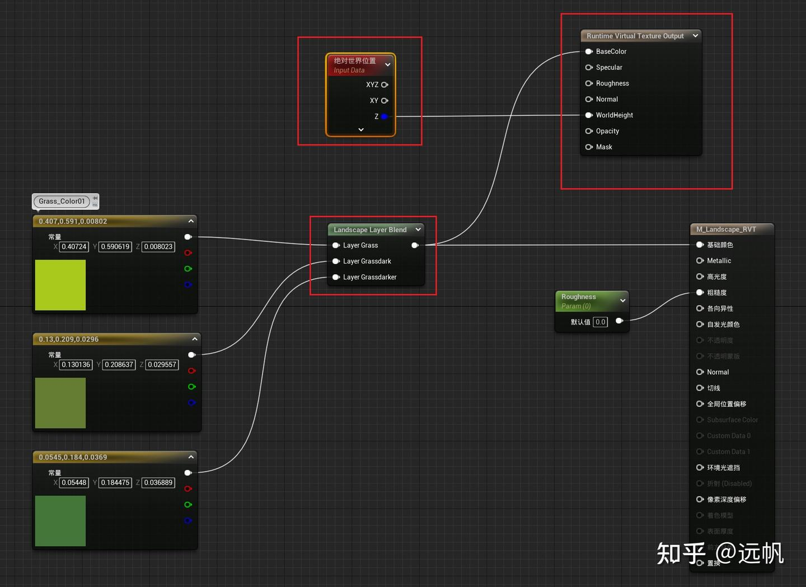

### Nanite

这个视图可以看到Nanite流程中一些数据结构的可视化

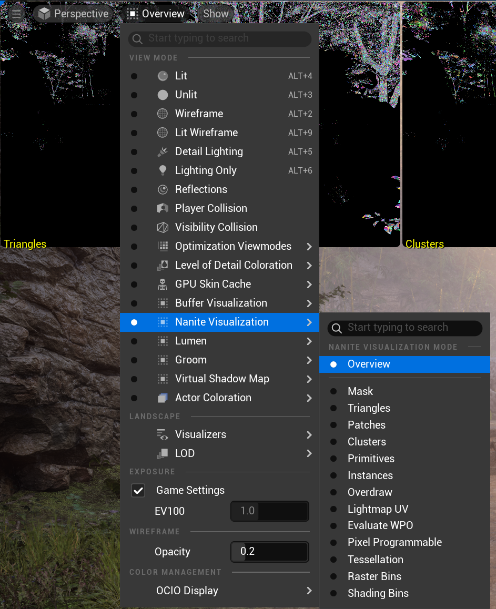

类似于网格版的VT，渲染管线会把多个三角面组成一个簇（cluster），首先Nanite网格是基于流处理的，会动态加载进内存，然后对每个cluster决定LOD级别，再基于cluster进行视锥体剔除和遮挡剔除，因为需要生成额外的cluster构造包围数据，因此Nanite网格包体会比原来的Mesh大一些。

Nanite只能进行一定限度内的三角面数量变化，不会做出能影响到模型形体的合面，因此效果不错，但相应的，面数下降是有限度的，因此如果一个模型存在近距离看细节的需求的同时也有远距离观看的情景时，需要老LOD技术配合才能达到性能的极致。

**Nanite不支持什么？**

​	不支持：

​		半透明或者带遮罩的材质

​		非刚体形变，骨骼动画等

​		细分和置换

​	支持但不友好：

​		对于aggregate类型的几何体不友好

​		很多很小的物体组成了一个带孔的体积

​		草地、树叶、毛发（因为这种情况，LOD很难建立的很有效）

问：一个3A游戏镜头中的cluster的数量非常多，这种数量的组下进行视锥体剔除和遮挡剔除，是如何做到剔除本身消耗的性能做的不错的地步的？


### Lumen

这是一套基于有向距离场光线追踪解决GI和反射的光照系统。

Lumen 生成一个自动参数化的附近场景表面，称为  **Surface Cache**  **表面缓存**。它用于快速查找场景中光线击中点的光照。Lumen 从多个角度捕获每个网格的材料属性。这些捕获位置（称为  **Cards** ）是为每个网格离线生成的。

cmd: r.Lumen.Visualize.CardPlacement 1
查看当前场景的Surface Cache

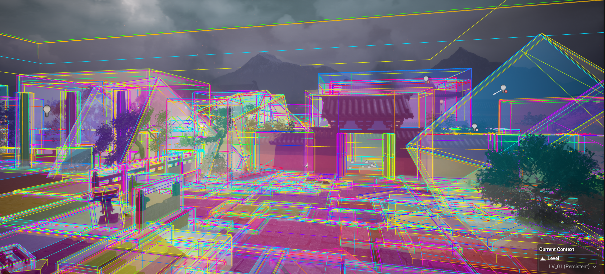

静态网格体默认生成12张Cards，可以在静态网格体的设置界面的LOD 0->Build Settings->**Max Lumen Mesh Cards** 设置生成的Cards数量。

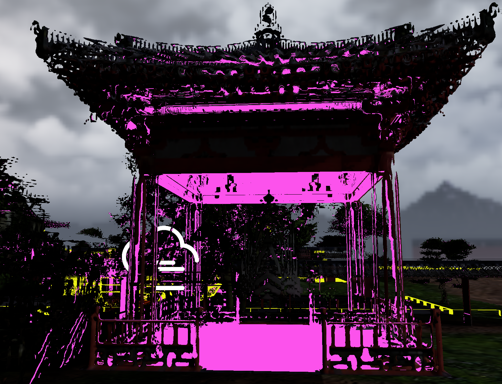

粉色区域是Lumen的Cards无法覆盖的区域，
这种区域不会产生反射光线，一般是将模型拆成更简单的部件可以改善这个问题。

也可以使用材质节点“**RayTracingQualitySwitchReplace**”，切换光追质量来提供缓存数据或优化复杂材质的表面缓存捕获。

开启Nanite可以加速Lumen的表面缓存的生成


### 多骨骼网格体渲染

VAT+GPU Instance

#### VAT


VAT是基于顶点偏移实现的动画效果，动画数据被存储在三张贴图中，分别是动作信息、骨骼信息、权重信息，然后在材质中使用相应的逻辑播放这些动画，如图是UE小白人的四个动画被烘焙进了这三张贴图。

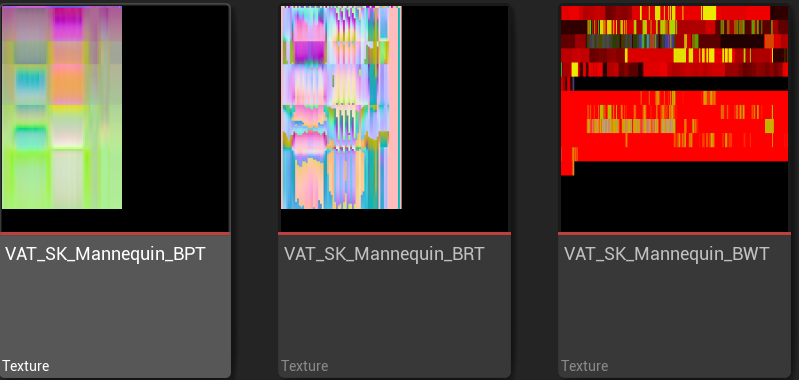

我们使用一些插件，将骨骼网格体与对应的动画，转换成静态网格体和动画贴图

首先在UE5内置插件中开启“AnimToTexture”插件对骨骼网格体和动画进行处理和烘焙，烘焙好需要的资源后，就可以开始处理材质了，我们需要让材质能够读懂这些动画信息，之后就可以使用静态网格体播放动画了：

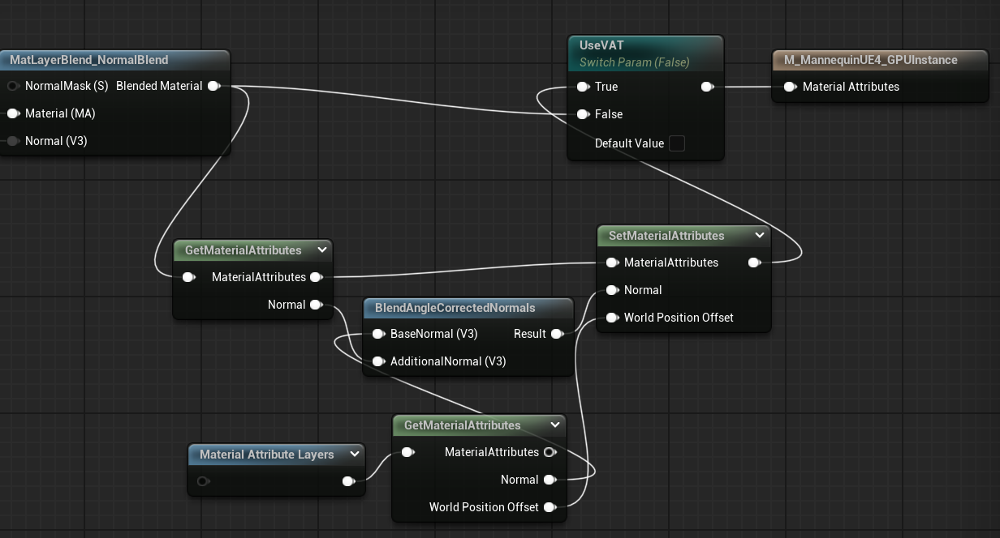


#### GPU Instance

UE5的GPU实例化已经实现了大多数基础功能，包括ZBuffer、GBuffer、光照、阴影、虚拟纹理支持、Nanite、距离剔除、视锥体剔除等。

只需要在蓝图中添加“InstancedStaticMesh”组件，然后在给出的面板上点点点就可以。


#### 开启Nanite

使用VAT后，直接开启Nanite的话会动画错乱和法系错误，关闭Lerp UV可以改善动画错乱，使用Explicit Tangent可以修复法线错误，其作用是在Nanite处理过后保留精确的切线值，保证法线表现正确，但会导致Nanite效果下降。

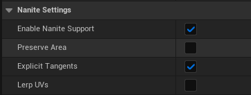


#### Mass AI

这是一个UE5的内置插件，可以基于路径生成人群，人群渲染的精度要远超VAT+GPU Instance，自带有人群的寻路以及随机组合算法，一个NPC由多个部件组成，当然，性能上必然是比之不足的。

首先，在Plugin里面打开Mass AI并重启，然后在场景中打开Zone Graph视图，以便看到路径。

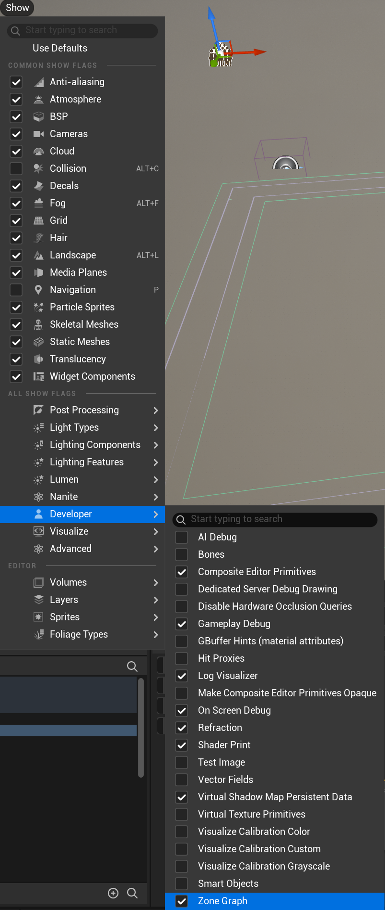

City Sample示例场景项目中有一个BP_MassCrowdSpawner蓝图，是人群生成的核心组件

然后在场景中创建一个“Zone Shape”的组件，这个是人群路径组件，点“W”后单击中轴线可以编辑路径，按住Alt可以转弯。

编辑好后，点击Build->Build ZoneGraph，烘好所需的数据，点击运行就可以看到人群了。

但实际人群的性能并不好，在开启了明显很重的LOD后，仍然会导致150帧的空地掉到80帧。


### 骨骼 (Skeletal)

**骨架（Skeleton）**本质上是一种层级结构，用于定义[骨架网格体](https://dev.epicgames.com/documentation/zh-cn/unreal-engine/skeletal-mesh-actors-in-unreal-engine?application_version=5.5)中的**骨骼（Bone）**（有时也称作**关节（Joint）**）。 就骨骼的位置及其对角色动作的控制而言，这些骨骼和生物学意义上的骨骼并无二致。

在虚幻引擎中，骨架用于保存动画数据、整体骨架层级和[动画序列](https://dev.epicgames.com/documentation/zh-cn/unreal-engine/animation-sequences-in-unreal-engine?application_version=5.5)，并设置它们的关联。 骨架资产还可以通过多种方式进行共享，从而让动画/数据在不同骨架间共享。


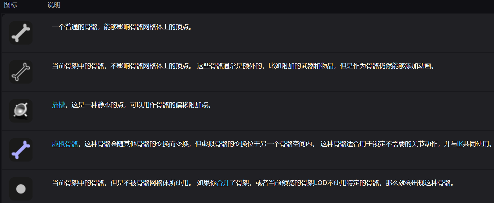


骨架可以储存以下几中动画数据：

- 动画通知
- 动画曲线
- 插槽：插槽偏移于骨架，可以用它将游戏物体对接到骨架上。
- 重定向源
- 混合配置文件和混合遮罩


#### 动画重定向

**动画重定向** 是一种允许在共用相同骨架资源但比例差异很大的角色之间复用动画的功能。通过重定位，可以防止生成动画的骨架在使用来自不同外形的角色的动画时丢失比例或产生不必要的变形。 通过动画重定位，还可以在使用 **不同骨架** 资源的角色之间共享动画，前提是他们使用相似的骨骼层级，并使用名为 **绑定（Rig）** 的共享资源在骨架之间传递动画数据。

想要多个骨骼网格体共享一个骨架，需要骨骼层级和命名相同。

如果想要增加骨骼节点，在不更改主要骨骼层级排列的情况下是可以的，但改变排列或在骨骼中间插入多余的骨骼均会出现问题或不能使用。


产生共享骨架途径：

导入多个具备相同层级和排列的骨骼网格体，导入时选择之前已导入的类似骨架，具体的骨骼比例旋转等信息会存储在骨骼网格体中，而新增的骨骼也会合并进去，对于不需要这些新增骨骼的模型会自动忽略掉。

但如果希望同一个动画能在不同骨骼网格体上表现出正常的效果，则需要让骨架基于不同的骨骼网格体进行重定向：
如图，两个角色可以共享一套骨架，他们的骨骼层级和排列均相同，但骨骼比例差别很大，因此如果不进行重定向就使用另一个角色的动画，就会使用动画原本对应骨骼网格体的骨骼比例

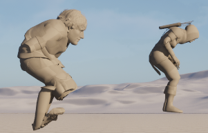

如果弹出如下警告窗口，说明导入的骨骼网格体和所选骨架的骨骼层级排列存在差异。

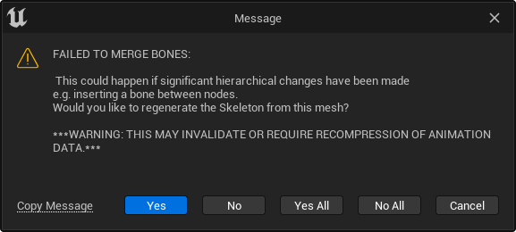


成功让多个骨骼网格体共享骨架后，需要去骨架资产中设置动画重定向的模式，如图展示重定向设置。有以下选项可供选择：

- Animation：默认值，骨骼的平移值来源于动画，不做不同体型的适配；
- Skeleton：骨骼平移来自目标骨架的绑定姿势；
- AnimationScaled：骨骼平移来自动画数据，但按骨架的比例调整。这是目标骨架（播放动画的骨架）与源骨架（制作动画的骨架）的骨骼长度之比；
- AnimationRelative：
- OrientAndScale：


对于针对每个骨骼进行设置的重定位设置，有一套标准的做法：

- 盆骨骨骼节点设置为“AnimationScaled”，保证动作的整体移动是生效的；
- Root骨骼、IK骨骼、使用了武器或其他标记式骨骼，设置为“Animation”，保证这些节点能准确的移动到动画本身想移动到的位置；
- 其余骨骼均设为“Skeleton”

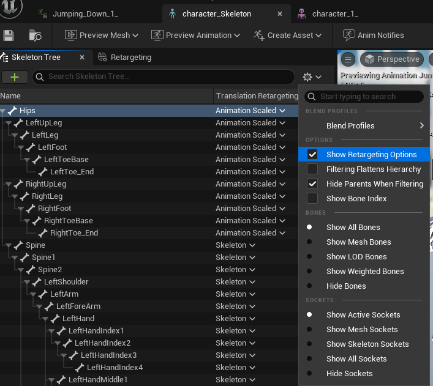

查看重定向骨架和非重定向骨架的区别：

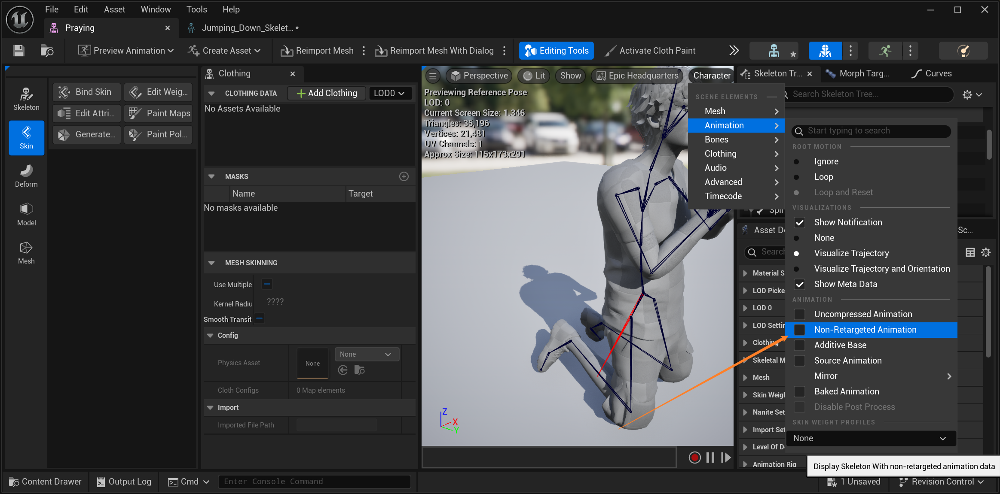


**如果不同骨架的骨骼网格体想要共享一个动画**

在为不共享相同骨架资源的角色处理动画重定位时，需要指定一个特殊的资源，名为 **绑定（Rig）**，它负责处理骨架之间传递的动画数据。 与各个角色关联的骨架资源通过共享的 **绑定（Rig）** 资源通信，以正确地将变换数据从一个源传递到其预定目标。


https://dev.epicgames.com/documentation/zh-cn/unreal-engine/using-retargeted-animations-in-unreal-engine?application_version=5.5


可兼容骨架：

要使用可兼容骨架系统，所有的角色都必须使用几乎一致的骨架层级结构和命名规则。 

除此以外，所有角色都必须拥有相似的网格体比例来达到理想的结果。


#### IK

IK(Inverse Kinematic)逆向动力学，与FK(Forward Kinematic)正向动力学相对，是根据骨骼的终节点来推算其他父节点的位置的一种方法。比如通过手的位置推算手腕、胳膊肘的骨骼的位置。

IK的优势在于需要精确控制手、脚位置的动作计算更方便，比如让脚实时贴合在地面和台阶上，比起为每种无法预测的状况单独制作动画，使用IK进行程序控制显然更方便。
类似的例子还有：靠近墙的时候自动扶墙，眼睛旋转伴随脖子的旋转，


##### IK目标（IK Goal）和解算器

IK目标（IK Goal）和解算器是控制角色肢体末端位置和旋转的核心组件，它们协同工作以实现更自然的动画效果。

1. 创建IK目标和解算器，点击层级（Hierarchy）面板中的 添加（+），然后选择 新建IK目标（New IK Goal） 。如果你的IK Rig尚无解算器，则将显示对话框窗口，你可以在其中选择要与新目标关联的解算器。人体骨架的IK最常用的是肢体Limb IK ，然后点击 确定（OK） 。
2. IK目标有可调整的属性，主要用于调整IK动作和动画的混合程度
   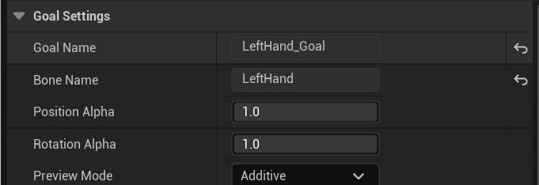


##### IK重定向两足标准角色

虚幻引擎提供了灵活的工具，用于将动画从一个角色重定向到另一个角色。一种方法是IK Rig与IK重定向器结合使用，这样就可以重定向带有迥异的骨架层级和比例的角色。重定向动画可用于在多个不同骨架之间共享动画数据，而无需在虚幻引擎之外创建和管理新动画。

1. 在为每个需要进行重定向的骨架创建IK Rig资产后，首先需要定义**根骨骼（Retarget Root）**，根骨骼一般是盆骨或臀部的骨骼，右击骨骼节点->Set Retarget Root；

2. 然后需要定义**骨骼链（Retarget Chain）**，一个骨骼链条中的骨骼必须是首尾相接的单线链，创建过程中需要核对骨骼链的部位是否和其自动命名能对的上。
   *创建链的时候也可以同时创建IK Goal和解算器，这个常用于解决重定向骨架之间动画不精准的问题，比如[快速栽植](https://dev.epicgames.com/documentation/zh-cn/unreal-engine/fix-foot-sliding-with-ik-retargeter-in-unreal-engine?application_version=5.5)、[步幅扭曲](https://dev.epicgames.com/documentation/zh-cn/unreal-engine/ik-rig-animation-retargeting-in-unreal-engine?application_version=5.5#全局设置)或 **混合到源**

   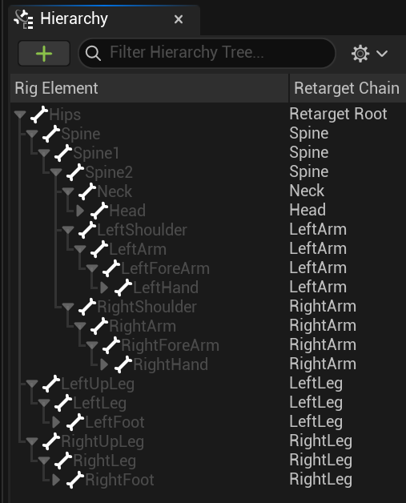

| **头部（Head）**   | `head`                                                 |
| ------------------ | ------------------------------------------------------ |
| **颈部（Neck）**   | `neck`                                                 |
| **腿部（Leg）**    | `leg` `hip` `thigh` `calf` `knee` `foot` `ankle` `toe` |
| **手臂（Arm）**    | `arm` `clavicle` `shoulder` `elbow` `wrist` `hand`     |
| **脊椎（Spine）**  | `spine`                                                |
| **下颌（Jaw）**    | `jaw`                                                  |
| **尾部（Tail）**   | `tail` `tentacle`                                      |
| **拇指（Thumb）**  | `thumb`                                                |
| **食指（Index）**  | `index`                                                |
| **中指（Middle）** | `middle`                                               |
| **无名指（Ring）** | `ring`                                                 |
| **小指（Pinky）**  | `pinky`                                                |
| **根骨骼（Root）** | `root`                                                 |

3. 成功创建后右下角IK重定向属性面板会出现该骨骼链，可以在这里做修改与增删；
   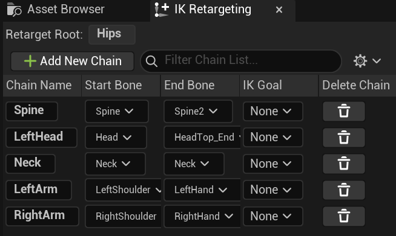

4. 接下来进行IK重定向，创建IK Retarget资产后并添加源Rig和目标Rig后，首先需要核对骨骼链映射，在Chain Mapping视图中查看，检查源骨架和目标骨架的重定向骨骼链映射是否正确。
   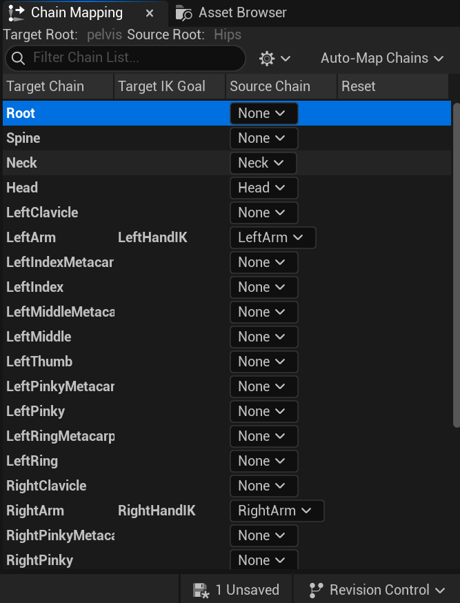
5. 如果双方的基础姿势不同（T pose和A pose），则需要进行重定向姿势，在IK Retarget资产中的左上角点击“Running Retarget”，切换成“Editing Retarget Pose”模式，点击骨骼节点即可旋转该节点，进行姿势重定向。
6. 一切就绪后，就可以在Asset Browser中预览动画了，如果效果可行，则可以点击该视图上方的“Export Selected Animations”，导出重定向后的动画序列资产。
   
7. 然而，如果重定向的两个骨架差距就过大，最后的动画效果可能还是会有一些瑕疵，或者想要加入一些更有特色的小动作，这就需要IK Goal与解算器进行调整，具体IK Goal和解算器添加过程参考上文**IK目标（IK Goal）和解算器**。
8. IK Goal和解算器创建成功后回到Rig Retarget资产界面，点击角色脚下的圆环，即可在Details调整根骨骼的各项属性，以此挑战角色整体动作。
   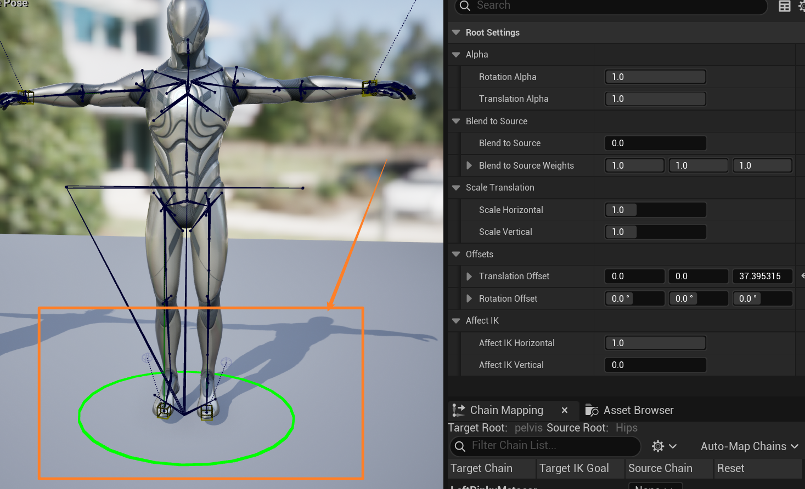


##### IK重定向配置文件

用于控制全局骨架IK重定向的配置文件


#### 功能


##### Mixamo骨架到UE小白人重定向IK骨骼定向

当类似Mixamo这类的骨架和小白人进行重定向时，因为IK骨骼没有对应的动画数据，因此导出的动画里小白人的IK骨骼不会随动画而动，这就会导致角色在实机播放动画时IK驱动的部位被定死在固定位置。


### ChaosCloth


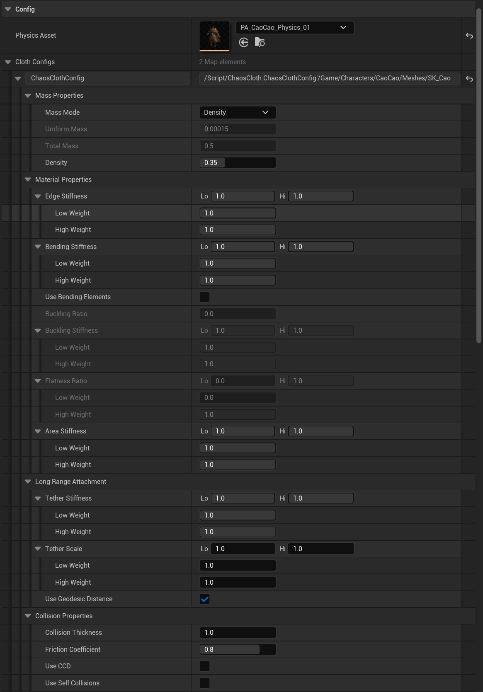


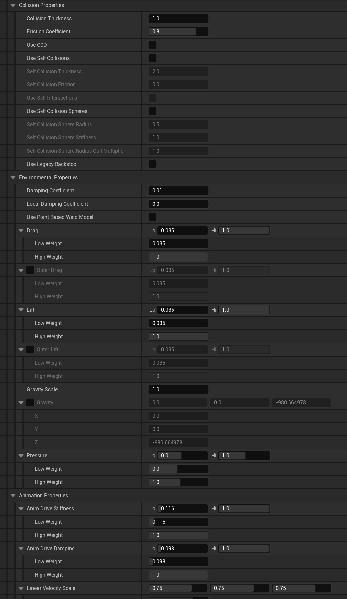


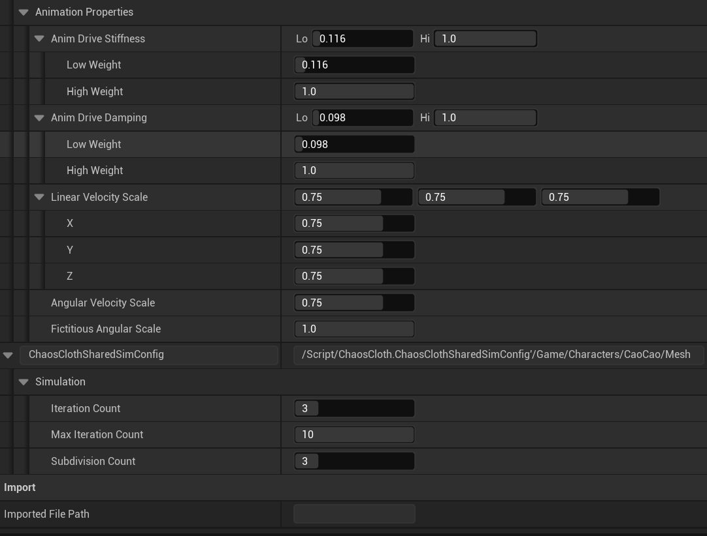


布料模拟和环境进行碰撞，勾线这两个选项

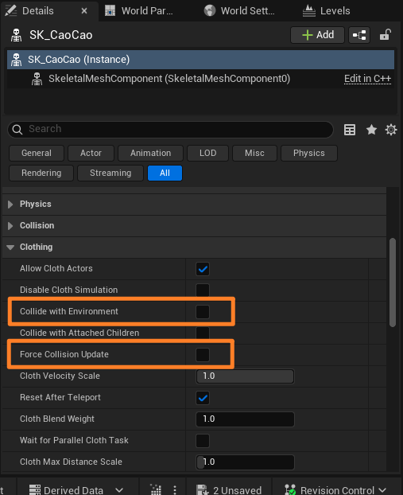


ChaosCloth不会对碰撞体数量做限制，但数量越多，效率也会越低，需要保证效果的前提下尽可能减少数量。


调试信息：

在骨骼网格体界面可以看到

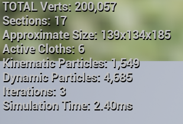


## 材质图

### 基本PBR材质

#### 基本不透明材质

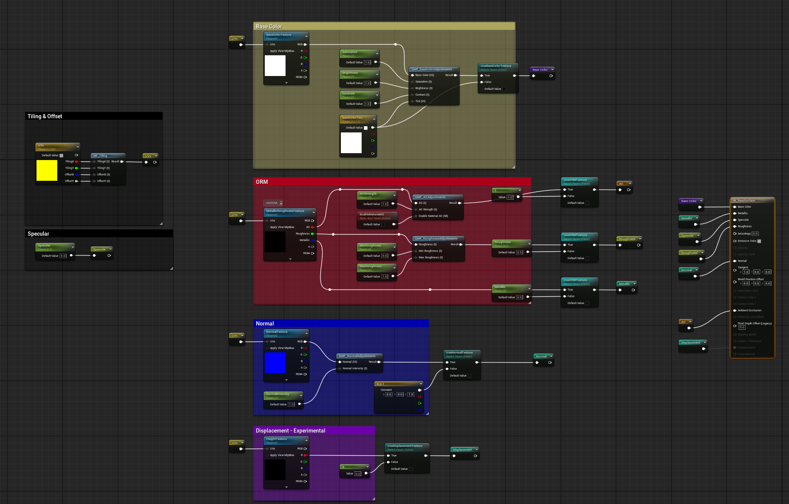


基础色，UE的贴图和采样是合在一起的（TextureSample），还可以输入Mip等级，静态分支是用static switch，Base Color节点是用于便于整理，可以转接到最终输出节点上去。

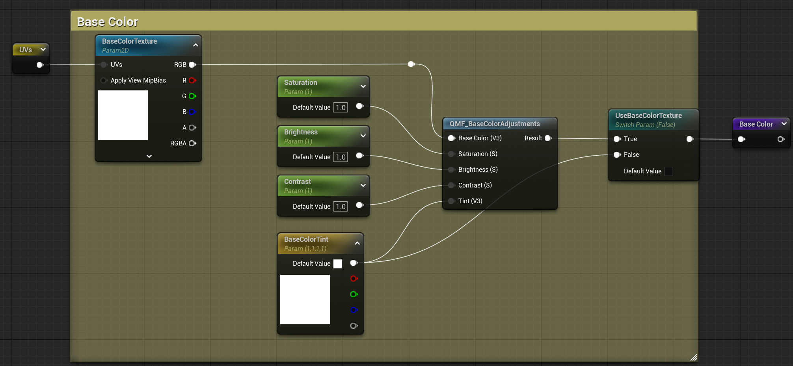

**材质函数**：QMF_BaseColorAdjustments，是调节基础色饱和、亮度和对比度的功能，是可自定义的材质函数，相当于include文件。

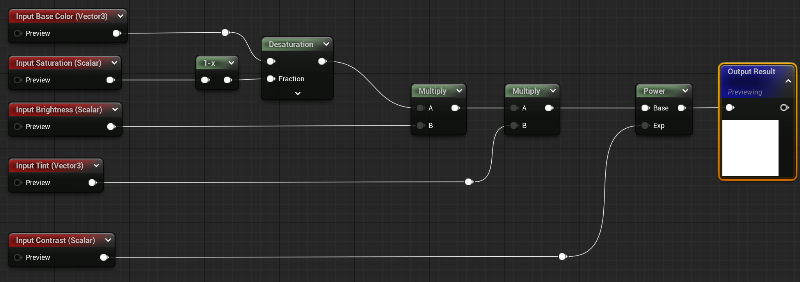

ORM三合一贴图，RGB通道分别为：AO、Roughness、Metallic，为避免进行多余的采样计算，每条都增加了静态分支。

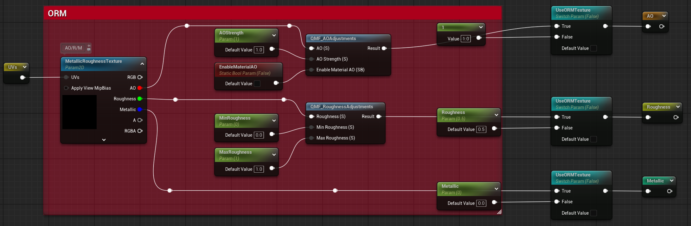

**材质函数**：处理AO，粗糙度和金属度同理。

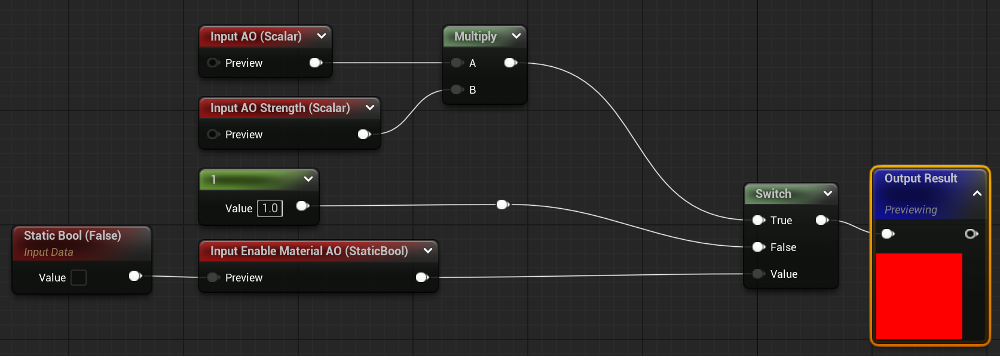

法线贴图和置换贴图同理，不过置换贴图只有在开启曲面细分的时候才能启用.

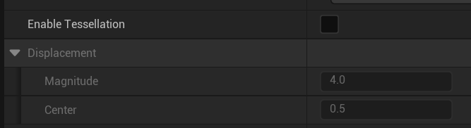

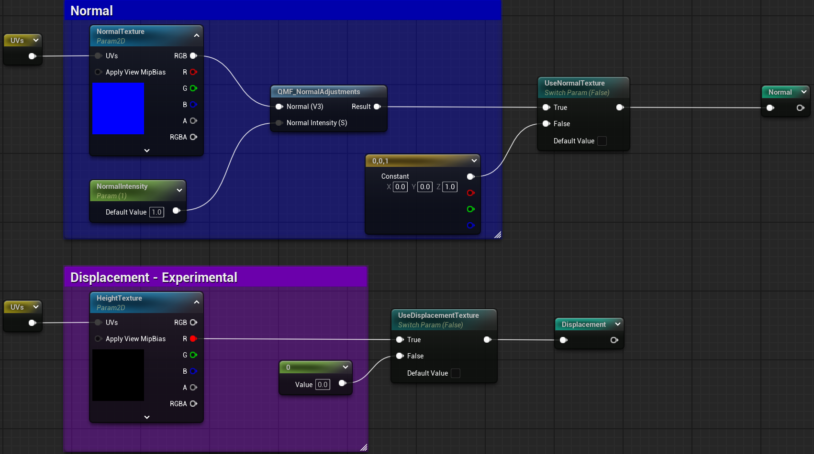


这是uv坐标的scale和offset，UV的节点叫“TextureCoordinate”

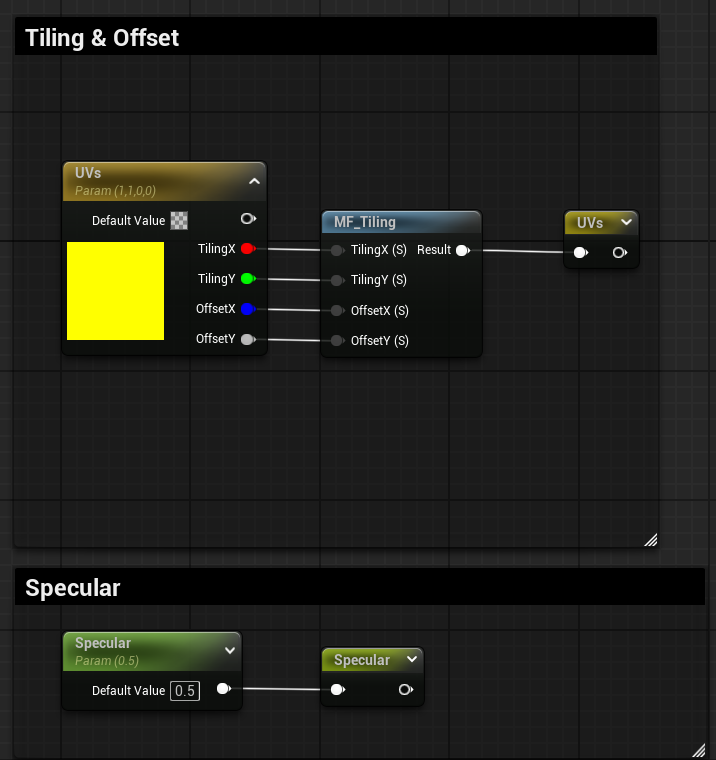

#### 透明玻璃

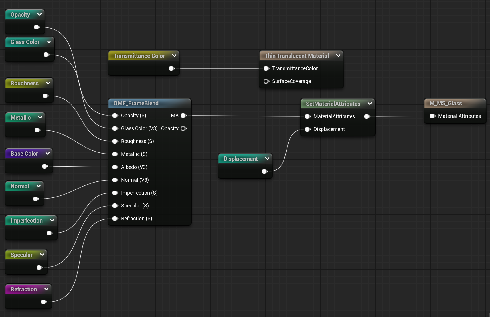


###  特殊节点

1. 避开自动曝光

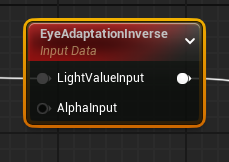


### 角色渲染


#### 纱布材质

遇到这类透明的纱材质时，应当使用透明测试制作，这样做出的纱材质也更加有质感。

传入两张贴图，一张透明度贴图，一张遮罩贴图，并将二者相乘后反相，即可得到纱布材质的遮罩图。

这两张贴图同时也影响到了纱布的颜色和光滑度，纱布越不透明的地方，质感会越接近丝绸，因此光滑度会高，颜色会深。

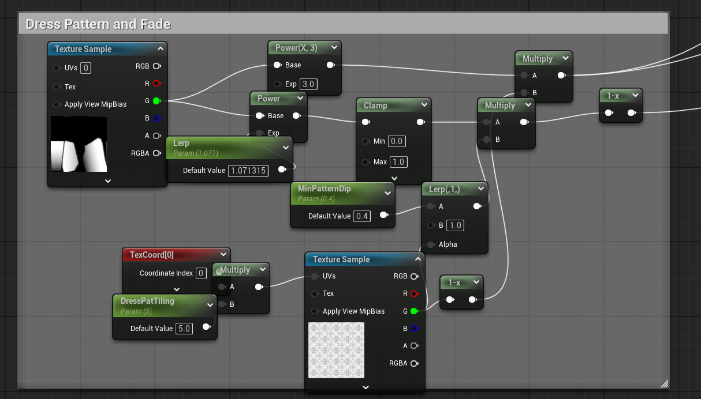

#### 皮肤材质

UE材质自带有效果很不错的次表面散射功能，皮肤渲染中，选用“Subsurface Profile”，即次表面轮廓。

开启次表面轮廓后，通过“Opacity”控制次表面散射度。
我们使用ORST四合一贴图（AO、Roughness、Specular、Thickness），厚度图并不需要很高的精度，因此放在Alpha通道是没有问题的。

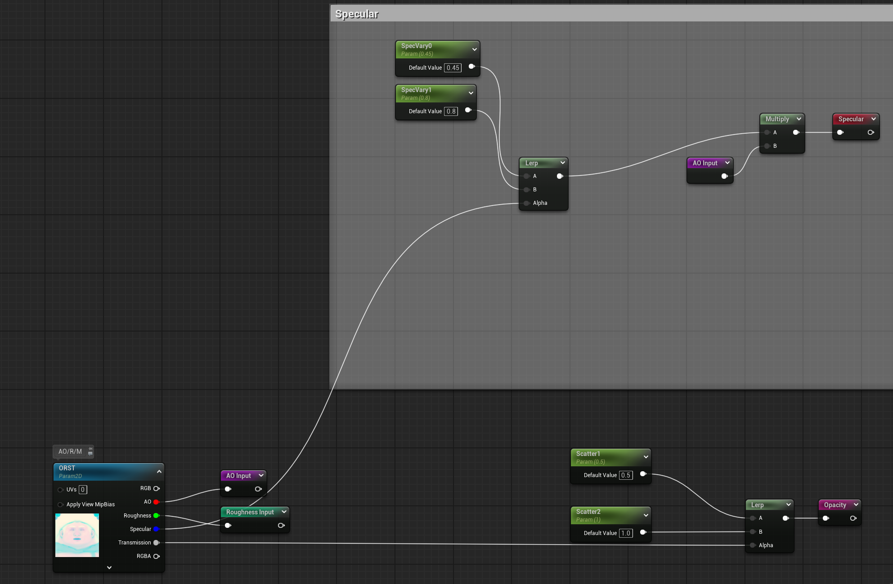


### 物件渲染

#### 冰材质

很好看的冰

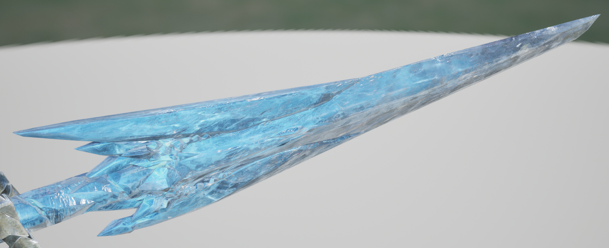


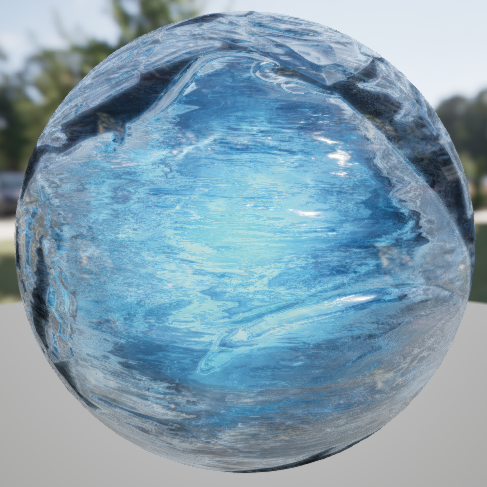

大致可以分为三部分：

1. 视差映射以及法线扭曲模拟冰的折射；
2. 冰的光照模型：次表面散射、光的反射、光的透射；


#### 植被交互

枢轴点

枢轴点植物的交互与动态的生动程度都远超过普通的位置或RT的简单模拟，但它的制作需要在模型中写入特殊的信息，同时需要Shader特殊的逻辑处理这些信息，才能得到优秀的效果。

**枢轴点绘制器工具（Pivot Painter Tool）** 是一个MAXScript（3d max的脚本程序），**可将模型枢轴点和轴向信息存储下来**。Pivot Painter目前有两个版本，在Pivot Painter1中，存储在模型的顶点和UV2、UV3通道上；**在Pivot Painter2中，会存储在导出的纹理贴图和UV2通道中**。这些信息随后即可在虚幻引擎的材质系统内引用并解析，以创建风力和交互效果。

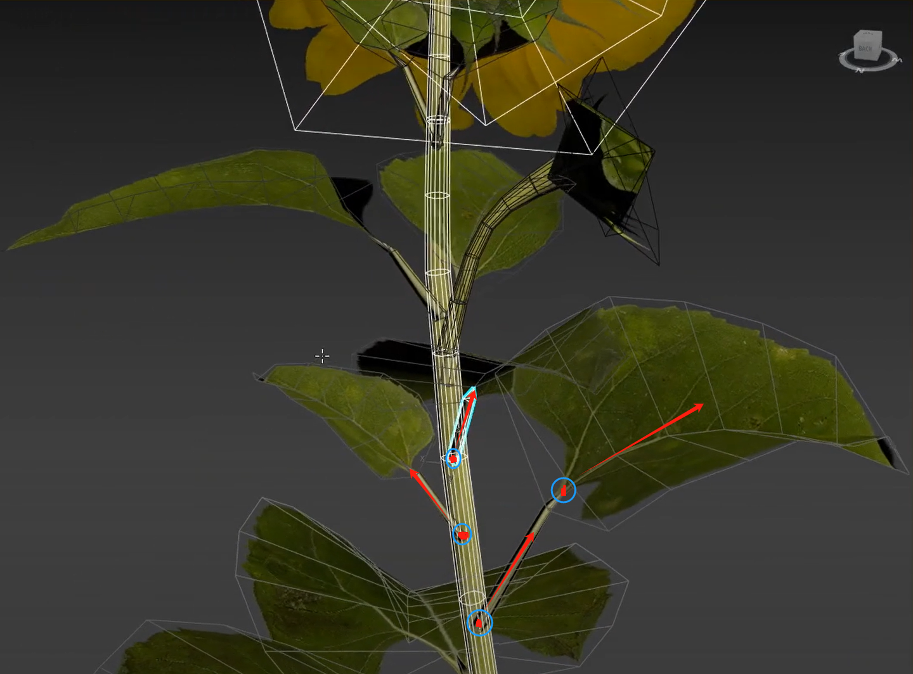


## UE测试与优化

### Unreal Insights Trace

Timing Insights窗口


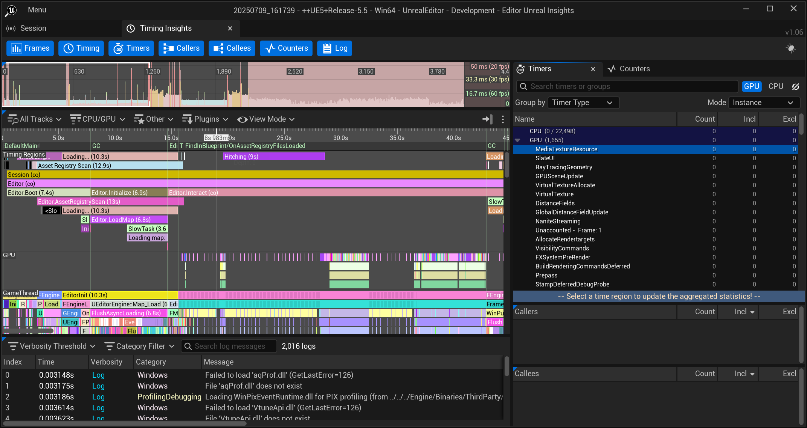


### Oodle压缩


### PSO缓存

参考文章：https://zhuanlan.zhihu.com/p/681319390

Pipeline State Object，这是D3D12、Vulkan、Metal等现代图形API提供的一种特性，用于减少改变渲染状态时造成的性能下降


### CMD命令

官方文档：https://dev.epicgames.com/documentation/zh-cn/unreal-engine/stat-commands-in-unreal-engine?application_version=5.5

纹理流送池：

​	**Stat STREAMING**

​	**ListTextures nonstreaming**


解锁编辑器帧率上限144fps

**t.maxFPS 144**


- **r.shadowquality** **0** 共有 0 到 5 六个等级，0 没有动态阴影，5 最高质量动态阴影。
- **t.maxfps** 调整最大帧率。
- **stat fps** 显示当前帧率。
- **stat unit** 显示当前帧的渲染延迟，包括 game 、draw 、rhi 、 GPU 线程的延迟。
- **stat + 任一线程名**可以查看更加细致的延迟。
- **stat scenerendering** 显示不同的渲染命令所需的时间。
- **freezerrendering** 冻结渲染，方便查看遮挡剔除情况，开启命令时会冻结当前帧的剔除。
- **stat initviews** 提供有关遮挡相关的渲染结果，比如多少个对象被因为遮挡有隐藏，被视锥体隐藏等。
- **stat LightRendering** 灯光耗时分析。
- **r.VisualizeOccludedPrimitives** 1 开启可视化剔除。
- **r.VisualizeOccludedPrimitives 0** 关闭可视化剔除。


### 图形设置

**SkeletalMeshLODBias** 骨骼网格体的LOD等级偏移

**ViewDistanceScale** 距离剔除

**foliage.DensityScale** 植被密度

**DistanceFieldAO** 有向距离场

**Lumen.DiffuseIndirect.Allow** Lumen漫反射间接光

**LumenScene.Radiosity.ProbeSpacing** Lumen


## 蓝图 Blueprint


## C++


### 基础操作与设置

“Enable Live Coding”，实时编译对代码的更新

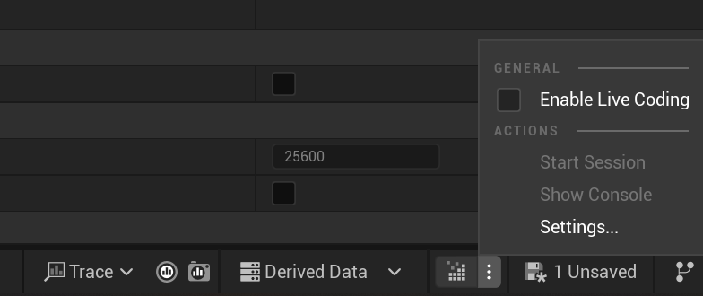

vs2022快捷键：

Ctrl+B：编译当前文件，只修改了当前文件的时候用这个就可以，编译的更快一些；

Ctrl+Shift+B：编译项目


主角色的控制、输入代码，模板案例会在此处重写一个C++类，使用一个蓝图类继承该C++类并放进这里，可以在蓝图中直观地修改一些暴漏的配置选项：

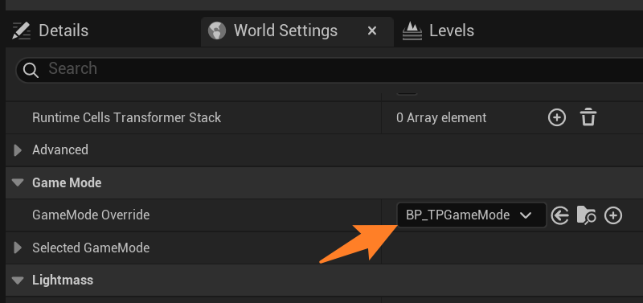

在这修改默认IDE

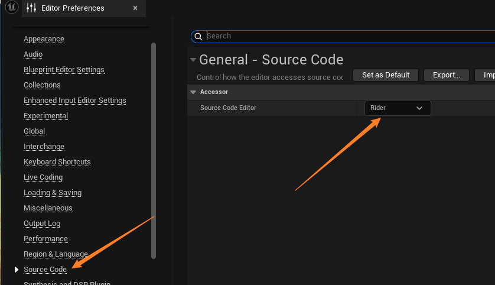

创建一个由我们控制的角色：

1. 基于C++角色类来创建一个蓝图 BP PlayerCharacter；
2. 创建基于GameMode的蓝图BP PlayerGameMode；
3. 将BP PlayerGameMode设置为游戏的GameMode；
4. 将BP PlayerGameMode的Default Pawn Class赋值为BP PlayerCharacter。


**UPROPERTY**

UPROPERTY是 Unreal Engine 中用于声明属性的宏，它用于标记某个属性是一个 Unreal Engine 托管的属性，并且可以在编辑器中进行访问和操作。
UPROPERTY宏提供了一系列参数，用于定义属性的属性和行为，例如是否可编辑、是否可序列化等。


类似于属性修饰符，部分常用UPROPERTY：

1. EditAnywhere:允许在编辑器中编辑该属性；

   示例：

   头文件中声明
   ```c++
   protected:
   UPROPERTY(EditAnywhere)
   float test_VisibleAnywhere;
   ```
   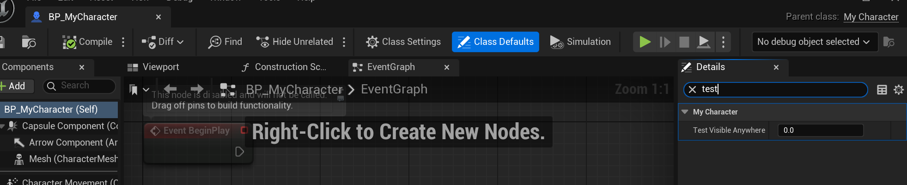


2. EditDefaultsOnly:实例就不能修改了；

3. BlueprintReadWrite:允许在蓝图(EventGraph)中读写该属性。

4. VisibleAnywhere**:在编辑器中显示该属性，但不允许编辑。

5. Transient:该属性不会被序列化保存，通常用于临时数据或不希望被保存的数据

6. Category:指定在编辑器中显示的该属性所属的分类。

7. meta:可以用来设置一些元数据，如文档、关键字等，meta=(AlowPrivateAccess="true")允许私有属性在编辑器中进行编辑。

   …………
   

```c++
protected:
UPROPERTY(EditDefaultsOnly, BlueprintReadOnly, Category="XT|TEST001")
float test_VisibleAnywhere;
```

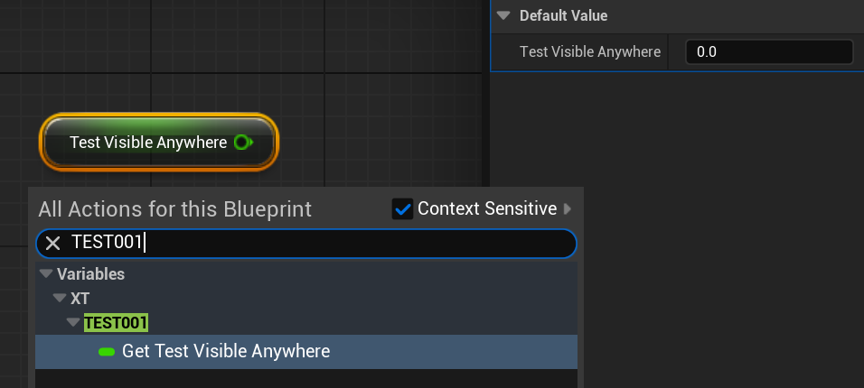

```c++
private:
    UPROPERTY(EditDefaultsOnly, BlueprintReadOnly, Category="XT|TEST001", meta=(AllowPrivateAccess = "true"))
    float test_VisibleAnywhere;
```

使用meta后，即便是私有变量，也可以从蓝图进行访问


**UFUNCTION**

UFUNCTION是 Unreal Engine 中用于声明函数的宏，它用于标记某个函数是-个 Unreal Engine 托管的函数，并且可以在编辑器中进行访问和操作。
UFUNCTION宏提供了一系列参数，用于定义函数的属性和行为，例如是否是蓝图可调用的、是否可在网络中复制等。

1. BlueprintCallable:允许在蓝图中调用该函数。
2. BlueprintPure:声明该函数为纯函数，即不会修改对象的状态。
3. BlueprintlmplementableEvent:声明该函数为蓝图可实现的事件，在蓝图中可以实现该事件的具体逻辑。
4. Category:指定在编辑器中显示的该函数所属的分类。
5. Meta:可以用来设置一些元数据，如文档、关键字等。
6. Server**、Client、Reliable:用于网络功能，指定该函数在服务器端、客户端执行，以及指定该函数是否可靠传输。
   …………

