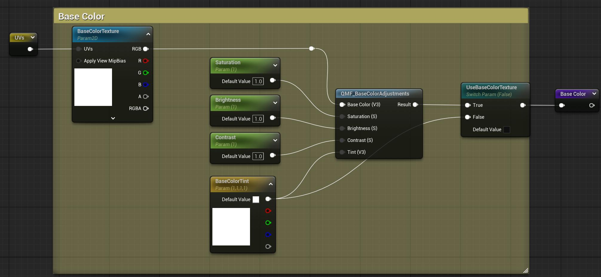
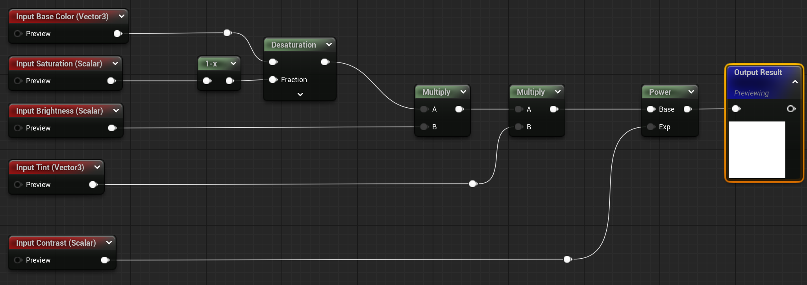
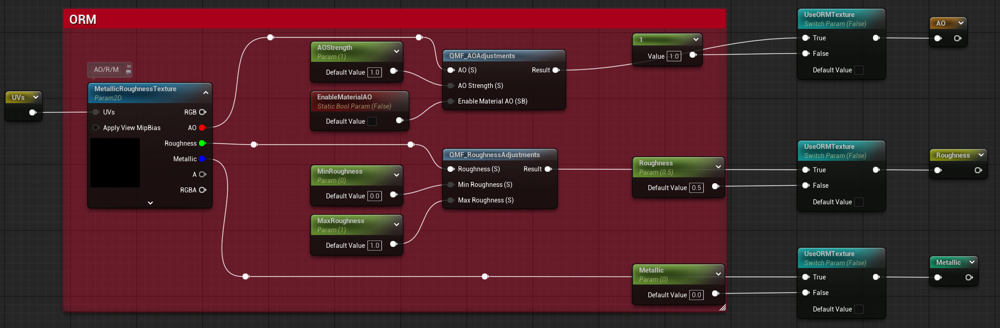
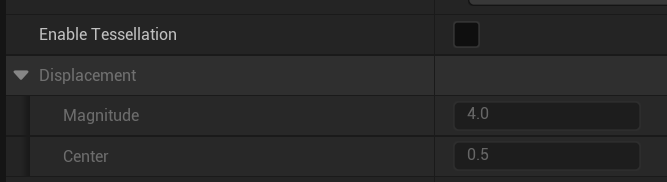
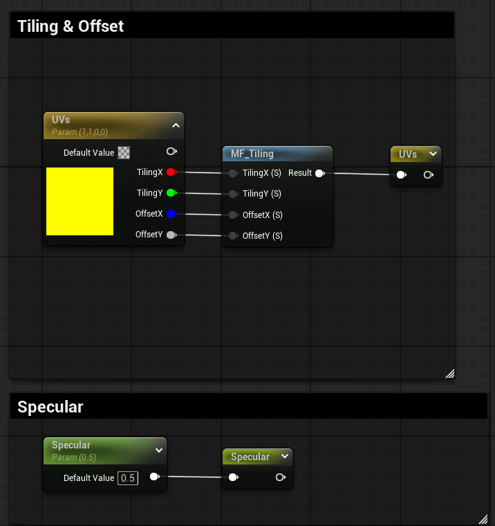
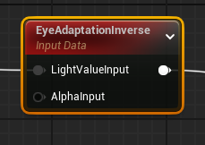
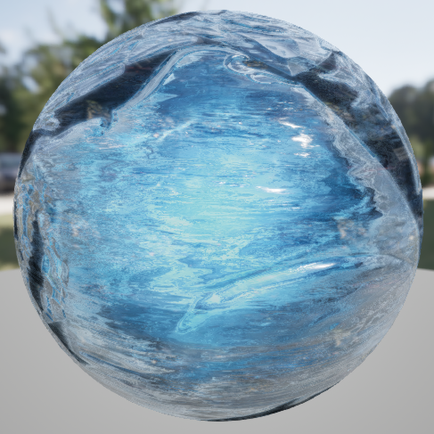

# 虚幻引擎


## 常用技术


### 虚拟纹理（Virtual Texture，简称VT）

1. 原理：
   类似于虚拟内存的概念，VT的核心思想便是尽可能只把需要用到的纹理内容加载到内存中。和[Texture Streaming](https://zhida.zhihu.com/search?content_id=242896378&content_type=Article&match_order=1&q=Texture+Streaming&zhida_source=entity)不一样的是，他不是仅仅以[Mip等级](https://zhida.zhihu.com/search?content_id=242896378&content_type=Article&match_order=1&q=Mip等级&zhida_source=entity)为粒度进行控制，而是将原始贴图切分成大小相同的Page，然后在运行时对所需要的Page发起请求。Page沿用了虚拟内存中页的概念，下文我们也互换地使用Tile来表示。请求完毕的Page会被映射到一个物理贴图（参考物理内存）中供实际的渲染使用。为了得知Page被映射到物理贴图中的哪个位置，我们还需要给shader额外提供一个页表（PageTable），来索引贴图实际的位置。物理贴图和页表的尺寸一般来说都远小于原始贴图，所以通过额外的采样和动态加载机制，我们节省了内存。


### Nanite

这个视图可以看到Nanite流程中一些数据结构的可视化


类似于网格版的VT，渲染管线会把多个三角面组成一个簇（cluster），首先Nanite网格是基于流处理的，会动态加载进内存，然后对每个cluster决定LOD级别，再基于cluster进行视锥体剔除和遮挡剔除，因为需要生成额外的cluster构造包围数据，因此Nanite网格包体会比原来的Mesh大一些。

Nanite只能进行一定限度内的三角面数量变化，不会做出能影响到模型形体的合面，因此效果不错，但相应的，面数下降是有限度的，因此如果一个模型存在近距离看细节的需求的同时也有远距离观看的情景时，需要老LOD技术配合才能达到性能的极致。

**Nanite不支持什么？**

​	不支持：

​		半透明或者带遮罩的材质

​		非刚体形变，骨骼动画等

​		细分和置换

​	支持但不友好：

​		对于aggregate类型的几何体不友好

​		很多很小的物体组成了一个带孔的体积

​		草地、树叶、毛发（因为这种情况，LOD很难建立的很有效）


问：一个3A游戏镜头中的cluster的数量非常多，这种数量的组下进行视锥体剔除和遮挡剔除，是如何做到剔除本身消耗的性能做的不错的地步的？


### 程序化生成（PCG）


## 材质图

### 基本PBR材质

#### 基本不透明材质


基础色，UE的贴图和采样是合在一起的（TextureSample），还可以输入Mip等级，静态分支是用static switch，Base Color节点是用于便于整理，可以转接到最终输出节点上去。



**材质函数**：QMF_BaseColorAdjustments，是调节基础色饱和、亮度和对比度的功能，是可自定义的材质函数，相当于include文件。



ORM三合一贴图，RGB通道分别为：AO、Roughness、Metallic，为避免进行多余的采样计算，每条都增加了静态分支。



**材质函数**：处理AO，粗糙度和金属度同理。


法线贴图和置换贴图同理，不过置换贴图只有在开启曲面细分的时候才能启用.




这是uv坐标的scale和offset，UV的节点叫“TextureCoordinate”



#### 透明玻璃


###  特殊节点

1. 避开自动曝光




### 角色渲染


#### 纱布材质

遇到这类透明的纱材质时，应当使用透明测试制作，这样做出的纱材质也更加有质感。

传入两张贴图，一张透明度贴图，一张遮罩贴图，并将二者相乘后反相，即可得到纱布材质的遮罩图。

这两张贴图同时也影响到了纱布的颜色和光滑度，纱布越不透明的地方，质感会越接近丝绸，因此光滑度会高，颜色会深。


### 物件渲染

#### 冰材质

很好看的冰




大致可以分为三部分：

1. 视差映射以及法线扭曲模拟冰的折射；
2. 冰的光照模型：次表面散射、光的反射、光的透射；
3. 

## UE测试与优化

### Unreal Insights Trace

Timing Insights窗口


### Oodle压缩


### PSO缓存

参考文章：https://zhuanlan.zhihu.com/p/681319390

Pipeline State Object，这是D3D12、Vulkan、Metal等现代图形API提供的一种特性，用于减少改变渲染状态时造成的性能下降


### CMD命令

官方文档：https://dev.epicgames.com/documentation/zh-cn/unreal-engine/stat-commands-in-unreal-engine?application_version=5.5

纹理流送池：

​	Stat STREAMING

​	ListTextures nonstreaming


- **r.shadowquality** **0** 共有 0 到 5 六个等级，0 没有动态阴影，5 最高质量动态阴影。
- **t.maxfps** 调整最大帧率。
- **stat fps** 显示当前帧率。
- **stat unit** 显示当前帧的渲染延迟，包括 game 、draw 、rhi 、 GPU 线程的延迟。
- **stat + 任一线程名**可以查看更加细致的延迟。
- **stat scenerendering** 显示不同的渲染命令所需的时间。
- **freezerrendering** 冻结渲染，方便查看遮挡剔除情况，开启命令时会冻结当前帧的剔除。
- **stat initviews** 提供有关遮挡相关的渲染结果，比如多少个对象被因为遮挡有隐藏，被视锥体隐藏等。
- **stat LightRendering** 灯光耗时分析。
- **r.VisualizeOccludedPrimitives** 1 开启可视化剔除。
- **r.VisualizeOccludedPrimitives 0** 关闭可视化剔除。


## C++


### 基础操作与设置

“Enable Live Coding”，实时编译对代码的更新


vs2022快捷键：

Ctrl+B：编译当前文件，只修改了当前文件的时候用这个就可以，编译的更快一些；

Ctrl+Shift+B：编译项目


主角色的控制、输入代码，模板案例会在此处重写一个C++类，使用一个蓝图类继承该C++类并放进这里，可以在蓝图中直观地修改一些暴漏的配置选项：


在这修改默认IDE


创建一个由我们控制的角色：

1. 基于C++角色类来创建一个蓝图 BP PlayerCharacter；
2. 创建基于GameMode的蓝图BP PlayerGameMode；
3. 将BP PlayerGameMode设置为游戏的GameMode；
4. 将BP PlayerGameMode的Default Pawn Class赋值为BP PlayerCharacter。


**UPROPERTY**

UPROPERTY是 Unreal Engine 中用于声明属性的宏，它用于标记某个属性是一个 Unreal Engine 托管的属性，并且可以在编辑器中进行访问和操作。
UPROPERTY宏提供了一系列参数，用于定义属性的属性和行为，例如是否可编辑、是否可序列化等。


类似于属性修饰符，部分常用UPROPERTY：

1. EditAnywhere:允许在编辑器中编辑该属性；

   示例：

   头文件中声明
   ```c++
   protected:
   UPROPERTY(EditAnywhere)
   float test_VisibleAnywhere;
   ```
   


2. EditDefaultsOnly:实例就不能修改了；

3. BlueprintReadWrite:允许在蓝图(EventGraph)中读写该属性。

4. VisibleAnywhere**:在编辑器中显示该属性，但不允许编辑。

5. Transient:该属性不会被序列化保存，通常用于临时数据或不希望被保存的数据

6. Category:指定在编辑器中显示的该属性所属的分类。

7. meta:可以用来设置一些元数据，如文档、关键字等，meta=(AlowPrivateAccess="true")允许私有属性在编辑器中进行编辑。

   …………
   

```c++
protected:
UPROPERTY(EditDefaultsOnly, BlueprintReadOnly, Category="XT|TEST001")
float test_VisibleAnywhere;
```


```c++
private:
    UPROPERTY(EditDefaultsOnly, BlueprintReadOnly, Category="XT|TEST001", meta=(AllowPrivateAccess = "true"))
    float test_VisibleAnywhere;
```

使用meta后，即便是私有变量，也可以从蓝图进行访问


**UFUNCTION**

UFUNCTION是 Unreal Engine 中用于声明函数的宏，它用于标记某个函数是-个 Unreal Engine 托管的函数，并且可以在编辑器中进行访问和操作。
UFUNCTION宏提供了一系列参数，用于定义函数的属性和行为，例如是否是蓝图可调用的、是否可在网络中复制等。

1. BlueprintCallable:允许在蓝图中调用该函数。
2. BlueprintPure:声明该函数为纯函数，即不会修改对象的状态。
3. BlueprintlmplementableEvent:声明该函数为蓝图可实现的事件，在蓝图中可以实现该事件的具体逻辑。
4. Category:指定在编辑器中显示的该函数所属的分类。
5. Meta:可以用来设置一些元数据，如文档、关键字等。
6. Server**、Client、Reliable:用于网络功能，指定该函数在服务器端、客户端执行，以及指定该函数是否可靠传输。
   …………

