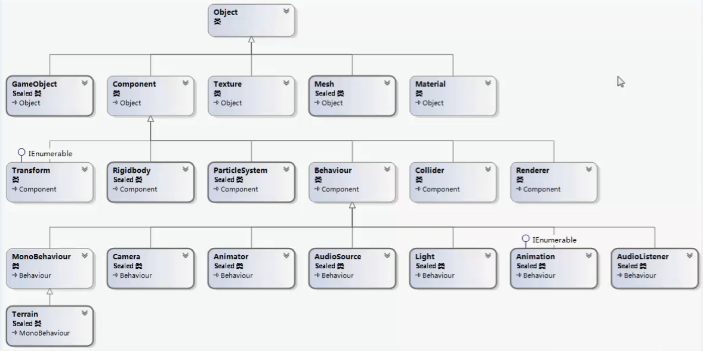

## 常用API




## 常用功能


### 常用调试代码

[ExecuteInEditMode] ：编辑器模式运行

断点调试：加断点->运行场景->F5调试->F11运行下一句->窗口快速监视/即时窗口

Update方法必须使用单帧调试：启动调试->运行场景 暂停->加断点->F11

性能测试：

```
Profiler.BeginSample("performance test");
……
Profiler.EndSample();
```

### 视锥体AABB包围盒

注意：Graphics.DrawMeshInstancedProcedural中会接收一个Bounds值，其作用是使实例化物体坐标空间转换至相对Bounds的空间。（根本不是内置的AABB裁切，屁用都没有，被骗了！）

https://zhuanlan.zhihu.com/p/55915345


unity引擎提供一些很方便的方法用于计算AABB盒

```
Plane[] cameraFrustumPlanes = new Plane[6];// 存储AABB盒的六个面
GeometryUtility.CalculateFrustumPlanes(cam, cameraFrustumPlanes);// 计算AABB盒的六个面
//or
//Plane[] cameraFrustumPlanes = GeometryUtility.CalculateFrustumPlanes(cam);

//计算单元对象的包围盒
Bounds bound = new Bounds(centerPosWS, sizeWS);

bool isInPlane = GeometryUtility.TestPlanesAABB(cameraFrustumPlanes, bound);// 判断bound是否在cameraFrustumPlanes内，返回一个布尔值

```


### 视锥体OBB包围盒


## 设计模式


### 单例模式


