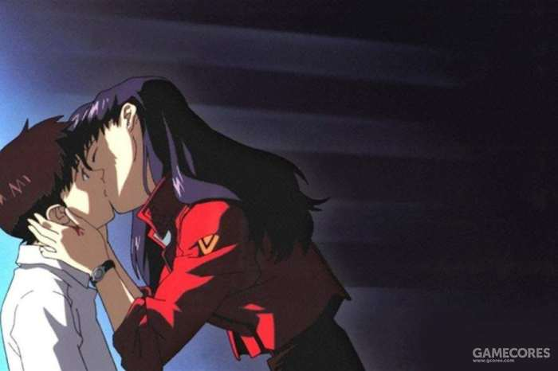
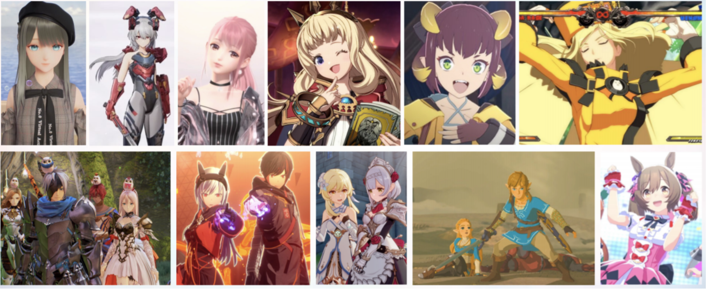
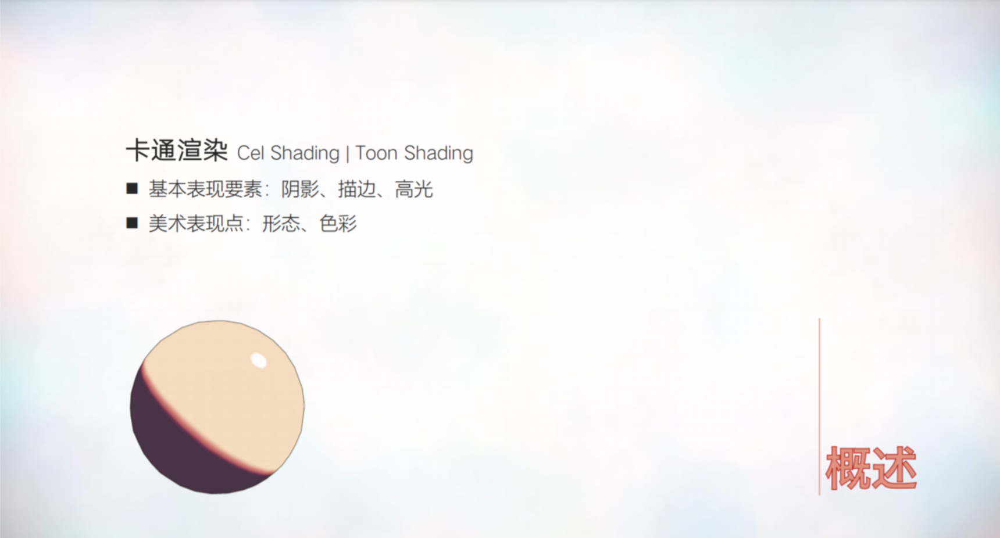
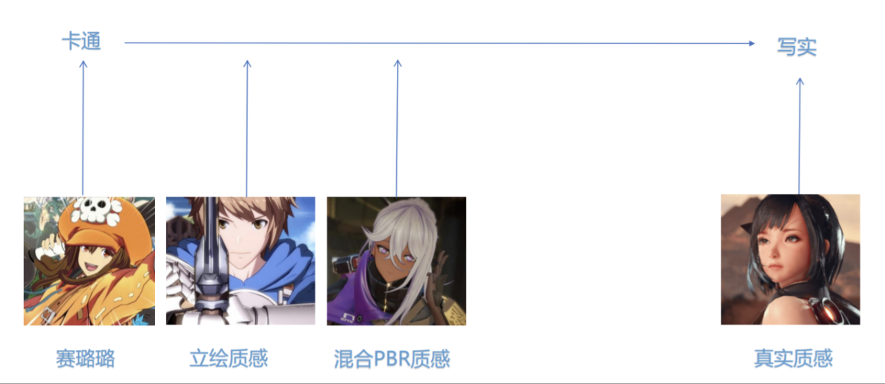
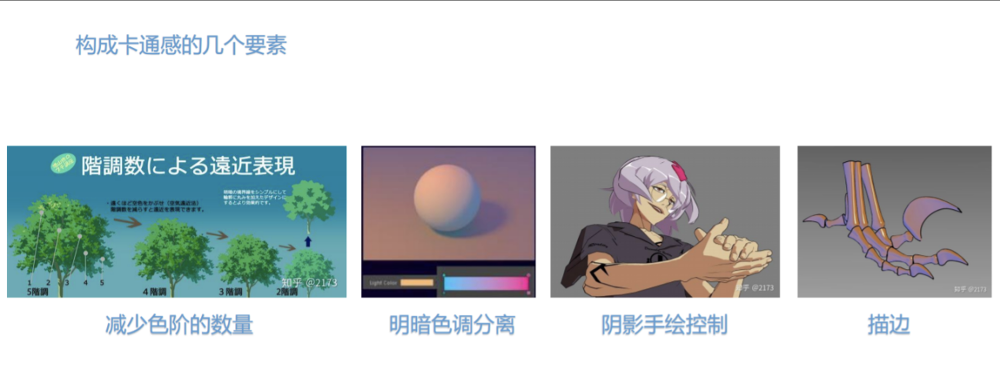

# Toon Shading Collection 

## Art Styles 卡通画风概述

卡通渲染属于非真实感渲染（Non-photorealistic rendering，简称NPR），追求更加有艺术感的画面效果，例如手绘风格的画面。对应的还有真实感渲染(Photorealistic rendering)，旨在渲染真实感的画面。

先对卡通渲染做大致分类：

------

 **美式卡通：**

着色——

- 色彩比较连续、有渐变色，接近真实感光照。
- 阴影和高光方面通常也有夸张和变形。
- 着色风格很大程度上依赖于艺术家定义的tone色调。

造型——

- 人物造型夸张。

典型例子——《军团要塞2》

------

**日式卡通：**

着色——

- 趋向于大片纯色色块。
- 明暗交界分明。（不连续渐变）

造型——

- 人物造型比美式写实。

典型例子——《崩坏3》

------

### 画风实现探讨

> 随着CGI技术的发展，电脑作画技术也不断地被运用到游戏和动画中，但是仍然有很多画面表现不协调的部分，看起来比较违和。这是由于工科出身的技术人员不了解动画中的某些效果为什么要这么呈现，以及创作者想要表达的内容到底是什么，他们只是在单纯地通过技术去还原效果而已。这就导致游戏画面中该有的元素都有，但就是表现不到位。
>
> 那么要实现好的效果，技术人员就需要对漫画画风和动画作画有一定的了解。一般对游戏来说对于动画的研究比对漫画的研究更具参考性一些。了解这些，就可以针对我们想要做的风格展开单方面的细化研究，然后再使用计算机图形技术进行画面实现。而不是目前大部分游戏渲染技术运用的那么单一化，只模仿到了表面没有模仿到神韵。
>
> 无论漫画作者还是作画大神或者某个动画公司，他们的风格一般都是很强烈的，粉丝一眼就能认出来是哪个公司的谁谁谁画的，而不是现在游戏千篇一律的卡通渲染效果。目前这个风格游戏的画面效果还有很多视觉元素没有开发出来，有很大的提升空间。
>
> 如果您是游戏或者动画相关的美术从业者，首先请思考，如何通过动画来实现图中的情感表现？如何通过3D渲染技术来表现图中的嘴部线条？如何通过灯光处理来烘托气氛？略有些年代感的赛璐璐风格统一配色是否依然好看？您在项目制作过程中是否有考虑表现这种效果？
>
> 
>
> 实际上技术就是那么几种，但是如何运用得好，如何还原原作的风格，并且表达出适当的情感，这才是最重要的。
>
> 随着真实感渲染技术的发展，技术逐渐定型。非真实感渲染（NPR）会越来越受到重视，其中一个最重要的品类就是卡通渲染（Cel-Shading）。这要求你对传统的赛璐璐动画专业知识以及3D技术有一个整合性的认识，只有纯技术经验是无法还原赛璐璐效果的。
>
> 要把渲染技术做到极致，不仅要掌握传统的美术技法、画过2D原画中间画（起码要知道其中的原理）、了解layout的镜头运用，还要会使用渲染技术手段，把效果尽可能地还原，并且使工作进程实现流程化。在保持视觉审美的同时使用计算机图形技术，这样做确实很难。
>
> 在国内外的论坛中，一些核心粉丝是比较反感照片级的写实画风的，他们也不想要一个日本版的皮克斯。这种想法产生的前提，主要是3D技术实现赛璐璐效果时的违和感仍然不好解决。
>
> 比如没有还原好的3D动画，就会像《剑风传奇》中的3D表现一样，出现一定作画崩坏的效果。
>
> 而在动画《宝石之国》的制作中，通过3D渲染技术，他们得到了还原赛璐璐动画表现的最正确的结果，达到了一种非常自然的手绘动画的感觉。
>
> 我认为Cel-Shading在游戏方面的运用，其实还有很大的提升空间。比如如果让我来制作一款《圣斗士星矢》的游戏，我就会还原这个作品最经典时期的动画风格。
>
> 有意思的是，现在这种复古的风格也逐渐成为了一种流行的亚文化趋势，比如蒸汽波（Vaporwave）视频中经常就会播放《美少女战士》或《新世纪福音战士》的片段，结合Lofi-Hiphop音乐，非常有赛博朋克的感觉。经典的艺术作品是几百年都不会过时的，何况动画的历史本身就几十年。
>
> 一位网友是这样说的：CGI技术不一定是好的或坏的，制作公司对于CGI技术的使用方式决定了它是好还是坏。您又是怎样认为的呢？

------

### 画风趋势探讨

> 卡通渲染在动画和游戏中的制作思路是不同的，动画中相机经常是固定角度，可以去手动修正瑕疵，而游戏中的卡通渲染会更加注重在不同环境与角度下效果表现的合理性。
>
> 因为2D画面在3D画面中并不是完全成立的，所以在卡通渲染中各种trick就是难以避免的。同时PBR可能仍然是现在的大方向之一。
>
> 从2015年罪恶装备在GDC上分享卡通渲染的方法大现在，卡通渲染的发展非常迅速，有基于赛璐璐的动画还原，比如说《罪恶装备》，《赛马娘》这些，还有基于PBR的风格化，像是《鹿鸣》、《奇迹暖暖》，也有不那么PBR，但是使用了PBR制作，比如《碧兰幻想》《蓝色协议》等，再到更加风格化的探索，像是《破晓传说》。
>
> 
>
> 卡通渲染的风格表现力是越来越广，对于卡通渲染来说，不像PBR那样有标准流程和衡量准则，卡渲很大程度上会依赖于美术方面的造型和色彩，所以美术风格的处理在卡通宣传中是比较重要的。
>
> 另外卡通渲染是人们主观审美与现实环境抽象的结合，不同人对卡通渲染概念理解不同，这就产生了各式各样的制作流程，不过还是有一定固定思路在其中的。然后我们就来看一下游戏开发者们为了好看的卡通渲染画面都做了哪些努力？
>
> 
>
> 首先列一下概念，卡通渲染常见的有两个名称，就是Cel Shading和Toon Shading，Cel是赛璐璐celluloid的缩写，而Toon就是cartoon的简写。最简单的我们只需要阴影、描边和高光，就可以组合成具有卡通感的画面。
>
> 不过就像刚刚所说的，这些并不是必须的。随着卡通渲染的发展，卡通渲染这个概念在逐渐的泛化，在美术上有对应的形态和色彩表现，就可以有卡通风格的感觉了。
>
> 
>
> 美术原画们在做他们的设计的时候会画一个坐标轴，然后把他们的一些参考游戏放在上面。通过这个坐标轴来确定，他们做的东西到底是多少偏卡通，多少偏写实。
>
> 卡通渲染虽然有非常多的trick，实际上这些trick最终都是为了还原美术的原画效果。
>
> 
>
> 构成画面感的几个要素——四个要素无论我们做赛璐璐风格的卡通渲染，还是做一些有一点写实风格的感动渲染，这四个要素应该都是通用的。
>
> 
>
> 首先是减少色阶的数量，我们可以看到随着色阶数量的减少，树木就变得越来越卡通了；
>
> 其次是明暗色调分离，我们的美术同学比较喜欢给物体的亮面一个暖色调，然后给物体的暗面一个冷色调。通过明暗的色调对比，可以让这个物体看起来更加的卡通，光感会更好。
>
> 然后是阴影的手绘控制，在日式的漫画里面，角色的脖子哪怕是处于受光状态，它也会显示为阴影。为了2D美术上的好看，阴影可能会跟我们3D模型的一些结构并不完全一致，那么这个时候需要我们对阴影有一些手绘方面的控制。
>
> 最后，描边也是卡通渲染里面比较重要的组成部分。

卡通渲染未来有几个方向可以继续推进（某鹅厂大佬个人观点）：

> 一个是赛璐璐风格，可以往更加2D动画的方向考虑。可以忽略结构，对Mesh进行更加夸张的处理，来还原2D动画的效果。
>
> 其次就是卡通渲染结合PBR表现材质效果，也是一个值得研究的方向。这块的话，大家各自用的方案也都不太一样，目前还没有出现一个统一的方案。但也正因如此，在未来是有很大发展空间的一个方向。
>
> 其三，就是将动画摄影类的后期效果加入卡通渲染中，这个思路它有点类似于一个跨行业的借鉴。我们把另一个行业的经验和知识应用于游戏的卡通渲染里面，这是一块新的领域，也是有很大发展空间的。

------

### 画风选择探讨

全文照抄大佬警世恒言，作为参考：

> 
>
>  之所以提出“赛璐璐已死”这样的暴论，当然不是“赛璐璐”这个风格有什么问题，而是因为单纯的赛璐璐风格在即时渲染方面已经到了一个再难提升表现力的程度，接下来要解决的每个问题都比较困难而且收效甚微。
>
> 在有米哈游这家财大气粗的公司存在的现况下，要在画面方面对它的产品产生竞争力，相同水平是不行的，还需要有比较大的视觉上的提升。而赛璐璐风格剩下的所有提升空间可能都不足以拉开足够的差距，这还是建立在对方止步不前的前提下。
>
> 所以对于所有米哈游的竞争厂商来讲，单纯的赛璐璐确实已经死了。严格的说，即使是原神，其实也已经不是纯粹的赛璐璐了。这也证明死守赛璐璐路线基本死路一条。
>
>  
>
>   #### **生路何在？**
>
> NPR本身是一个巨大的体系，断然不是只有一种风格可供选择。
>
> 但是作为一部商业作品，风格选择自然不能根据个人喜好，而应该考虑广泛接受度。那么实际就需要遵循下述标准：
>
> - 这种风格应该被市场证实确实具有竞争力。不仅仅要有成功作品，还必须有大量成功作品。单一成功作品很可能仅仅是不可复制的偶然结果，也可能成功要素并不包括画面。另外，成功的趋势还要延续到现在。如果一种风格以前大量存在，现在不复存在，则很可能是因为它已经被市场竞争所淘汰，反而属于绝对不能进行的选择。
>
> - 即使是有市场竞争力的风格，也还要考虑这个风格和载体的兼容程度。如果你做的是一个自由视角的3D游戏，这个画风就必须在所有可能的视角下都能够做到美观，而许多基于2D/静态的画风其实是做不到这点的。此外，也存在一些只能表现人物，甚至只能表现少量人物的画风，使用这样的风格就只能做做简单场景和低人物数量的箱庭解密或者换装游戏什么的，无法用来塑造一个正常的，有大量NPC和风貌的完整世界。为了满足这些要求，除了从已有游戏取材外，最合适的临近载体是**影视**。静态画册的美术风格许多都不太符合这个要求，或者不确定是否可以符合要求。
>
>    
>
> 大体上，可以将现有美术风格分为基于PBR技术手段的，代表者为迪斯尼动画的3D体系，以及基于用3D模拟2D手绘风格的三渲二体系。
>
> （当然，还有纯写实，这是非常有价值的分类，但不在此次讨论范围内。写实的问题是“卷”。）
>
> 迪斯尼的动画风格，由于作品一直都保持着合家欢的低龄特征，不太适合成人向作品。但其技术手段其实是可以应用于成人向作品的，典型的例子便是守望先锋，所以除了作品数量偏低外倒没什么问题。
>
> 它的问题其实在于：它的绝大部分作品都是针对欧美的，亚洲较少使用这种风格的作品，因此创造符合亚洲人审美的作品的时候，参考就极少。最终幻想本来属于这个路线，但显然，他们自己都已经陷入了迷茫的死局之中，恰恰让人们对这个方向缺乏信心。
>
> 中国自己探索的结果在我看也是基本失败的。就一句话：一个npr风格的作品，如果改成写实效果会更好，它就应该直接做成写实的，那它自身就失去了意义。国产许多游戏其实都更适合仿照电视剧风格做成纯写实的，一半写实一半不写实终究只是妥协后的中间阶段。
>
> 当然，欧美风格亚洲人也是可以接受的，比如某大圣哪吒，况且如果全球发行这也不算劣势。但始终还是存在水土不服的问题，可参考的成人化作品不多也算是个缺点。
>
> 
>
> 而另一个所谓的三渲二方向，大体来讲，基本就已经可以说成是日本卡通风格了。
>
> 当然，2D动画并不是只有这样一个风格。就算不提欧美2D动画，一些类似简笔画的风格化作品也常常出现在游戏中。但问题是，那些并非主流，只进行少量传播的个人画风，我们很难确定它是否有着足够的广泛接受度，而更关键的是，它们往往缺乏影视方面的参考物。
>
> 日式卡通风格在市场上经过了长时间的迭代，旧世代画风和现世代有着很大的“品质”上的区别，这种迭代的成果很难被认为是没有竞争力的。更关键的是，它的主要载体漫画和动画，都可以作为良好的游戏化参考，目前也有不少游戏化的例子可供参考。
>
> 日式卡通风格有着它独立的受众群，在其受众中自然是极好的。可问题是，即使你不打算针对这部分受众，考虑到参考物的多寡导致的创作难度，选择其他风格未必是优解。即使这个风格并不是为他们设计的，只要确实做的好，也不会觉得难看。而即使你针对用户选择画面风格，由于参考少，做出效果很难，未必能讨得欢心。
>
> 总之，即使是针对非受众，日式卡通风格也都有它独有的优势。因此，对于受众，那还有什么可讨论的余地
>
> 
>
> #### **“借物”的重要性**
>
> 我上面这样强调“大量参考”这个概念，多半会让一些人觉得不适。他们可能会觉得：
>
> 做没做过的事，虽然难，但那不是理所当然应该做的事吗？
>
> 甚至高喊：**“抄袭”是不道德的！**
>
> 那我可得说：这个游戏界“不道德”的事或许远比你想到的要更多。
>
> 
>
> 最近流行的PBR，“基于物理真实的渲染，”它的优势是什么？
>
> 是**产能**。同样的量和质，PBR的成本远低于原始方案，而且创作速度也更快。因此，在同样的成本和限定的工期下，可以做到更高的数量和质量。
>
> 为什么成本低，速度快？
>
> 因为可以直接从现实中取材，而不需要靠人脑去创造。
>
> 刺客信条复原历史建筑，复原真实地形风貌，你认为它成本增加了吗？
>
> 从绝对值上，确实可能增加了。
>
> 但是假如对比物是：完全不参考现实，从零开始重新创作出和现在产品相同质量的成果。那成本毫无疑问是降低了，而且降低的不是一点半点。
>
> 
>
> 所以说，PBR而能够降低成本，增加产能的根本原因，通俗来讲，其实就是**抄袭现实**。
>
> “抄”这个词是避不开的。不通过“抄”，你就只能无限堆叠人力进行推量。而一个游戏实际成本其实基本是固定的，工期也没得商量，所以并不存在这个方法。
>
> 你在固定成本下还想进行高质量的创作，其实只有两个方法：
>
> 1. 天降猛男。指望招募到几个实际价值能够以一顶百的高水平的创作者，然后只用三千块钱就帮你干活。这样你就能省下钱和时间来，去生产更多的内容。
>2. 抄。
> 
> 
>
> NPR领域自然无法“抄袭”现实，而最接近的代替方案，就是找已有的成体系的作品来代替现实锚点。所以，你选择的方向，可“抄”的内容数量越多，质量越高，你同样条件下创作出的内容就会越好。
>
> 这还没有考虑人才市场的问题。
>
> 这里再强调一次，并不是说日式卡通比其他风格要好，也很可能并不符合你的目标受众的喜好。确实可能有很多人喜欢那些半写实半卡通的奇怪玩意儿，也可能它确实才是你的受众“审美”的终点。
>
> 可问题是，如果你真的要做那些，世界上基本就没出现过的全新的“先端”风格。你怎么证明自己做的是对的？即使你能够做到正确的判断，具体实现中所需要付出的探索成本，也会计入到你的总成本内，最终拖累产出，影响质量。质量如果低了，甚至干脆做不出来，就算方向正确又能如何？
>
> 而且，日式卡通还有个非常重要的优势：它本身就有大量现成的影视作品可供参考，而影视是最容易转移到游戏里来的形式。PBR之所以能够大幅降低成本，也和它无脑沿用影视行业的现成成果有非常大的关系。
>
> 这方面能够和日式卡通相比的也就迪士尼3D动画了。
>
> 其他没有影视作品背书的作品，首先就要解决“影视化”问题，需要将这个探索过程重新走一遍。而游戏化其实还需要解决实时渲染的问题。这些问题，没有一个是容易完成的，甚至，有可能是无法完成的。
>
> 
>
> #### **赛璐璐，死不掉**
>
> 所以我上面说那么多是为了证实选择“日式卡通”这个方向的合理性吗？
>
> 不，如果你已经选择了要做这方面的产品，这本来就是一个不需要讨论的问题。
>
> 我要表达的是，如果按上面的逻辑，考虑到参考物的多寡，考虑到影视化，乃至游戏化的程度。
>
> **你好像只能做赛璐璐。**
>
> 毕竟动画都是赛璐璐的啊。不做赛璐璐，说不定还不如选择所谓的国产3D呢，起码有过影视作品。
>
> 
>
> 然后你说，干嘛纠结影视呢？直接一步到位到游戏不好吗？不也有好多没有对应风格的影视作品，效果也还不错的游戏出现了吗？
>
> 然后你回想下，这些游戏里，是不是有很多都是固定视角或者俯视角的游戏，而且人物距离摄像机的距离都特远。
>
> 它们存在自由视角，电影式过场吗？
>
> 里面有人类吗？有不同年龄层的人吗？有不同性别的人吗？
>
> 有室外吗？有白天吗？有正常的场景吗？
>
> 而你要做的游戏是否需要这样的东西？
>
> 
>
> 当然，认真想一下的话，其实还是有的。但这些作品的画风，也完全可以做出一部合格的动画了。他们确实凭借自己的能力，独自完成了画风的影视化和游戏化，是值得尊敬的。
>
> 但是你打算抄那个画风吗？（是否觉得能达到你的要求？）
>
> 不想抄的话，你能自己做到吗？
>
> 
>
> #### **猎魔人选择**
>
> 但是赛璐璐又不行。
>
> 也就是说，现在我们面前的是一个双坏选择。你需要在里面随便选一个。
>
> 要不就选择赛璐璐赛道，和米哈游和将来必定会出现的100个幻塔竞争。为了生存，你需要拥有足够的实力。有实力，一切都不是问题。
>
> 无非，就是退回写实的“终极卷”状态罢了。那么多公司，不一样活下来了。决定游戏的又不光是画风。画风和别人一样，靠其他方面进行竞争不就好了。
>
> 当前，前提是，你得有实力，还要有其他可竞争的方面。通常你是没有的。
>
> 
>
> 而另一个选择就是去探索新的风格。毕竟赛璐璐的缺陷是同质化，只要做到“不完全相似”就好了。只是做少量的改动，其附加探索成本还在可控范围内。
>
> 也就是说，不重新去游戏化“厚涂”风格，而只是选择一些比较接近赛璐璐的插画画风作为参考，并对先有的赛璐璐风格做出改进，就和日本动画这些年来通过CG技术不断在进行的改进类似。
>
> 这在我看是相对比较“风险均衡”的方案。
>
> 
>
> 然而，这样做的实际结果很可能只是从4到5的转变。
>
> 
>
> 其实除此之外还是可以做出不少改变的。但是改变越多，探索成本越高。
>
> 动画现在的很多技法也可以搬运到游戏里来，但这个大家都在做，你本来就也要跟着做，这依然还是在赛璐璐里卷。
>
> 我只能说，卷就卷吧。
>
> 赛璐璐死不死得了另说，模拟“剧场动画”这条路大家都在走的路，你恐怕还真的跑不掉。

